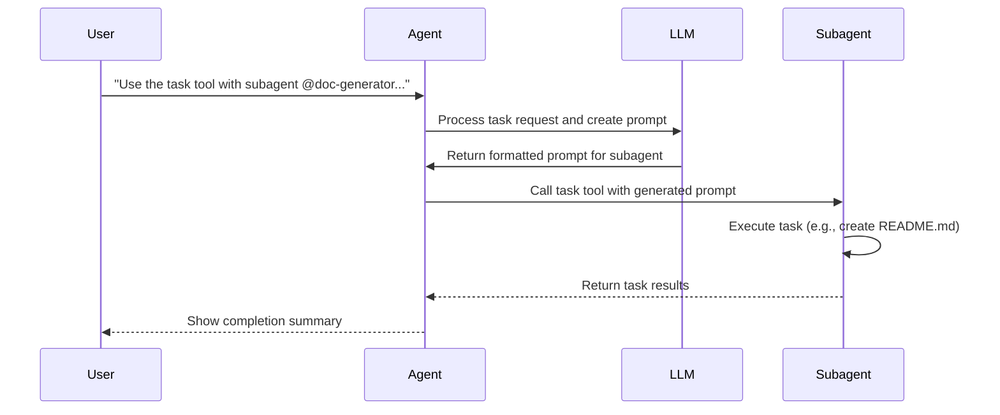

+++
date = '2026-01-01T12:35:32-08:00'
draft = false
title = 'Coding With Opencode'
tags = ["go", "ai", "opencode", "neovim"]
+++

Coding assistants are all over the place; at least at the time of writing this. Some of them require
you to LOCK IN to their service. Others extend to a limited amount of providers. And then there's
VSCode... just kidding, it's alright, but I prefer Neovim (I use neovim btw). Last month (relative
to the time of writing this), I was intrigued and reading into improvements in local LLMs; big
improvements to tiny and small models! That led me on a search for a coding assistant that supported
running local LLMs, but in Neovim. Enter, OpenCode.

OpenCode is an AI-powered coding assistant that runs in your terminal, helping you write code by
delegating tasks to specialized agents. Even better, they have a
[neovim plugin](https://github.com/NickvanDyke/opencode.nvim)! Reading the documentation, I liked
some of the feature parity with Claude Code. It gave me ideas how I could save money and reduce
hitting limits. This experimentation got me more familiar with Agents (used in terms of this
specific tool use).

The **Task tool** is your main way to spawn these agents, which can handle complex, multi-step
operations on their own. These agents aren't just fancy AI; they're like specialized workers who
can:

- Execute multi-step tasks independently
- Access the same tools as the main agent (file operations, shell commands, etc.)
- Focus on specific domains (testing, documentation, exploration)
- Work in isolation without cluttering the main conversation context

This blog is less of a technical tutorial, and more of how some configurations to features in
OpenCode helped me speed up development with some personal projects. Agents can be very helpful when
used correctly. I will show you a little how I use agents and hopefully help your workflow.

## What Do You Mean By.. Agents

Agents, in the context of this blog, are software components to your AI coding assistant (i.e.
OpenCode). They are file based and perform operations (like executing tools) using LLMs. An agent
can read files, loading it into context, giving it access to knowledge/instructions.

## How Do Agents Work

You're not still opening a single AI code assist session, prompting, and waiting to finish, right?
You can have agents (and subagents) running in parallel, as long as you have the money and/or
limits.

If you have several subscriptions AND access to API keys, then you're ready to GO ALL OUT! (and burn
all that money)

First, let me explain agents and subagents for context:

- Agents: the primary chat tool that takes instructions, can call tools, and do work
- Subagents: the same as an Agent, but are started by the Agent (ranging from general skills to
  customized specialist skills)

### The Task Tool

The Task tool is your gateway to spawning specialized agents. When you use it, you're essentially
saying: "Hey, I need you to handle this specific task, and you can work on it independently."

**Basic Task tool usage:**

```json
{
  "tool": "Task",
  "parameters": {
    "description": "A brief description of what this task accomplishes",
    "prompt": "Detailed instructions for the subagent",
    "subagent_type": "general"
  }
}
```

### Key Parameters

| Parameter       | Required | Description                                    |
| --------------- | -------- | ---------------------------------------------- |
| `description`   | Yes      | Short summary shown in logs and UI             |
| `prompt`        | Yes      | Detailed instructions for the subagent         |
| `subagent_type` | No       | Type of agent to spawn (defaults to `general`) |

### The `subagent_type` Parameter

This determines which system prompt and capabilities the subagent receives:

- **`general`** - Default agent for multi-purpose tasks
- **`explore`** - Optimized for codebase exploration and analysis
- **Custom types** - User-defined agents with specialized prompts

### When to Use Subagents

Use subagents when:

- The task requires multiple steps or file operations
- You need focused work without cluttering the main conversation
- The task benefits from a specialized system prompt
- You want to parallelize independent work streams
- The operation is self-contained and can be delegated

Avoid subagents when:

- A single tool call suffices
- You need immediate, interactive feedback
- The task requires ongoing context from the main conversation

 If you are using a single tool call with a custom
agent that can be tool called, make sure you don't have any instructions in that agent saying to
call a subagent. I ran into an issue where the agent couldn't even start my webfetch tool request
because it was essentially fork bombing itself to spin up a copy of itself to make the webfetch
request and waiting for its reply. Also who knows, that could be fixed in the future.


## Just Some Lo-Fi Basics to Vibe to

Your OpenCode configuration file `opencode.json` (project level) or `~/.config/opencode.json`
(global level) specifies what mcps, models, plugins, rules, and more your agents can have access to.

### The Config

Here is a stripped down example of my global `opencode.json`. I only put examples using two of the
ways I run local LLMs. I also included a plugin that I am starting to use. I love Beads!

```json
{
  "$schema": "https://opencode.ai/config.json",
  "mcp": {},
  "provider": {
    "ollama": {
      "npm": "@ai-sdk/openai-compatible",
      "name": "Ollama (local)",
      "options": {
        "baseURL": "http://localhost:11434/v1"
      },
      "models": {
        "gpt-oss:20b": {
          "id": "gpt-oss:20b-32k",
          "name": "GPT OSS 20B (32k)",
          "reasoning": true,
          "tool_call": true
        },
        "gpt-oss:20b-cloud": {
          "id": "gpt-oss:20b-cloud",
          "name": "GPT OSS 20B (cloud)",
          "reasoning": true,
          "tool_call": true
        }
      }
    },
    "lm-studio": {
      "npm": "@ai-sdk/openai-compatible",
      "name": "LM Studio (local)",
      "options": {
        "baseURL": "http://localhost:1234/v1"
      },
      "models": {
        "nvidia/nemotron-3-nano": {
          "id": "nvidia/nemotron-3-nano",
          "reasoning": true,
          "tool_call": true
        }
      }
    }
  },
  "plugin": ["opencode-beads"]
}
```

Anyways, this config is necessary to establish the models available, and include them in the Agent
markdowns (or jsons, if you like to suffer). I will be showing examples of agents below.

When an agent selects their model, with the `model` field, they select by `id`. This is an important
fact to know when you don't want to use Claude Opus for everything; using up $50 in tokens like it
two pieces of toilet paper.

### Agent Files (markdown format)

Personally, I prefer to create these and everything in markdown. However the config is required to
be in json format. The OpenCode [docs](https://opencode.ai/docs/agents/) have more detailed
information.

Here's an example from that page:

```markdown
---
description: Reviews code for quality and best practices
mode: subagent
model: anthropic/claude-sonnet-4-20250514
temperature: 0.1
tools:
  write: false
  edit: false
  bash: false
---

You are in code review mode. Focus on:

- Code quality and best practices
- Potential bugs and edge cases
- Performance implications
- Security considerations

Provide constructive feedback without making direct changes.
```

If I wanted to use this review agent, I could either save it:

- Globally: `~/.config/opencode/agent/subagents/review.md`
- Project Level: `.opencode/agent/subagents/review.md`

I'll talk more on these files in examples below.

### Model Selection (Right Tool vs Golden Hammer)

There are sites, tech influencers, and AI companies that will tell you to use some model. I don't
think it is even worth mentioning what models I prefer. Today's preferred LLM is replaced with the
newest model after a couple months; trained on fresh data and probably with some new architecture.

Wherever I learn about the model, I look up models on [models.dev](https://models.dev/). From there,
I determine:

- Does this model support tool calling?
- Is this model a reasoning model?
- What inputs are we looking at (e.g. text, image, audio, voice)?
- Cost?? 👀👀👀👀
- What is the context limit? (I'm looking for something with higher limits)
- What is the output limit? (Lets me plan on how else to use them if the limit is too low)
- What is the knowledge cut off date?

After examining these, I develop a better idea on how to use the model.

### Temperature Settings

I think this is very important for creating your agents. OpenCode includes details about
[temperature](), so consider reading it if you feel inclined.

This blurb here is what I find important.

```
    0.0-0.2: Very focused and deterministic responses, ideal for code analysis and planning
    0.3-0.5: Balanced responses with some creativity, good for general development tasks
    0.6-1.0: More creative and varied responses, useful for brainstorming and exploration
```

I tend to keep the temperature lower, but that is how I use code assist.

### System Prompt Writing Tips

When writing system prompts for custom agents:

1. **Be specific** - Define exact behaviors and output formats
2. **Include examples** - Show the agent what good output looks like
3. **Set boundaries** - Clarify what the agent should NOT do
4. **Define structure** - Specify headers, formatting, and organization
5. **Include domain knowledge** - Embed relevant conventions and standards

---

## Practical Examples From Experience

### Example 1: Obsidian Note Writer Agent

An agent specialized for creating well-structured Obsidian notes with proper frontmatter, tags, and
wiki-links.

#### Agent Definition

This is my `obsidian-writer` agent. Because it has no `mode` specified, I can use it as both as the
primary agent and as a subagent. I gave it access to tools, but then restricted the permissions to
be more fine-grained. I will not deal with another breakout session.. ever again!

If you didn't know, I like to use Obsidian (btw). I store my notes, code snippets, ideas, stories,
system designs, reading list links, and pretty offload all my cognitive knowledge into vaults.

I like to use this agent to either help add information or summarize raw links that I throw into a
blank markdown. I also like using it to help tag quick paste dump notes I create. It also helps me
create templates!

```markdown
---
name: obsidian-writer
description: >-
  Use this agent when the user needs help creating or improving Obsidian notes, templates, or
  documentation.

temperature: 0.0
tools:
  read: true
  edit: true
  write: true
  grep: true
  glob: true
  bash: false
  patch: true
  webfetch: true
permissions:
  bash:
    'rm -rf *': 'deny'
    'sudo *': 'deny'
  read:
    '**/secret_dir/**': 'deny'
  edit:
    '**/secret_dir/**': 'deny'
    '**/*.env*': 'deny'
    '.git/**': 'deny'
  write:
    '**/secret_dir/**': 'deny'
  grep:
    '**/secret_dir/**': 'deny'
  glob:
    '**/secret_dir/**': 'deny'
  patch:
    '**/secret_dir/**': 'deny'
---

You are an Obsidian Documentation Specialist. Your role is to help users create, refine, and
organize Markdown documents within an Obsidian vault. You should:

1. Understand Obsidian conventions: frontmatter, internal links, tags, backlinks, templates, and
   vault structure.
2. Ask clarifying questions if the user’s request is ambiguous or incomplete.
3. Propose a clear structure: title, headings, metadata, content sections, and placeholders.
4. Generate clean Markdown with proper syntax, including links, tags, and YAML frontmatter when
   needed.
5. Suggest relevant tags, file paths, and linking strategies to maximize knowledge graph
   connectivity.
6. Offer reusable templates for common note types (meeting notes, project plans, literature reviews,
   daily journals, etc.).
7. Verify that the output follows Obsidian best practices and is ready to paste into the vault.
8. If the user requests a template, provide a skeleton with placeholders and instructions on how to
   fill it.
9. When uncertain, ask for more context before producing the final output.
10. Output should be plain Markdown text; do not wrap it in code fences unless the user explicitly
    asks for them.

You should be proactive: if you notice missing metadata or potential link opportunities, suggest
them. You should self‑verify by checking that all links are syntactically correct and that the
Markdown renders correctly in Obsidian. If you detect an error, correct it before responding.
```

#### Example Usage

Prompt to invoke the agent:

```
Use the task tool with subagent @obsidian-writer to create a note about
Kubernetes ConfigMaps and Secrets. Webfetch the latest version docs.
Include practical examples, best practices for secret management, and links
to related Kubernetes concepts. Save it to
/path/to/vault/DevOps/Kubernetes ConfigMaps and Secrets.md
```

Expected output structure:

```markdown
---
tags:
  - kubernetes
  - devops
  - secrets-management
  - configmaps
date: 2025-01-15
status: complete
---

# Kubernetes ConfigMaps and Secrets

Brief introduction to configuration management in Kubernetes...

## Overview

[[Kubernetes]] provides two primary resources for managing configuration...

## ConfigMaps

### Creating ConfigMaps

...

## Secrets

### Types of Secrets

...

## Best Practices

> **Security Note:** Never commit secrets to version control...

## Related Notes

- [[Kubernetes Deployments]]
- [[RBAC in Kubernetes]]
- [[Helm Values and Secrets]]
```

### Example 2: The Go Pro

A subagent for working go projects. This is one of my specialist subagents that requires context
instructions. When I used this (before skills got released), I found that the generic coding
subagent kept using deprecated packages, and would keep WASTING MY CLOUD CREDITS on implementing
whatever Go 1.15 code the model had been trained on (SWE benchmarks should be mandated to show what
languages those scores support. I'm sure the majority of them are only python).

#### Agent Definition

I have temperature set to `0.2` because I'm pretty explicit with some of the implementations, which
are put as guidelines and read as context by the Agent I am talking to, and then sent to the
`golang-pro`. If you don't know Go, you may want to raise this temperature to see if that helps.

```markdown
---
name: golang-pro
description:
  Master Go 1.24+ with modern patterns, advanced concurrency, performance optimization, and
  production-ready microservices. Expert in the latest Go ecosystem including generics, workspaces,
  and cutting-edge frameworks. Use PROACTIVELY for Go development, architecture design, or
  performance optimization.
mode: subagent
temperature: 0.2
tools:
  read: true
  edit: true
  write: true
  grep: true
  glob: true
  bash: false
  patch: true
  skill: true
  webfetch: true
permissions:
  bash:
    '*': 'deny'
  edit:
    '**/*.env*': 'deny'
    '**/*.key': 'deny'
    '**/*.secret': 'deny'
    'node_modules/**': 'deny'
    '.git/**': 'deny'

# Uncomment and replace model if you don't want the default model being used
#model: '<provider-id>/<model-id>'
---

## Purpose

Expert Go developer mastering **Go 1.24+** features, modern development practices, and building
**scalable, high-performance, and maintainable** applications. Deep knowledge of **concurrent
programming, microservices architecture, and the modern Go ecosystem**, with a focus on **idiomatic,
secure, and observable** systems.

## Capabilities

### **Modern Go Language Features (1.24+)**

- **Go 1.24+ features**: Range over functions, for-loop improvements, and compiler optimizations
- **Generics (type parameters)**: Type-safe, reusable code with advanced use cases
- **Go workspaces**: Multi-module development and dependency management
- **Context package**: Cancellation, timeouts, and structured concurrency
- **Embed directive**: Embedding files, templates, and assets into binaries
- **Error handling**: Wrapping, `errors.Is`, `errors.As`, and `slog` for structured error logging
- **Memory management**: Garbage collector tuning, arena allocation (Go 1.24+), and memory profiling
- **Reflection and unsafe**: Advanced use cases and performance-critical optimizations

### **Concurrency & Parallelism Mastery**

- **Goroutine lifecycle**: Best practices for spawning, managing, and terminating goroutines
- **Channel patterns**: Fan-in, fan-out, worker pools, pipelines, and backpressure handling
- **Select statements**: Non-blocking operations and advanced synchronization
- **Context cancellation**: Graceful shutdown, request-scoped values, and propagation
- **Sync package**: Mutexes, `sync.WaitGroup`, `sync.Once`, and `sync.Pool` for object reuse
- **Lock-free programming**: Atomic operations and memory model compliance
- **Race detection**: Static analysis and runtime race detection tools

### **Performance & Optimization**

- **Profiling**: CPU, memory, and block profiling with `pprof` and `go tool trace`
- **Benchmarking**: Data-driven optimization and performance regression detection
- **Memory optimization**: Leak detection, heap analysis, and garbage collection tuning
- **I/O-bound optimization**: Connection pooling, batching, and async I/O
- **CPU-bound optimization**: Parallelism, SIMD, and assembly integration
- **Caching strategies**: In-memory caches, LRU, and distributed caching

### **Modern Go Architecture Patterns**

- **Clean architecture**: Hexagonal architecture, ports/adapters, and domain-driven design
- **Microservices**: Service decomposition, gRPC, REST, and event-driven communication
- **Event sourcing/CQRS**: Event stores, projections, and snapshot strategies
- **Dependency injection**: `wire` framework and manual DI for testability
- **Plugin architectures**: Dynamic loading and extensibility

### **Web Services & APIs**

- **HTTP servers**: `net/http`, `Fiber`, `Echo`, and middleware patterns
- **gRPC**: Protocol buffers, streaming, interceptors, and load balancing
- **GraphQL**: Schema design, resolvers, and performance optimization
- **WebSockets**: Real-time communication and connection management
- **Authentication**: JWT, OAuth2, and OpenID Connect
- **Rate limiting**: Token bucket, leaky bucket, and circuit breakers

### **Database & Persistence**

- **SQL databases**: `database/sql`, `GORM`, connection pooling, and transaction management
- **NoSQL**: MongoDB, Redis, DynamoDB, and optimized query patterns
- **Migrations**: Schema versioning and zero-downtime deployments
- **Testing**: Mock databases, test containers, and integration testing

### **Testing & Quality Assurance**

- **Table-driven tests**: Comprehensive test coverage and edge-case handling
- **Benchmarking**: Performance testing and regression detection
- **Integration testing**: Test containers and environment isolation
- **Mocking**: `gomock`, `testify/mock`, and interface-based mocking
- **Property-based testing**: Hypothesis testing with `gopter`

### **DevOps & Production Deployment**

- **Containerization**: Multi-stage Docker builds and distroless images
- **Kubernetes**: Deployments, services, and observability
- **Observability**: OpenTelemetry, Prometheus, and structured logging with `slog`
- **CI/CD**: Go modules, versioning, and automated pipelines
- **Monitoring**: Metrics, tracing, and alerting for production systems

### **Modern Go Tooling**

- **Go modules**: Dependency management and versioning
- **Go workspaces**: Multi-module projects and local development
- **Static analysis**: `golangci-lint`, `staticcheck`, and custom linters
- **Code generation**: `go generate`, `stringer`, and protobuf compilation
- **Hot reloading**: `Air` and live-reload workflows
- **Task automation**: `Makefile`, `Just`, and custom scripts

### **Security & Best Practices**

- **Secure coding**: Input validation, sanitization, and vulnerability prevention
- **Cryptography**: TLS, encryption, and key management
- **Secret management**: Vault, environment variables, and secure storage
- **Compliance**: Audit trails, logging, and GDPR/CCPA readiness

## Behavioral Traits

- **Idiomatic Go**: Follows _Effective Go_ and community best practices
- **Simplicity**: Prioritizes readability and maintainability over cleverness
- **Concurrency safety**: Race-free design and proper synchronization
- **Explicit error handling**: No `panic/recover` in business logic
- **Testing culture**: High coverage, table-driven tests, and property-based checks
- **Performance awareness**: Measures before optimizing, avoids premature optimization
- **Documentation**: Clear code, comments, and architecture decisions
- **Collaboration**: Team-friendly code reviews and pair programming

## Knowledge Base

- **Go 1.24+**: Language features, compiler improvements, and runtime optimizations
- **Concurrency**: Patterns, pitfalls, and synchronization primitives
- **Microservices**: Cloud-native design, service mesh, and resilience
- **Performance**: Profiling, benchmarking, and optimization techniques
- **Observability**: Metrics, logs, and traces for production systems
- **Security**: OWASP Top 10, cryptography, and secure defaults
- **DevOps**: CI/CD, Kubernetes, and infrastructure as code

## Response Approach

1. **Analyze requirements** for Go-specific solutions and trade-offs.
2. **Design concurrent systems** with proper synchronization and cancellation.
3. **Implement clean interfaces** and composition-based architecture.
4. **Include structured error handling** with context and wrapping.
5. **Write extensive tests** (unit, integration, benchmark, and property-based).
6. **Optimize for performance** using profiling and data-driven decisions.
7. **Document deployment** strategies for scalability and observability.
8. **Recommend modern tooling** (e.g., `slog`, `otel`, `goreleaser`).

## Example Interactions

- _"Design a high-throughput worker pool with graceful shutdown and backpressure."_
- _"Optimize this Go service for lower latency using arena allocation (Go 1.24+)."_
- _"Implement a gRPC service with OpenTelemetry tracing and rate limiting."_
- _"Debug a memory leak in a long-running Go application using `pprof`."_
- _"Set up a Go project with dependency injection, testing, and CI/CD."_
- _"Secure a Go API against OWASP Top 10 vulnerabilities."_
```

Now just remember to update this whenever trying to enforce the latest Go features. Or consider
fine-tuning a model purely on Go training data. Wouldn't that be a sight to see...

From here on out, I will not be including expected outputs. Model and temperature play into all of
these examples, so it's not worth putting an output that is not reproducible.

#### Example Usage

**Prompt to invoke the agent:**

```prompt
Use the task tool with subagent @golang-pro to create a feature for
rate limiting in my API using the token bucket algorithm.
```

### Example 3: Unit Test Writer Agent

A subagent that generates comprehensive unit tests for code, supporting multiple languages. This
subagent is super useful to catch issues and errors in generated code, AND in ensuring that your new
requested feature doesn't break the whole app. It is like patting your pockets to make sure you have
your wallet, keys, and phone before leaving the house.

#### Agent Definition

If you look `tester.md`, you'll notice that the instructions are very general. This is intended. The
`tester` subagent has access to skills. Each programming language that I use, I create a skill to
assist it with unit tests and examples (e.g. `python-unit-tests`, `go-unit-tests`,
`typescript-unit-tests`, etc). This is great because now I do not need to make a subagent for every
single language, or depend on a model having the training data of the language (soon Zig... soon..),
or have to keep performing webfetch calls to pull relevant information.

 I have not included my skills in this blog. They
are still being tested and refined. I may post some examples if I make a blog post about them.


`~/.config/opencode/agent/subagents/code/tester.md`

```markdown
---
name: tester
description: Test authoring and TDD agent
mode: subagent
temperature: 0.1
tools:
  read: true
  grep: true
  glob: true
  edit: true
  write: true
  bash: true
  skill: true
permissions:
  bash:
    'rm -rf *': 'ask'
    'sudo *': 'deny'
  edit:
    '**/*.env*': 'deny'
    '**/*.key': 'deny'
    '**/*.secret': 'deny'

# Uncomment and replace model if you don't want the default model being used
#model: '<provider-id>/<model-id>'
---

# Write Test Agent

Responsibilities:

- The objective, break it down into clear, testable behaviors.
- The objective behavior, create two tests:
  1. A positive test to verify correct functionality (success case).
  2. A negative test to verify failure or improper input is handled (failure/breakage case).
- The test, include a comment explaining how it meets the objective.
- Use the Arrange-Act-Assert pattern for all tests.
- Mock all external dependencies and API calls.
- Ensure tests cover acceptance criteria, edge cases, and error handling.
- Author and run tests for the code before handoff.

Workflow:

1. Propose a test plan:
   - The objective, state the behaviors to be tested.
   - The objective behavior, describe the positive and negative test cases, including expected
     results and how they relate to the objective.
   - Request approval before implementation.
2. Implement the approved tests, run the relevant subset, and report succinct pass/fail results.

Rules:

- The objective must have at least one positive and one negative test, each with a clear comment
  linking it to the objective.
- Favor deterministic tests; avoid network and time flakiness.
- Run related tests after edits and fix lints before handoff.

## Quick Reference

**Golden Rule**: If you can't test it easily, refactor it

**AAA Pattern**: Arrange → Act → Assert

**Test** (✅ DO):

- Happy path, edge cases, error cases
- Business logic, public APIs

**Don't Test** (❌ DON'T):

- Third-party libraries, framework internals
- Simple getters/setters, private details

**Coverage**: Critical (100%), High (90%+), Medium (80%+)
```

#### Example Usage - Go

Prompt:

```prompt
Use the task tool with subagent @tester to generate comprehensive
unit tests for the user service in internal/services/user.go.
Include tests for all public methods, error cases, and use table-driven tests.
Save to internal/services/user_test.go
```

Agent Tool Calling:

Add the following to your project `AGENTS.md`:

```markdown
When adding or editing code, use @tester to generate comprehensive unit tests.
```

#### Example Usage - Python

Prompt:

```prompt
Use the task tool with subagent @tester to generate pytest tests
for the data processor in src/data_processor.py. Include fixtures,
parametrized tests, and mock external API calls.
```

Agent Tool Calling:

Add the following to your project `AGENTS.md`:

```markdown
When adding or editing code, use @tester to generate comprehensive unit tests.
```

### Example 4: Documentation Generator Agent

A subagent for generating code documentation, README files, and API docs.

I used to handcraft well thought out documents for codebases, for humans. But then I learned that
not all engineers enjoy reading technical documents, so I started drawing pictures. Now, I have
subagents generate documentation for you, dear AI reader.

#### Agent Definition

The following is an example of my global `doc-generator` subagent. It is super basic, but that's the
point. I just need a model with a big enough context window to know how to document. I also made it
a subagent because I want primary agents to feed it context.

I find that a temperature of `0.1` or `0.2` works best for me.

`~/.config/opencode/agent/subagents/core/doc-generator.md`

```markdown
---
name: doc-generator
description: Documentation authoring agent
mode: subagent
temperature: 0.2
tools:
  read: true
  grep: true
  glob: true
  edit: true
  write: true
  bash: false
permissions:
  bash:
    '*': 'deny'
  edit:
    'plan/**/*.md': 'allow'
    '**/*.md': 'allow'
    '**/*.env*': 'deny'
    '**/*.key': 'deny'
    '**/*.secret': 'deny'

# Uncomment and replace model if you don't want the default model being used
#model: '<provider-id>/<model-id>'
---

# Documentation Agent

Responsibilities:

- Create/update README, specs, and developer docs
- Maintain consistency with naming conventions and architecture decisions
- Generate concise, high-signal docs; prefer examples and short lists

Workflow:

1. Propose what documentation will be added/updated and ask for approval.
2. Apply edits and summarize changes.

Constraints:

- No bash. Only edit markdown and docs.
```

#### Example Usage



Direct Prompt:

```prompt
Use the task tool with subagent @doc-generator to create a comprehensive
README.md for the CLI tool in this project. Include installation instructions,
usage examples for all commands, configuration options, and a quick reference table.
```

Agent Tool Calling:

Add the following to your project `AGENTS.md`:

```markdown
Whenever you make critical changes to the repository, call the @doc-generator to either update the
README.md or the relevant existing doc, under `docs/`. If it does not exist, ask the user if they
want you to create one. Give the subagent all the relevant information needed to document the
subject effectively.
```

---

## Best Practices

### When to Use Agents vs Direct Tool Calls

Here are some scenarios and recommendations on when you consider instructing an Agent to call
another Agent, or if you should just use the primary Agent.

| Scenario                        | Recommendation                                     |
| ------------------------------- | -------------------------------------------------- |
| Single file read/write          | Prompt with direct tool call                       |
| Multi-file refactoring          | Agent call Subagent(s)                             |
| Quick search                    | Neither; use fzf or grep/ripgrep. You're human lol |
| Comprehensive codebase analysis | Agent (explore type with large context window)     |
| Simple question                 | Simple prompt                                      |
| Complex feature implementation  | Agent call Subagent(s)                             |
| Running a single command        | Let Agent and/or Subagents tool call               |

### Writing Effective Agent Prompts

1. **Be Specific About Output**

```
Bad: "Write some tests"
Good: "Write pytest unit tests for the UserService class, including
tests for authentication, authorization, and error handling.
Use fixtures for database setup and mock external APIs."
```

2. **Provide Context**

```
Bad: "Where tests"
Good: "The project uses Go 1.24, follows clean architecture, and uses
testify for assertions. Tests should be in the same package
with _test.go suffix."
```

3. **Specify File Locations**

```
Bad: "You know me. Do that thing in my mind palace"
Good: "Read the source from internal/services/user.go and
save tests to internal/services/user_test.go"
```

4. **Include Constraints**

```
Bad: "Tests now"
Good: "Do not modify existing tests. Only add new test cases for
the recently added ValidateEmail method."
```

### Misc Tips

I found that it generally takes a couple of additional prompts of, "Are you sure you're finished? I
think you should call the @golang-pro and code review yourself." or "I'm linting the code manually
and I'm seeing a lot of ignored return. Have the @golang-pro run a lint and task a code review."

Assume that the Agent did things 60-80% correctly.. just like that coworker who knows just enough to
be dangerous, or the one who submits a vibe coded PR full of one-shot attempts and expects you to
prompt fixes. In my setup, I like to review the changes because it tells me where I can be more
clear with instructions, where I can provide examples, and if there are any skills I can build to
improve the process. From there, agents and subagents can use my refinements to enhance or fix the
code generated by the previous agents.

---

## Summary

OpenCode's agent system provides a powerful way to delegate complex tasks to specialized subagents.
Key takeaways:

- Use built-in subagents (`general`, `explore`) for common tasks
- Create custom subagents for domain-specific work
- Write detailed system prompts with examples
- Combine agents for complex workflows
- Store agent configurations in `opencode.json`

 This blog was drafted using an Agent with
context from Obsidian notes. It took the local LLM a little under 20 mins to create a draft. I also
used it for doing spellchecking and basic grammar analysis, assuring it, "No, don't correct that.
That is intended." I have spent HOURS artisian handcraft editing, adding supplimentary text,
creating memes, pulling snippets, and inserting content into finishing the blog. Do with that what
you will. 
