+++
date = '2025-04-05T14:30:41-07:00'
draft = false 
title = "Mastering DSAs in Go: The Big-O Guide [Part 1]" 
tags = ["go", "algorithms", "performance", "big-o", "computer-science"] 
featured_image = "/images/gophers/go-grow.svg" 
+++

I've been really enjoying teaching fundamentals in Go, recently. If you haven't read any of my other
blogs or are new to go, I strongly recommend checking out my
[fundamentals](https://blog.mikesahari.com/tags/fundamentals/) posts. I started this blog as a next
step, and before I knew it I was writing something way too long to share. This will be the first
part of a blog series on data structures and algorithms; and of course, in Go!

In my opinion, understanding algorithm complexity is non-negotiable for writing efficient code. But
let's face it, you're not always going to work on a team where engineers write efficient code (let
alone an algorithm!). Even worse, you may work in a larger team with tech leads that don't
understand algorithms; resulting in your newer engineers missing out on the chance for proper
mentorship in coding (or be taught bad practices!).


Big-O isn't just academic theory—it's a practical tool that determines whether your application will
handle 10,000 users or crash when the 101st person logs in. Whether you're new to Big-O or
interested in learning it in Go, this blog will help teach you about these algorithms.

## What is Big-O Notation?

Big-O notation is how we describe an algorithm's efficiency as input size grows. It's like a speed
limit sign for your code—telling you not how fast your algorithm runs on your M2 MacBook Pro, but
how it will perform when your data grows from kilobytes to gigabytes.

 Big-O notation describes the worst-case scenario
for your algorithm's time or space complexity. It answers: "How does my algorithm's performance
scale?" rather than "How fast is my function right now?" 

In essence, Big-O focuses on the growth rate of time or space requirements as the input size
increases toward infinity, ignoring constants and lower-order terms that become insignificant with
large inputs.

```mermaid
flowchart LR
    classDef default fill:#2d333b,stroke:#3b454e,color:#adbac7
    classDef constant fill:#1a237e,stroke:#3949ab,color:#e8eaf6
    classDef logarithmic fill:#004d40,stroke:#00796b,color:#e0f2f1
    classDef linear fill:#b71c1c,stroke:#e53935,color:#ffebee
    classDef linearithmic fill:#311b92,stroke:#5e35b1,color:#ede7f6
    classDef quadratic fill:#880e4f,stroke:#d81b60,color:#fce4ec
    classDef exponential fill:#3e2723,stroke:#6d4c41,color:#efebe9

    A["<b>Common Big O Complexities</b>"] --> B["O(1): Constant"]
    A --> C["O(log n): Logarithmic"]
    A --> D["O(n): Linear"]
    A --> E["O(n log n): Linearithmic"]
    A --> F["O(n²): Quadratic"]
    A --> G["O(2^n): Exponential"]

    B:::constant
    C:::logarithmic
    D:::linear
    E:::linearithmic
    F:::quadratic
    G:::exponential
```



## Understanding Complexity Classes in Practice

Let's explore these complexity classes with practical Go implementations and see exactly what
happens as our inputs grow.

### O(1) - Constant Time: The Speed Champion


Operations that execute in the same time regardless of input size. This is the gold standard we
strive for.

```go
// GetMapValue is an example of Constant Time
func GetMapValue(m map[string]int, key string) (int, bool) {
    val, exists := m[key]
    return val, exists
}
```

This function performs a hash table lookup which takes the same amount of time whether your map has
10 entries or 10 million. Go's maps are implemented as hash tables, giving us O(1) average-case
access time.

Here's what happens behind the scenes:


 While Go maps provide O(1) lookups on average,
their worst-case performance can degrade to O(n) under pathological hash collision cases. In
practice, Go's implementation mitigates this by using a good hash function and automatically growing
the hash table when needed. 

The beauty of O(1) operations is their predictability—they'll perform the same whether your app has
10 users or 10 million. This is why we love them for hot paths in our code.

### O(log n) - Logarithmic Time: The Efficient Divider


Algorithms that reduce the problem size by a fraction (typically half) with each step. The binary
search is the poster child here.

```go
// BinarySearch is an example of Logarithmic Time
func BinarySearch(sorted []int, target int) int {
    left, right := 0, len(sorted)-1

    for left <= right {
        mid := left + (right-left)/2 // Avoids integer overflow

        switch {
        case sorted[mid] == target:
            return mid // Found it!
        case sorted[mid] < target:
            left = mid + 1 // Look in the right half
        case sorted[mid] > target:
            right = mid - 1 // Look in the left half
        }
    }

    return -1 // Target not found
}
```

Let's trace through this with a concrete example:

```
sorted = [2, 5, 8, 12, 16, 23, 38, 56, 72, 91]
target = 23
```

1. Initial state: `left=0, right=9, mid=4, sorted[mid]=16`
2. 16 < 23, so we set `left=5`
3. New state: `left=5, right=9, mid=7, sorted[mid]=56`
4. 56 > 23, so we set `right=6`
5. New state: `left=5, right=6, mid=5, sorted[mid]=23`
6. 23 == 23, return 5

With just 3 comparisons, we found our target in a list of 10 elements. If we had a million elements?
It would take around 20 comparisons. That's the power of O(log n).


 The Go standard library uses binary search in
several places, like the `sort.Search` function. Here's how you'd use it to find the position to
insert a new element while maintaining order:

```go
import "sort"

func FindInsertPosition(sorted []int, value int) int {
    return sort.Search(len(sorted), func(i int) bool {
        return sorted[i] >= value
    })
}
```



Remember that binary search requires sorted data, which is a crucial prerequisite. If your data
isn't sorted, you'll need to sort it first (typically an O(n log n) operation), which changes the
overall performance characteristics.

### O(n) - Linear Time: The Honest Worker


Operations where execution time grows in direct proportion to input size. Every element gets
processed exactly once.

```go
// ContainsElement is an example of Linear Time
func ContainsElement(slice []int, target int) bool {
    for _, val := range slice {
        if val == target {
            return true
        }
    }
    return false
}
```

This might look simple, but don't underestimate it. Linear algorithms are often the best you can do
for unsorted data, and they're predictable and cache-friendly. The time required scales directly
with the input size.


 Go's slice iteration with `range` is highly
optimized. The compiler can eliminate bounds checking in many situations, making linear scans
extremely efficient—sometimes approaching the theoretical memory bandwidth limit of your hardware.


Linear algorithms are often unavoidable when you need to process all elements at least once, such as
when calculating sums, finding maximum values, or checking if all elements meet a condition.

### O(n log n) - Linearithmic Time: The Practical Sorter


Found in efficient sorting algorithms and divide-and-conquer approaches, O(n log n) represents the
best possible time complexity for comparison-based sorting.

Go's standard library sort package implements an optimized version of quicksort (with insertion sort
for small slices) that achieves O(n log n) average-case performance:

```go
// QuickSort is an example of Linearithmic Time
func QuickSort(arr []int) []int {
    // Make a copy to avoid modifying input
    result := make([]int, len(arr))
    copy(result, arr)

    // Call the recursive helper
    quickSortHelper(result, 0, len(result)-1)
    return result
}

func quickSortHelper(arr []int, low, high int) {
    if low < high {
        // Partition the array and get the pivot index
        pivotIndex := partition(arr, low, high)

        // Recursively sort the sub-arrays
        quickSortHelper(arr, low, pivotIndex-1)
        quickSortHelper(arr, pivotIndex+1, high)
    }
}

func partition(arr []int, low, high int) int {
    // Choose the rightmost element as pivot
    pivot := arr[high]

    // Index of smaller element
    i := low - 1

    for j := low; j < high; j++ {
        // If current element is smaller than the pivot
        if arr[j] <= pivot {
            // Increment index of smaller element
            i++
            arr[i], arr[j] = arr[j], arr[i]
        }
    }

    // Swap the pivot element with the element at (i+1)
    arr[i+1], arr[high] = arr[high], arr[i+1]

    // Return the partition index
    return i + 1
}
```

 In this example, we used `copy`. If you are
not familiar with how this works, it accepts a destination slice type and a source slice type.

So in our use above, we copied all the values from `arr` into `result`. Without this copy step,
you'd be modifying the original slice that was passed in, which could lead to unexpected side
effects. 

Now let's analyze what happens during a quicksort with a small example:

```
arr = [38, 27, 43, 3, 9, 82, 10]
```

The recursive partitioning creates a tree-like structure of work:


 In Go, prefer using the standard library's `sort`
package for sorting needs rather than implementing your own. It's well-optimized and handles edge
cases properly:

```go
import "sort"

// For slices of basic types
nums := []int{5, 2, 6, 3, 1, 4}
sort.Ints(nums)

// For custom sorting
sort.Slice(people, func(i, j int) bool {
    return people[i].Age < people[j].Age
})
```



The O(n log n) complexity comes from:

- The recursive partitioning creates a tree of height log n (divide)
- At each level, we do about n work comparing elements (conquer)

This makes it much more efficient than quadratic algorithms for large datasets. When sorting a
million elements, quicksort would perform about 20 million operations compared to a trillion for
bubble sort!

### O(n²) - Quadratic Time: The Brute-Force Approach


Characterized by nested loops, quadratic algorithms quickly become impractical as data size grows.

I once had an engineer message me on Slack, asking how I was able to retrieve a ton of data so fast.
He asked if it was because I was using Go and because he was using Python. When I told him that was
part of the reason, he said he was just going to use AI to rewrite it in Go; but before he went down
the vibe coding route with his Cursor setup, I asked a bunch of leading questions about how he was
processing the data. Turns out, he had vibe coded a very poor implementation of bubble sort (without
understanding it)!

Let's take a look at a cleaner implementation of bubble sort.

```go
// Bubble Sort is an example of Quadratic Time
func BubbleSort(arr []int) {
    n := len(arr)
    for i := 0; i < n; i++ {
        swapped := false
        for j := 0; j < n-i-1; j++ {
            if arr[j] > arr[j+1] {
                arr[j], arr[j+1] = arr[j+1], arr[j]
                swapped = true
            }
        }
        // If no swapping occurred in this pass, the array is sorted
        if !swapped {
            break
        }
    }
}
```

Bubble sort performs comparisons and swaps between adjacent elements, gradually "bubbling" the
largest elements to their correct positions. Let's walk through it:

```
arr = [5, 3, 8, 4, 2]

Pass 1:
Compare 5 & 3 → Swap → [3, 5, 8, 4, 2]
Compare 5 & 8 → No swap → [3, 5, 8, 4, 2]
Compare 8 & 4 → Swap → [3, 5, 4, 8, 2]
Compare 8 & 2 → Swap → [3, 5, 4, 2, 8]

Pass 2:
Compare 3 & 5 → No swap → [3, 5, 4, 2, 8]
Compare 5 & 4 → Swap → [3, 4, 5, 2, 8]
Compare 5 & 2 → Swap → [3, 4, 2, 5, 8]

Pass 3:
Compare 3 & 4 → No swap → [3, 4, 2, 5, 8]
Compare 4 & 2 → Swap → [3, 2, 4, 5, 8]

Pass 4:
Compare 3 & 2 → Swap → [2, 3, 4, 5, 8]

Final: [2, 3, 4, 5, 8]
```


 Quadratic algorithms become impractical very
quickly. For n = 1,000, a bubble sort performs nearly 500,000 comparisons. For n = 1,000,000, it
would require about 500 billion comparisons! This is why we almost never use bubble sort in
production code (or do we?).

 

Despite their inefficiency, quadratic algorithms sometimes appear in code bases:

1. When processing small datasets where the simplicity of implementation outweighs performance
   concerns
2. When the nested loops perform constant-time operations, making the code appear simpler
3. In legacy code (languishing) that hasn't been optimized

Always be suspicious of nested loops in performance-critical code paths, as they often indicate
O(n²) complexity.

## Practical Performance Comparison

To drive home the dramatic differences between these complexity classes, let's look at how they
scale with input size:

| Input Size | O(1) | O(log n) | O(n)      | O(n log n) | O(n²)             |
| ---------- | ---- | -------- | --------- | ---------- | ----------------- |
| 10         | 1    | 3        | 10        | 30         | 100               |
| 100        | 1    | 7        | 100       | 700        | 10,000            |
| 1,000      | 1    | 10       | 1,000     | 10,000     | 1,000,000         |
| 1,000,000  | 1    | 20       | 1,000,000 | 20,000,000 | 1,000,000,000,000 |

Notice how the O(n²) algorithm becomes completely impractical for large inputs, while O(log n)
barely increases as the input size explodes. This is why binary search on a sorted array of 1
billion items still completes almost instantly, while a bubble sort would take years on the same
data.

## Go Standard Library Performance Tips

The Go standard library was designed with performance in mind, and its implementations often use
clever optimizations to achieve better-than-expected performance:

 Go's slice and map operations have specific
performance characteristics you should know:

- `append()` is amortized O(1) per element, though occasionally it requires O(n) work for resizing
- Map iterations with `range` are O(n) but in random order by design
- `sort.Sort()` uses introsort, a hybrid algorithm with O(n log n) complexity
- `copy()` is O(n) where n is the minimum of the destination and source slice lengths
  

## Beyond Big-O: The Devil in the Details

While Big-O notation is crucial, it doesn't tell the whole story:

1. **Constants matter**: An O(n) algorithm with a high constant factor might be slower than an O(n
   log n) algorithm for practical input sizes
2. **Memory access patterns**: Go's slice operations are efficient partly because they leverage CPU
   cache locality
3. **Best/average/worst case**: Some algorithms have different complexity in different scenarios

For example, Go's map lookup is O(1) on average but could degrade to O(n) in the worst case with
pathological hash collisions. In practice, this almost never happens due to Go's implementation
details.

## When to Optimize?

 Choosing the right algorithm from the start isn't
premature optimization—it's good engineering. You can refactor inefficient code, but you can't
refactor a crashed production system while it's broken! 

In Go, the general approach should be:

1. Choose algorithms with appropriate complexity for your expected data scale
2. Write clean, idiomatic Go code
3. Profile to identify actual bottlenecks
4. Optimize only where needed

## Conclusion

Understanding Big-O notation is a foundational skill for every Go developer. It helps you make
informed decisions about algorithm selection and predict how your application will scale as data
grows.

In the next part of this series, we'll dive deeper into data structures and algorithms in Go!

Until then, remember: the difference between O(n) and O(n²) might be the difference between a system
that scales smoothly and one that collapses under load.

## References

1. [Big O Cheat Sheet](https://www.bigocheatsheet.com/)
2. [Go Blog: Slices](https://blog.golang.org/slices-intro)
3. [Go Standard Library - sort package](https://golang.org/pkg/sort/)
4. [YouTube: MIT Introduction to Algorithms](https://www.youtube.com/watch?v=HtSuA80QTyo)
5. [Go Documentation - Maps](https://golang.org/doc/effective_go#maps)
