+++
date = '2025-05-17T14:06:14-07:00'
draft = false 
title = "Mastering DSAs in Go - Data Structures [Part 2]" 
tags = ["go", "programming", "data-structures", "algorithms", "big-o", "performance"] 
featured_image = "/images/gophers/go-learn.svg" 
+++

Hello, Gophers! Welcome to Part 2 of Data Structures and Algorithms. If you've missed Part 1 on Big
O, you can read it [here](https://blog.mikesahari.com/posts/dsa-part1-big-o/).

Data structures form the foundation of computer science—they're how we organize, store, and
manipulate information in ways that mirror how we think and solve problems. Far beyond mere
implementation details, these abstractions shape how we conceptualize computational challenges.
Whether you're building a search engine indexing billions of webpages, an operating system managing
memory resources, or a mobile app tracking user interactions, choosing the right data structure can
mean the difference between a solution that scales gracefully and one that becomes that legacy tech
debt app that engineers share stories about, blaming the original designer (you know who you are).

Across every programming language and problem domain, the core principles of data organization
remain the same: we seek the optimal balance between time efficiency, memory usage, and conceptual
clarity. Master these fundamentals, and you gain the power to solve problems not just in Go, but in
any computational context.

Let's explore the essential data structures (in Go), to understand their inner workings, and learn
exactly when to use each one to enhance your code. Please note that code examples are meant for
readability and not the most optimized leetcode examples.

 This guide assumes you're familiar with Go basics
and looking to level up your data structure knowledge. If you're new to Go, check out the
[official Go tour](https://tour.golang.org/) first! In addition, check out my blogs on
[Go Fundamentals](https://blog.mikesahari.com/tags/fundamentals/). 

## Understanding Big O: The Language of Performance

Before we can dive into specific data structures, we need to review what we know of Big O.

At its core, Big O measures how operation count scales as data size increases:

```mermaid
flowchart LR
    A["O(1): Constant"] --> B["O(log n): Logarithmic"]
    B --> C["O(n): Linear"]
    C --> D["O(n log n): Linearithmic"]
    D --> E["O(n²): Quadratic"]
    E --> F["O(2^n): Exponential"]

    style A fill:#4CAF50,stroke:#388E3C,color:#E8F5E9
    style B fill:#2196F3,stroke:#1976D2,color:#E3F2FD
    style C fill:#FFC107,stroke:#FFA000,color:#FFF8E1
    style D fill:#FF9800,stroke:#F57C00,color:#FFF3E0
    style E fill:#F44336,stroke:#D32F2F,color:#FFEBEE
    style F fill:#9C27B0,stroke:#7B1FA2,color:#F3E5F5
```



Here's what these notations mean in practical terms:

| Notation   | Name         | Technical Impact                                        |
| ---------- | ------------ | ------------------------------------------------------- |
| O(1)       | Constant     | Operation count doesn't increase with data size         |
| O(log n)   | Logarithmic  | Operation count increases logarithmically (very slowly) |
| O(n)       | Linear       | Operation count increases proportionally to data size   |
| O(n log n) | Linearithmic | Common in efficient sorting algorithms                  |
| O(n²)      | Quadratic    | Operation count increases with the square of data size  |
| O(2^n)     | Exponential  | Operation count doubles with each new element           |

Now that we have our performance vocabulary sorted out, let's see how these concepts apply to real
Go data structures!

## Arrays and Slices: The Foundation of Sequential Data

Our first stop in the Go data structure tour is the humble array and its flexible cousin, the slice.
These are the workhorses of Go programming, and understanding their little nuances are essential for
writing performant code.

In Go, arrays and slices represent contiguous memory blocks that enable extremely fast indexed
access. While arrays have fixed sizes determined at compile time, slices provide dynamic sizing with
three key components: a pointer to the underlying array, a length, and a capacity.

Here's how to declare them:

```go
// Fixed-size array (size is part of the type)
fixed := [5]int{1, 2, 3, 4, 5}

// Dynamic slices with make
dynamicWithCapacity := make([]int, 0, 5) // Length 0, capacity 5
dynamicWithLength := make([]int, 5)      // Length 5, capacity 5
```

The three-part structure of slices (pointer, length, capacity) looks like this:


### Technical Performance Analysis

Here's a detailed breakdown of array/slice operation complexity:

| Operation         | Time Complexity | Technical Explanation                                                                 |
| ----------------- | --------------- | ------------------------------------------------------------------------------------- |
| Access by index   | O(1)            | Direct memory address calculation via base address + (index \* element_size)          |
| Search (unsorted) | O(n)            | Requires sequential examination of each element until target is found                 |
| Append            | O(1) amortized  | Fast when capacity is available; requires O(n) reallocation when capacity is exceeded |
| Insert at middle  | O(n)            | Requires shifting all elements after insertion point                                  |
| Delete            | O(n)            | Requires shifting all elements after deletion point                                   |

### Practical Examples

Let's explore two practical examples that demonstrate the most common slice operations:

#### Example 1: Dynamic Collection with Append

Here's a simple score tracker that uses slice append operations:

```go
// ScoreTracker keeps track of a series of scores with unlimited capacity
type ScoreTracker struct {
    scores []int
}

// NewScoreTracker creates a new tracker with initial capacity
func NewScoreTracker(initialCapacity int) *ScoreTracker {
    return &ScoreTracker{
        scores: make([]int, 0, initialCapacity),
    }
}

// AddScore appends a new score to the collection - O(1) amortized
func (st *ScoreTracker) AddScore(score int) {
    st.scores = append(st.scores, score)
}

// AverageScore calculates the average of all scores - O(n)
func (st *ScoreTracker) AverageScore() float64 {
    if len(st.scores) == 0 {
        return 0
    }

    sum := 0
    for _, score := range st.scores {
        sum += score
    }

    return float64(sum) / float64(len(st.scores))
}

// Example usage:
func main() {
    tracker := NewScoreTracker(10) // Start with capacity for 10 scores

    // Add some scores (using O(1) amortized append operations)
    tracker.AddScore(85)
    tracker.AddScore(92)
    tracker.AddScore(78)
    tracker.AddScore(95)

    fmt.Printf("Average score: %.2f\n", tracker.AverageScore())
}
```

This example demonstrates the efficient append operation:

```go
// O(1) amortized time complexity
func (st *ScoreTracker) AddScore(score int) {
    st.scores = append(st.scores, score)
}
```

#### Example 2: Fixed-Size Collection with Insertions

For contrast, here's an example that uses a fixed-size array and requires element shifting:

```go
// TopScores maintains a fixed-size sorted list of the highest scores
type TopScores struct {
    scores [5]int  // Fixed-size array of top 5 scores (highest first)
}

// Initialize with zeros
func NewTopScores() *TopScores {
    return &TopScores{}
}

// TryAddScore adds a score if it's high enough to make the top 5 - O(n)
func (ts *TopScores) TryAddScore(newScore int) bool {
    // Find position where this score belongs (if any)
    pos := -1
    for i, score := range ts.scores {
        if newScore > score {
            pos = i
            break
        }
    }

    // If not in top 5, we're done
    if pos == -1 {
        return false
    }

    // Shift lower scores down (this is an O(n) operation)
    for i := len(ts.scores) - 1; i > pos; i-- {
        ts.scores[i] = ts.scores[i-1]
    }

    // Insert the new score
    ts.scores[pos] = newScore
    return true
}

// Example usage:
func main() {
    topScores := NewTopScores()

    // Add some scores (each requires O(n) operations when shifting is needed)
    topScores.TryAddScore(85)
    topScores.TryAddScore(92)
    topScores.TryAddScore(78)
    topScores.TryAddScore(95)
    topScores.TryAddScore(88)

    // Try adding a score too low to make the cut
    wasAdded := topScores.TryAddScore(70)
    if !wasAdded {
        fmt.Println("Score 70 didn't make the top 5")
    }

    fmt.Println("Top scores:", topScores.scores)
}
```

 The amortized O(1) complexity of append()
comes from the reallocation strategy. When capacity is exceeded, Go allocates a new underlying array
with approximately double the capacity. This O(n) operation happens infrequently enough that when
averaged across many append operations, the effective cost approaches O(1) per operation.


### Optimal Usage Scenarios

Arrays and slices are ideal when:

- Random access by index is the primary operation
- Data is processed sequentially from start to finish
- Cache locality provides performance benefits
- Insertion and deletion operations at the middle are infrequent

But what if you need frequent insertions and deletions at arbitrary positions? That's where our next
data structure comes into play..

## Linked Lists: The Chain of Nodes

So arrays and slices are great when you need fast random access, but they fall apart when you're
constantly inserting and removing elements in the middle. Enter linked lists - the data structure
that laughs in the face of insertion complexity (hue hue hue).

Linked lists represent a fundamental departure from array-based structures. Instead of contiguous
memory, linked lists consist of individual nodes where each node contains both data and a reference
to the next node in the sequence.

```go
type Node struct {
    Value int
    Next  *Node
}

type LinkedList struct {
    Head   *Node
    Length int
}
```

A linked list's structural organization looks like this:


### Technical Performance Analysis

Here's a detailed breakdown of linked list operation complexity:

| Operation           | Time Complexity | Technical Explanation                                                    |
| ------------------- | --------------- | ------------------------------------------------------------------------ |
| Access by index     | O(n)            | Requires traversing the list from head to desired position               |
| Search              | O(n)            | Requires examining each node sequentially                                |
| Insert at beginning | O(1)            | Only requires updating the head pointer and one node                     |
| Insert at end       | O(n) or O(1)    | O(n) with only head pointer (requires traversal), O(1) with tail pointer |
| Delete              | O(n)            | Requires finding the node and updating pointers                          |

### Practical Example: Linked List Operations

Let's implement a basic linked list with its core operations:

```go
// Create a new linked list
func NewLinkedList() *LinkedList {
    return &LinkedList{
        Head:   nil,
        Length: 0,
    }
}

// Insert at beginning - O(1) time complexity
func (l *LinkedList) InsertAtBeginning(val int) {
    newNode := &Node{
        Value: val,
        Next:  l.Head,
    }
    l.Head = newNode
    l.Length++
}

// Insert at end - O(n) time complexity without tail pointer
func (l *LinkedList) InsertAtEnd(val int) {
    newNode := &Node{
        Value: val,
        Next:  nil,
    }

    // If list is empty, new node becomes the head
    if l.Head == nil {
        l.Head = newNode
    } else {
        // Traverse to the last node
        current := l.Head
        for current.Next != nil {
            current = current.Next
        }
        // Link the last node to the new node
        current.Next = newNode
    }
    l.Length++
}

// Search for a value - O(n) time complexity
func (l *LinkedList) Search(val int) bool {
    current := l.Head
    for current != nil {
        if current.Value == val {
            return true
        }
        current = current.Next
    }
    return false
}

// Delete a node with given value - O(n) time complexity
func (l *LinkedList) Delete(val int) bool {
    // If list is empty
    if l.Head == nil {
        return false
    }

    // If head is the target
    if l.Head.Value == val {
        l.Head = l.Head.Next
        l.Length--
        return true
    }

    // Search for the value in the rest of the list
    current := l.Head
    for current.Next != nil && current.Next.Value != val {
        current = current.Next
    }

    // If value was found
    if current.Next != nil {
        current.Next = current.Next.Next
        l.Length--
        return true
    }

    return false
}

// Example usage
func main() {
    list := NewLinkedList()

    // Add some values
    list.InsertAtBeginning(10)  // List: 10
    list.InsertAtBeginning(20)  // List: 20 -> 10
    list.InsertAtEnd(30)        // List: 20 -> 10 -> 30

    // Search for values
    fmt.Println("Contains 20:", list.Search(20))  // true
    fmt.Println("Contains 25:", list.Search(25))  // false

    // Delete a value
    list.Delete(10)             // List: 20 -> 30

    // Print the list
    current := list.Head
    for current != nil {
        fmt.Printf("%d -> ", current.Value)
        current = current.Next
    }
    fmt.Println("nil")
}
```

Let's examine the insert at beginning operation, which showcases the linked list's strength:

```go
// Insert at beginning - O(1) time complexity
func (l *LinkedList) InsertAtBeginning(val int) {
    newNode := &Node{
        Value: val,
        Next:  l.Head,  // Point to current head
    }
    l.Head = newNode   // Update head to the new node
    l.Length++
}
```

This operation is constant time (O(1)) because it requires only a fixed number of steps regardless
of the list size:

1. Create a new node
2. Point the new node's Next to the current head
3. Update the head pointer to the new node
4. Increment the length counter

### Real-world application: Transaction History

To see how linked lists can be useful in practical applications, let's look at a transaction history
implementation:

```go
// Transaction represents a single financial transaction
type Transaction struct {
    ID          string
    Amount      float64
    Description string
    Timestamp   time.Time
    Next        *Transaction  // Pointer to the next transaction
}

// TransactionHistory manages a linked list of transactions
type TransactionHistory struct {
    Head        *Transaction
    Size        int
}

// AddTransaction adds a new transaction to the beginning (most recent first) - O(1)
func (th *TransactionHistory) AddTransaction(amount float64, desc string) string {
    // Generate a transaction ID
    id := generateID()

    // Create a new transaction
    newTransaction := &Transaction{
        ID:          id,
        Amount:      amount,
        Description: desc,
        Timestamp:   time.Now(),
        Next:        th.Head,  // Point to current head (same pattern as our generic linked list)
    }

    // Update the head
    th.Head = newTransaction
    th.Size++

    return id
}

// Helper function (in a real implementation, this would be more sophisticated)
func generateID() string {
    return fmt.Sprintf("TX-%d", time.Now().UnixNano())
}
```

Notice that the `AddTransaction` method follows the exact same pattern as our `InsertAtBeginning`
method from the generic linked list - it's an O(1) operation that makes linked lists particularly
well-suited for this kind of application.

### Technical Implementation Considerations

When implementing linked lists in Go, consider these technical aspects:

1. **Memory Management**: Each node requires additional memory for pointers (8 bytes per pointer on
   64-bit systems)
2. **Cache Locality**: Nodes can be scattered throughout memory, reducing cache efficiency
3. **Tail Pointers**: Adding a tail pointer transforms end insertions from O(n) to O(1)
4. **Doubly-Linked Variants**: Adding previous pointers enables backwards traversal at the cost of
   additional memory

 For specialized linked list needs, consider using
the container/list package from the standard library, which provides a doubly-linked list
implementation with constant-time insertions and deletions. 

But wait, what if we need fast lookups by a specific identifier rather than by position? That's when
we need to reach for a different tool.

## Hash Tables (Maps in Go): Key-Value Access Masters

When you need lightning-fast lookups by key, hash tables are your best friend. Forget about
traversing through elements one by one - hash tables use mathematical magic to zoom directly to the
value you need.

Hash tables provide exceptional key-value lookup performance through a clever mathematical trick:
they convert keys into array indices using a hash function. Go implements hash tables as the
built-in `map` type.

```go
// Creating an empty map
ages := make(map[string]int)

// (Alternatively) Creating with initial values
ages := map[string]int{
	"Argo": 32,
	"Bumpkin": 28,
	"Cassandra": 45,
}
```

Hash tables achieve their speed through a clever combination of arrays and hash functions:

1. A hash function converts your key into a number (the hash code)
2. This hash code is used to determine the index in an underlying array (the bucket)
3. The key-value pair is stored at that location
4. When looking up a value, the same hash function is applied to find the bucket


### Technical Performance Analysis

| Operation | Average Time | Worst Case | Technical Explanation                                                     |
| --------- | ------------ | ---------- | ------------------------------------------------------------------------- |
| Access    | O(1)         | O(n)       | Direct bucket access via hash; worst case occurs with many collisions     |
| Insert    | O(1)         | O(n)       | Direct bucket placement; worst case requires traversing a collision chain |
| Delete    | O(1)         | O(n)       | Direct bucket access; worst case requires traversing a collision chain    |

### Practical Example: User Age Lookup

Let's build a simple system to store and retrieve user ages:

```go
// Creating a map to store user ages
func NewUserAgeSystem() map[string]int {
    return make(map[string]int)
}

// Add or update a user's age
func AddUser(users map[string]int, name string, age int) {
    users[name] = age
}

// Get a user's age with error handling
func GetUserAge(users map[string]int, name string) (int, bool) {
    age, exists := users[name]
    return age, exists
}

// Example usage:
func main() {
    userAges := NewUserAgeSystem()

    // Add some users
    AddUser(userAges, "Argo", 32)
    AddUser(userAges, "Bumpkin", 28)
    AddUser(userAges, "Cassandra", 45)

    // Retrieve and display Argo's age
    if age, exists := GetUserAge(userAges, "Argo"); exists {
        fmt.Printf("Argo is %d years old\n", age)
    } else {
        fmt.Println("Argo not found in the system")
    }

    // Try to get a non-existent user
    if age, exists := GetUserAge(userAges, "Mahindra"); exists {
        fmt.Printf("Mahindra is %d years old\n", age)
    } else {
        fmt.Println("Mahindra not found in the system")
    }

    // Update Bumpkin's age
    AddUser(userAges, "Bumpkin", 29) // Bumpkin aged because of a birthday

    // Remove Cassandra from the system
    delete(userAges, "Cassandra")
}
```

This example directly matches the basic map operations:

```go
// Insert or update - O(1) average case
userAges["Argo"] = 32

// Access with existence check - O(1) average case
age, exists := userAges["Bumpkin"]

// Delete - O(1) average case
delete(userAges, "Cassandra")
```

### Technical Implementation Details

Go's map implementation includes several sophisticated features:

1. **Dynamic Resizing**: Maps automatically grow when they become too full, keeping operations fast
2. **Good Hash Distribution**: Go uses high-quality hash functions to minimize collisions
3. **Memory Efficiency**: The implementation balances memory usage with performance
4. **Zero Values**: Accessing a non-existent key returns the zero value for that type

 Maps in Go are unordered collections. When you
iterate through a map using a for-range loop, the elements appear in a random order. This
randomization is deliberate to prevent developers from relying on any specific order. If you need
ordered elements, you'll need to pair your map with a separate slice to track insertion order.


Maps excel at key-based lookups, but what if we need both fast lookups and a specific ordering?
That's where our next data structure comes in.

## Binary Trees: Hierarchical Ordered Data

Have you ever needed to both lookup data quickly AND maintain a specific order? Enter binary trees -
the elegant data structure that lets you have your cake and eat it too (at least most of the time).

Binary trees organize data in a hierarchical structure where each node has at most two children.
Binary Search Trees (BSTs) enforce an ordering: values in left subtrees are smaller than the node's
value, while values in right subtrees are larger.

```go
type TreeNode struct {
    Value int
    Left  *TreeNode
    Right *TreeNode
}

type BinarySearchTree struct {
    Root *TreeNode
}
```

The hierarchical structure of a balanced binary search tree looks like this:


### Technical Performance Analysis

The performance characteristics of binary search trees depend critically on their balance:

| Operation | Balanced Tree | Unbalanced Tree | Technical Explanation                                          |
| --------- | ------------- | --------------- | -------------------------------------------------------------- |
| Search    | O(log n)      | O(n)            | Eliminates half the remaining nodes at each step when balanced |
| Insert    | O(log n)      | O(n)            | Requires finding the correct leaf position                     |
| Delete    | O(log n)      | O(n)            | Requires finding node and potentially restructuring            |

### Basic BST Implementation

Let's implement a basic Binary Search Tree with core operations:

```go
// Create a new BST
func NewBinarySearchTree() *BinarySearchTree {
    return &BinarySearchTree{Root: nil}
}

// Insert a value into the BST
func (bst *BinarySearchTree) Insert(value int) {
    newNode := &TreeNode{Value: value}

    // If tree is empty, new node becomes root
    if bst.Root == nil {
        bst.Root = newNode
        return
    }

    // Otherwise, find the correct position
    insertNode(bst.Root, newNode)
}

// Helper function for insertion
func insertNode(node, newNode *TreeNode) {
    // Go left if new value is smaller
    if newNode.Value < node.Value {
        if node.Left == nil {
            node.Left = newNode
        } else {
            insertNode(node.Left, newNode)
        }
    } else {
        // Go right if new value is greater or equal
        if node.Right == nil {
            node.Right = newNode
        } else {
            insertNode(node.Right, newNode)
        }
    }
}

// Search for a value in the BST
func (bst *BinarySearchTree) Search(value int) *TreeNode {
    return searchNode(bst.Root, value)
}

// Helper function for searching (recursive approach)
func searchNode(node *TreeNode, value int) *TreeNode {
    // Base cases: not found or found
    if node == nil || node.Value == value {
        return node
    }

    // Recursive case: search in left or right subtree
    if value < node.Value {
        return searchNode(node.Left, value)
    }
    return searchNode(node.Right, value)
}

// Search iteratively (alternative implementation)
func (bst *BinarySearchTree) SearchIterative(value int) *TreeNode {
    current := bst.Root

    // Traverse down the tree
    for current != nil {
        // Value found
        if current.Value == value {
            return current
        }

        // Navigate left or right
        if value < current.Value {
            current = current.Left
        } else {
            current = current.Right
        }
    }

    // Value not found
    return nil
}

// In-order traversal (left, root, right)
func (bst *BinarySearchTree) InOrderTraversal() []int {
    result := []int{}
    inOrder(bst.Root, &result)
    return result
}

func inOrder(node *TreeNode, result *[]int) {
    if node != nil {
        inOrder(node.Left, result)
        *result = append(*result, node.Value)
        inOrder(node.Right, result)
    }
}

// Example usage
func main() {
    bst := NewBinarySearchTree()

    // Insert values
    values := []int{8, 3, 10, 1, 6, 9, 14}
    for _, v := range values {
        bst.Insert(v)
    }

    // Search for a value
    if node := bst.Search(6); node != nil {
        fmt.Println("Found value:", node.Value)
    } else {
        fmt.Println("Value not found")
    }

    // Print all values in order
    fmt.Println("In-order traversal:", bst.InOrderTraversal())
}
```

The search operation demonstrates the divide-and-conquer approach of binary trees:

```go
// Search iteratively
func (bst *BinarySearchTree) SearchIterative(value int) *TreeNode {
    current := bst.Root

    // Traverse down the tree
    for current != nil {
        // Value found
        if current.Value == value {
            return current
        }

        // Navigate left or right based on value comparison
        if value < current.Value {
            current = current.Left
        } else {
            current = current.Right
        }
    }

    // Value not found
    return nil
}
```

Each comparison eliminates roughly half of the remaining nodes from consideration, giving us the
O(log n) complexity for balanced trees.

### Real-World Application: Word Frequency Counter

Binary search trees can be adapted for specialized use cases. Here's an example of using a BST to
count and sort word frequencies in text:

```go
// A specialized tree for counting word occurrences
type WordCount struct {
    Word  string
    Count int
}

type WordCountTree struct {
    Value WordCount
    Left  *WordCountTree
    Right *WordCountTree
}

// Insert or increment word count
func (t *WordCountTree) Insert(word string) *WordCountTree {
    // If tree is empty, create a new node
    if t == nil {
        return &WordCountTree{
            Value: WordCount{Word: word, Count: 1},
        }
    }

    // Compare words lexicographically
    if word < t.Value.Word {
        // Insert into left subtree
        t.Left = t.Left.Insert(word)
    } else if word > t.Value.Word {
        // Insert into right subtree
        t.Right = t.Right.Insert(word)
    } else {
        // Word already exists, increment count
        t.Value.Count++
    }

    return t
}

// Process text and build a word frequency tree
func BuildWordFrequencyTree(text string) *WordCountTree {
    var root *WordCountTree

    // Split text into words and clean them
    words := strings.Fields(text)
    for _, word := range words {
        // Clean the word (remove punctuation, lowercase)
        word = strings.ToLower(strings.Trim(word, ",.!?:;\"'()"))
        if word != "" {
            root = root.Insert(word)
        }
    }

    return root
}

// Print the words in alphabetical order with their counts
func (t *WordCountTree) PrintSorted() {
    if t == nil {
        return
    }

    // In-order traversal: left, root, right
    t.Left.PrintSorted()
    fmt.Printf("%s: %d\n", t.Value.Word, t.Value.Count)
    t.Right.PrintSorted()
}
```

Notice how this specialized implementation follows the same principles as our generic BST, but
adapts the tree for a specific use case:

1. The comparison is based on string values instead of integers
2. The nodes store both a word and its count
3. Duplicate words increment the count rather than adding a new node
4. The tree remains ordered alphabetically, allowing for sorted output

We've covered data structures that manage their elements in different ways, but what about when we
need strict control over the order of additions and removals? Let's look at two specialized
structures designed for exactly that.

## Stacks and Queues: Sequential Access Patterns

Sometimes we need strict control over the order of processing elements. When I'm debugging a complex
algorithm or implementing a breadth-first search, two data structures consistently save my bacon:
stacks and queues.

Stacks and queues implement specific access patterns that model many real-world scenarios:

- **Stacks**: LIFO (Last In, First Out) - like a stack of plates where you can only take from the
  top
- **Queues**: FIFO (First In, First Out) - like people waiting in line at a coffee shop

Both are easily implemented using slices in Go:

### Stack Implementation

```go
// Stack is a LIFO (Last In, First Out) data structure
type Stack struct {
    items []int
}

// NewStack creates a new stack
func NewStack() *Stack {
    return &Stack{
        items: make([]int, 0),
    }
}

// Push adds an item to the top of the stack
func (s *Stack) Push(item int) {
    s.items = append(s.items, item)
}

// Pop removes and returns the top item from the stack
func (s *Stack) Pop() (int, error) {
    if len(s.items) == 0 {
        return 0, errors.New("stack is empty")
    }

    lastIdx := len(s.items) - 1
    item := s.items[lastIdx]
    s.items = s.items[:lastIdx]
    return item, nil
}

// Peek returns the top item without removing it
func (s *Stack) Peek() (int, error) {
    if len(s.items) == 0 {
        return 0, errors.New("stack is empty")
    }

    return s.items[len(s.items)-1], nil
}

// IsEmpty returns true if the stack has no items
func (s *Stack) IsEmpty() bool {
    return len(s.items) == 0
}

// Size returns the number of items in the stack
func (s *Stack) Size() int {
    return len(s.items)
}
```

### Queue Implementation

```go
// Queue is a FIFO (First In, First Out) data structure
type Queue struct {
    items []int
}

// NewQueue creates a new queue
func NewQueue() *Queue {
    return &Queue{
        items: make([]int, 0),
    }
}

// Enqueue adds an item to the back of the queue
func (q *Queue) Enqueue(item int) {
    q.items = append(q.items, item)
}

// Dequeue removes and returns the front item from the queue
func (q *Queue) Dequeue() (int, error) {
    if len(q.items) == 0 {
        return 0, errors.New("queue is empty")
    }

    item := q.items[0]
    q.items = q.items[1:]
    return item, nil
}

// Front returns the front item without removing it
func (q *Queue) Front() (int, error) {
    if len(q.items) == 0 {
        return 0, errors.New("queue is empty")
    }

    return q.items[0], nil
}

// IsEmpty returns true if the queue has no items
func (q *Queue) IsEmpty() bool {
    return len(q.items) == 0
}

// Size returns the number of items in the queue
func (q *Queue) Size() int {
    return len(q.items)
}
```

### Comparison (visualized)

From a structural perspective, they operate as follows:


### Technical Performance Analysis

| Operation    | Stack          | Queue (slice implementation) | Technical Explanation                              |
| ------------ | -------------- | ---------------------------- | -------------------------------------------------- |
| Push/Enqueue | O(1) amortized | O(1) amortized               | Both use slice append()                            |
| Pop          | O(1)           | -                            | Removing from end doesn't require element shifting |
| Dequeue      | -              | O(n)                         | Removing from start requires shifting all elements |
| Peek/Front   | O(1)           | O(1)                         | Direct access to first/last element                |

### Practical Example: Postfix Expression Evaluator

Here's our `Stack` in action for evaluating a postfix (Reverse Polish Notation) expression:

```go
// EvaluatePostfix evaluates a postfix expression like "3 4 + 5 *"
func EvaluatePostfix(expression string) (int, error) {
    stack := NewStack()
    tokens := strings.Fields(expression)

    for _, token := range tokens {
        switch token {
        case "+", "-", "*", "/":
            // Need at least two operands
            if stack.Size() < 2 {
                return 0, errors.New("invalid expression: not enough operands")
            }

            // Pop the two operands (remember: LIFO order)
            b, _ := stack.Pop()
            a, _ := stack.Pop()

            // Perform the operation and push result
            var result int
            switch token {
            case "+":
                result = a + b
            case "-":
                result = a - b
            case "*":
                result = a * b
            case "/":
                if b == 0 {
                    return 0, errors.New("division by zero")
                }
                result = a / b
            }

            stack.Push(result)

        default:
            // Must be a number, convert and push
            num, err := strconv.Atoi(token)
            if err != nil {
                return 0, fmt.Errorf("invalid token: %s", token)
            }
            stack.Push(num)
        }
    }

    // The result should be the only item on the stack
    if stack.Size() != 1 {
        return 0, errors.New("invalid expression: too many operands")
    }

    return stack.Pop()
}

// Example usage:
// result, _ := EvaluatePostfix("3 4 + 5 *") // (3 + 4) * 5 = 35
```

This example demonstrates how a stack is perfect for expression evaluation because of its LIFO
nature. When we see a number, we push it onto the stack. When we see an operator, we pop the
required operands, perform the calculation, and push the result back.

### Practical Example: Simple Task Queue

Now let's see how our `Queue` can be used to process tasks in order:

```go
// Task represents a simple task with an ID and a function to execute
type Task struct {
    ID      string
    Execute func() error
}

// TaskQueue manages a queue of tasks to be executed in FIFO order
type TaskQueue struct {
    tasks []Task
}

// NewTaskQueue creates a new task queue
func NewTaskQueue() *TaskQueue {
    return &TaskQueue{
        tasks: make([]Task, 0),
    }
}

// AddTask adds a new task to the queue
func (tq *TaskQueue) AddTask(id string, execute func() error) {
    tq.tasks = append(tq.tasks, Task{
        ID:      id,
        Execute: execute,
    })
}

// ProcessAllTasks processes all tasks in the queue in FIFO order
func (tq *TaskQueue) ProcessAllTasks() []error {
    var errors []error

    for len(tq.tasks) > 0 {
        // Get the next task (from the front of the queue)
        task := tq.tasks[0]
        tq.tasks = tq.tasks[1:] // Dequeue operation

        // Execute the task
        if err := task.Execute(); err != nil {
            errors = append(errors, fmt.Errorf("task %s failed: %v", task.ID, err))
        }
    }

    return errors
}

// Example usage:
func main() {
    taskQueue := NewTaskQueue()

    // Add some tasks
    taskQueue.AddTask("task1", func() error {
        fmt.Println("Executing task 1")
        return nil
    })

    taskQueue.AddTask("task2", func() error {
        fmt.Println("Executing task 2")
        return errors.New("task 2 failed")
    })

    taskQueue.AddTask("task3", func() error {
        fmt.Println("Executing task 3")
        return nil
    })

    // Process all tasks
    errors := taskQueue.ProcessAllTasks()

    // Report any errors
    for _, err := range errors {
        fmt.Println("Error:", err)
    }
}
```

In this example, the queue ensures that tasks are processed in the exact order they were added - a
classic FIFO operation.

### Implementation Alternatives for Efficient Queues

The slice-based queue implementation above has a significant limitation: O(n) dequeue operations.
More efficient alternatives include:

1. **Circular Buffer**: Using an array with head and tail pointers that wrap around
2. **Linked List Queue**: Using a linked list with head and tail pointers
3. **Double-Ended Queue**: Using container/list from the standard library

Here's a simple implementation of a circular buffer queue:

```go
// CircularQueue implements a queue using a circular buffer
type CircularQueue struct {
    items []int
    head  int
    tail  int
    size  int
    cap   int
}

// NewCircularQueue creates a new circular queue with the given capacity
func NewCircularQueue(capacity int) *CircularQueue {
    return &CircularQueue{
        items: make([]int, capacity),
        head:  0,
        tail:  0,
        size:  0,
        cap:   capacity,
    }
}

// Enqueue adds an item to the queue - O(1)
func (q *CircularQueue) Enqueue(item int) error {
    if q.size == q.cap {
        return errors.New("queue is full")
    }

    q.items[q.tail] = item
    q.tail = (q.tail + 1) % q.cap
    q.size++
    return nil
}

// Dequeue removes and returns the front item - O(1)
func (q *CircularQueue) Dequeue() (int, error) {
    if q.size == 0 {
        return 0, errors.New("queue is empty")
    }

    item := q.items[q.head]
    q.head = (q.head + 1) % q.cap
    q.size--
    return item, nil
}
```

This circular queue implementation gives us O(1) operations for both enqueue and dequeue,
eliminating the need to shift elements.

 The standard library's container/list provides a
generic doubly-linked list implementation that can efficiently serve as a queue with O(1) operations
for both insertions and removals from either end. 

## Practical Comparisons: Choosing the Right Tool

Alright, so you've got a toolbox full of data structures, but which one should you reach for? Let's
break down exactly when to use each one - just practical advice for real-world Go code.

Here's a cheat sheet comparing our data structures side-by-side:

| Data Structure | Best For                                                        | Not Great For                               | Technical Trade-offs                                     |
| -------------- | --------------------------------------------------------------- | ------------------------------------------- | -------------------------------------------------------- |
| Arrays/Slices  | Random access, sequential processing, cache-friendly operations | Frequent insertions/deletions in the middle | Fast access (O(1)) vs. slow modifications (O(n))         |
| Linked Lists   | Constant-time insertions/deletions at known positions           | Random access or cache locality             | Fast modifications at known positions vs. slow traversal |
| Hash Maps      | Key-value lookups, existence checks, counting                   | Maintaining order, range queries            | Near-constant lookups vs. randomized iteration order     |
| Binary Trees   | Ordered data, range scans, floor/ceiling operations             | Simple lookups where order doesn't matter   | Logarithmic operations vs. implementation complexity     |
| Stacks         | Tracking state for backtracking, expression parsing             | Random access to elements                   | Simple LIFO interface vs. limited access patterns        |
| Queues         | Ordered processing, breadth-first traversals                    | Priority-based processing                   | Simple FIFO interface vs. limited access patterns        |

### Common Use Case Examples

I can't count how many times I've seen engineers, who know just enough to be dangerous, reach for
the wrong data structure and then wonder why their code crawls when given more than a hundred
elements! Here are some example problems matched with their ideal data structure:

1. **Login system with username lookups**: Hash map - `map[string]UserData`
2. **Undo functionality in a text editor**: Stack - push state changes, pop to undo
3. **Account metadata with prefix search**: Trie (specialized tree) - efficient prefix matching
4. **Graph traversal with BFS**: Queue - keeps track of the "frontier" nodes
5. **Task scheduling by priority**: Heap (priority queue) - O(log n) for highest-priority extraction

Let's visualize the decision process:


## Space Complexity: Memory Matters Too

Time complexity gets all the glory, but space complexity can make or break your application,
especially in constrained environments. Here's how our data structures stack up:

| Data Structure | Space Complexity | Memory Overhead           | Technical Details                                                                     |
| -------------- | ---------------- | ------------------------- | ------------------------------------------------------------------------------------- |
| Arrays/Slices  | O(n)             | Low                       | Contiguous memory allocation with minimal metadata                                    |
| Linked Lists   | O(n)             | High                      | Each node requires additional pointer storage (8 bytes per pointer on 64-bit systems) |
| Hash Maps      | O(n)             | Medium-High               | Requires extra space for buckets to minimize collisions                               |
| Binary Trees   | O(n)             | Medium                    | Each node contains two child pointers plus value                                      |
| Stacks/Queues  | O(n)             | Depends on implementation | Inherits from underlying data structure                                               |

### Memory Optimization Strategies

When memory becomes a bottleneck, consider these technical approaches:

1. **Custom allocators**: Implement arena allocation for many small objects
2. **Bit packing**: Use bit fields to compress data when working with small values
3. **Immutable data structures**: Share memory between instances using structural sharing
4. **Lazy loading**: Only load data when needed, especially for tree structures
5. **Memory pools**: Pre-allocate fixed-size blocks to reduce allocation overhead

 When implementing recursive algorithms, be
mindful of stack space. Each recursive call consumes additional stack frames, which can lead to
stack overflow for deep recursion. Consider iterative alternatives using an explicit stack when
processing large datasets. 

## Decision Framework for Data Structure Selection

When you're staring at a new problem and trying to decide which data structure to use, ask yourself
these questions:

1. **Access pattern**: How will the data be accessed? (randomly, sequentially, by key)
2. **Modification frequency**: Is the data mostly static or frequently modified?
3. **Ordering requirements**: Does the natural order of elements matter?
4. **Size considerations**: How large will the dataset grow?
5. **Operation frequency**: Which operations will be performed most often?
6. **Memory constraints**: Are there limitations on memory usage?

These questions form a decision tree that can guide you to the optimal data structure for your
specific scenario.

## Conclusion

By understanding data structures and their characteristics, strengths, and limitations at a deep
technical level, you can make informed decisions that dramatically impact your application's
performance.

The Go standard library provides excellent implementations of the most commonly used data
structures, with well-defined performance characteristics. For specialized needs, there are plenty
of third-party packages offering advanced implementations.

Remember that theoretical performance is just one factor in the decision. Practical considerations
like readability, maintainability, and the specific patterns of your data are equally important for
building efficient systems.

Now get out there and crush those performance bottlenecks with the right data structure for the job!

## References

- [Go Standard Library](https://golang.org/pkg/)
- [The Go Programming Language](https://www.gopl.io/) by Alan A. A. Donovan and Brian W. Kernighan
- [Big O Cheat Sheet](https://www.bigocheatsheet.com/)
