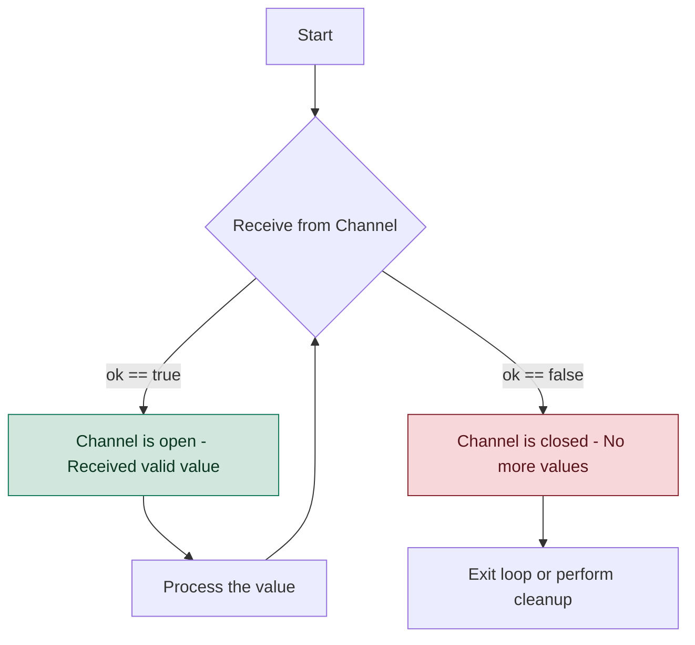
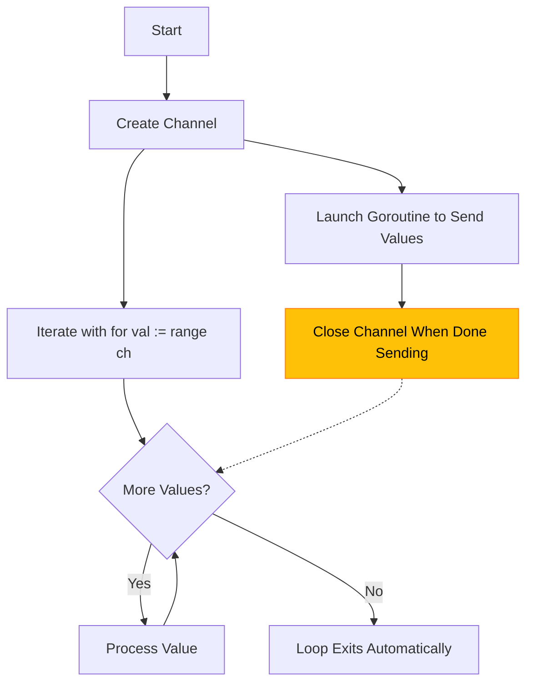
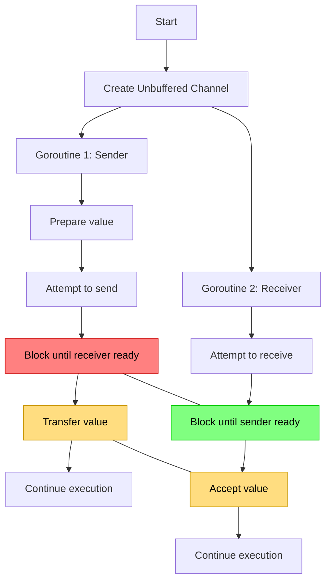
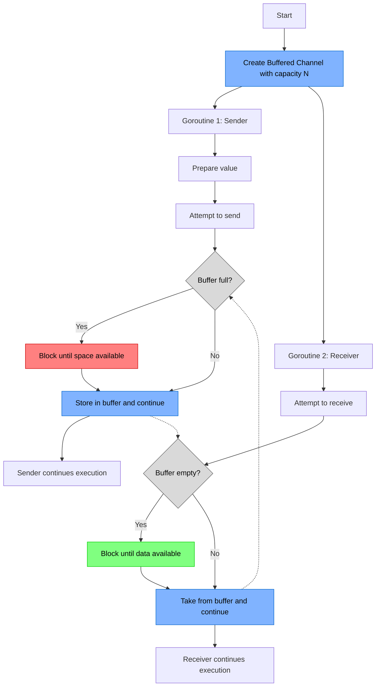
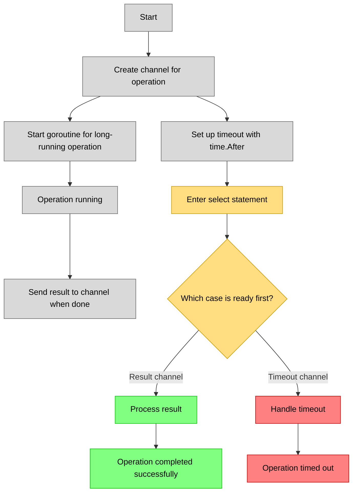
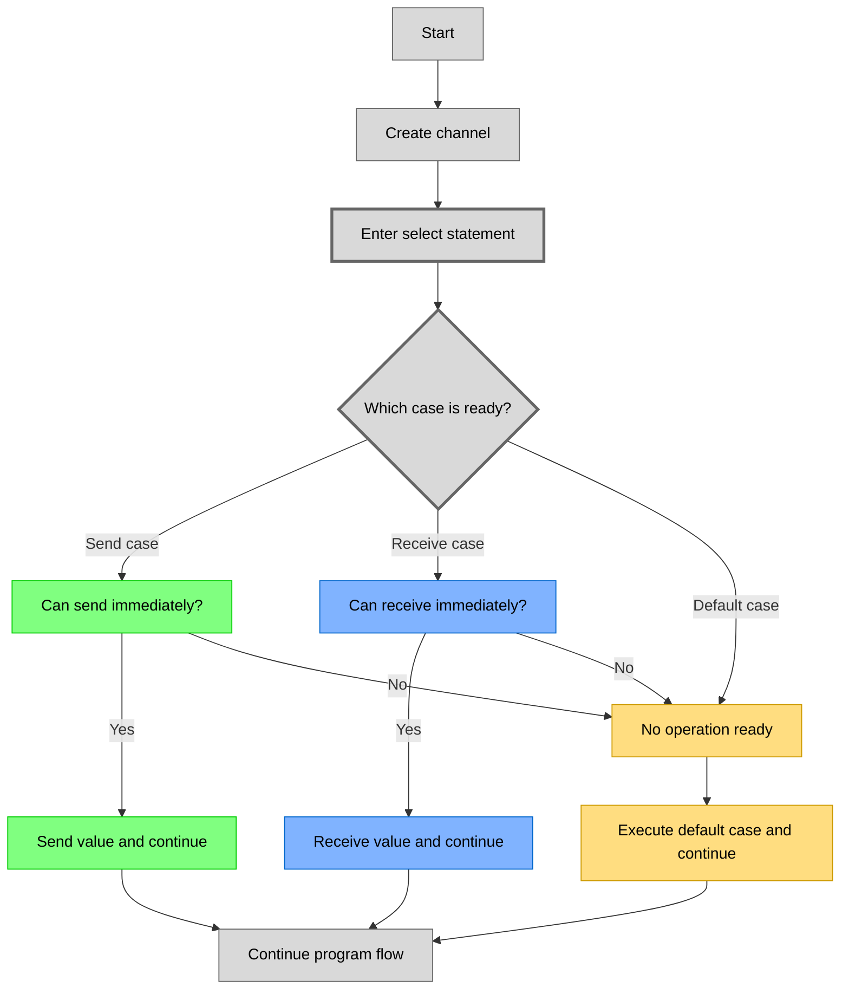
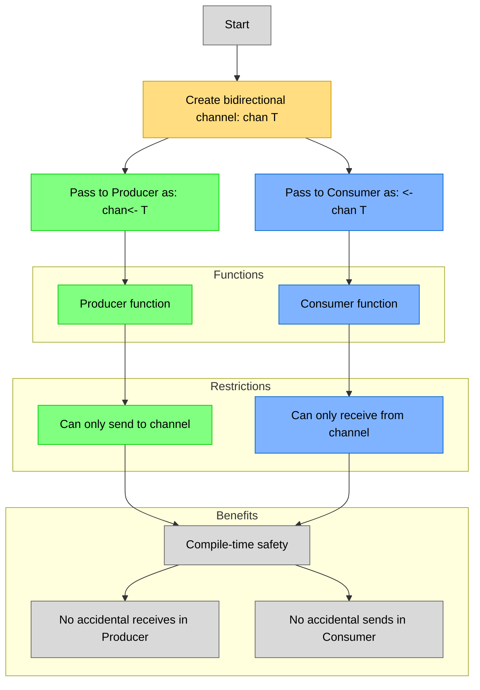

+++
date = '2025-02-21T21:43:05-08:00'
draft = false
title = 'Go Channels: A Concurrency Guide'
tags = ["go", "channels", "concurrency", "parallelism", "fundamentals"]
toc = false
featured_image = "/images/go-learn.svg"
+++

Hello fellow Gophers!

I'm absolutely thrilled to dive deep into one of Go's most elegant features: **Channels**! If you're just starting your Go journey or looking to level up your concurrency game, you're in for a treat.

Channels are the communication mechanism that makes goroutines work together efficiently and safely. They enable goroutines to exchange data without shared memory, reducing the risk of race conditions.

I hate to use an analogy here, but imagine you have a team of engineers working on some big company project.. let's call it Kilonova.

For project Kilonova to be complete, your engineers need to meet to chat and exchange information, along with completing their work. Channels are that method of meeting. They are an area where your goroutines—I mean engineers can communicate to complete Kilonova. Without channels, it would be like the team of engineers never talk to each other and go about working in silos (and we all know how well that works out! 😅).


Analogy out of the way, this blog post is full of material because I have tons of notes (I use [Obsidian](https://obsidian.md/) btw) on Go Channels. Let's dive in.

## Table of Contents
- [Understanding Go Channels](#understanding-go-channels)
  - [Basic Channel Operations](#basic-channel-operations)
  - [Example: Sending and Receiving Data](#example-sending-and-receiving-data)
- [Detecting Closed Channels](#detecting-closed-channels)
  - [Example: Checking if a Channel is Open](#example-checking-if-a-channel-is-open)
  - [Common Gotcha: Sending on Closed Channels](#common-gotcha-sending-on-closed-channels)
- [Iterating Over Channels with `range`](#iterating-over-channels-with-range)
  - [Example: Using range with Channels](#example-using-range-with-channels)
- [Unbuffered Channels: Synchronous Communication](#unbuffered-channels-synchronous-communication)
  - [Example: Unbuffered Channel in Action](#example-unbuffered-channel-in-action)
  - [When to Use Unbuffered Channels](#when-to-use-unbuffered-channels)
- [Buffered Channels: Asynchronous Communication](#buffered-channels-asynchronous-communication)
  - [Example: Buffered Channel in Action](#example-buffered-channel-in-action)
  - [Choosing the Right Buffer Size](#choosing-the-right-buffer-size)
- [Select Statement: The Channel Traffic Controller](#select-statement-the-channel-traffic-controller)
  - [Example: Timeouts with Select](#example-timeouts-with-select)
  - [Example: Non-blocking Channel Operations](#example-non-blocking-channel-operations)
- [Channel Direction: Type-Safe Communication](#channel-direction-type-safe-communication)
  - [Example: Using Channel Direction in Functions](#example-using-channel-direction-in-functions)
- [Real-Life Use Cases for Channels](#real-life-use-cases-for-channels)
  - [1. Background Task Processing](#1-background-task-processing)
  - [2. Building a Terminal UI with Charm's Bubble Tea](#2-building-a-terminal-ui-with-charms-bubble-tea)
  - [3. Worker Pool for Efficient Parallel Processing](#3-worker-pool-for-efficient-parallel-processing)
  - [4. Fan-out, Fan-in Pattern](#4-fan-out-fan-in-pattern)
  - [5. Rate Limiting and Throttling](#5-rate-limiting-and-throttling)
- [Advanced Channel Patterns](#advanced-channel-patterns)
  - [Done Channel Pattern](#done-channel-pattern)
  - [Pipeline Pattern](#pipeline-pattern)
  - [Or-Done Channel Pattern](#or-done-channel-pattern)
- [Best Practices and Common Pitfalls](#best-practices-and-common-pitfalls)
  - [Memory Leaks: Forgotten Goroutines](#memory-leaks-forgotten-goroutines)
  - [Deadlocks: The Concurrency Standoff](#deadlocks-the-concurrency-standoff)
  - [Race Conditions: Timing Is Everything](#race-conditions-timing-is-everything)
- [Wrapping Up](#wrapping-up)

---

## Understanding Go Channels

A **channel** in Go is a typed communication conduit that connects concurrent goroutines. Channels implement the "don't communicate by sharing memory; share memory by communicating" philosophy that makes Go concurrency effective and safe.


Channels ensure type-safe communication between goroutines and provide built-in synchronization.


Channels come in two varieties:

- **Unbuffered Channels**: Synchronous communication where sender and receiver must be ready simultaneously
- **Buffered Channels**: Allow sending multiple values without an immediate receiver (up to the buffer capacity)

### Basic Channel Operations

```go
// Creating channels
ch := make(chan string)       // Unbuffered channel of strings
bufferedCh := make(chan int, 10)  // Buffered channel of ints with capacity 10

// Sending values (note the arrow points INTO the channel)
ch <- "I languish"            // Send a string into the channel
bufferedCh <- 42              // Send an int into the buffered channel

// Receiving values (arrow points OUT FROM the channel)
message := <-ch               // Receive a value and assign it
value := <-bufferedCh         // Receive from buffered channel
<-ch                          // Receive and discard the value

// Closing a channel
close(ch)                     // Prevent further sends
```

### Example: Sending and Receiving Data

```go
package main

import (
    "fmt"
    "time"
)

func main() {
    ch := make(chan string)

    // Anonymous function as a goroutine
    go func() {
        // Simulate work with a slight delay
        time.Sleep(100 * time.Millisecond)
        ch <- "Buy more coffee!"
    }()

    // Main goroutine receives the message
    msg := <-ch
    fmt.Println(msg)
}
```

**Output:**
```bash
Buy more coffee!
```

In this example, I'm creating a goroutine that sends a message through the channel after a brief pause (simulating actual work). Meanwhile, the main goroutine waits to receive that message before printing it out.

This demonstrates how channels naturally synchronize concurrent operations without explicit locks or condition variables.

---

## Detecting Closed Channels

When working with channels, determining if a channel has been closed is important! Go provides a two-value assignment idiom for this purpose:

### Example: Checking if a Channel is Open

```go
package main

import "fmt"

func main() {
    jobs := make(chan int, 5)
    done := make(chan bool)

    // Producer goroutine
    go func() {
        for i := 1; i <= 3; i++ {
            jobs <- i
        }
        close(jobs)  // No more jobs to send
        fmt.Println("All jobs sent!")
    }()

    // Consumer goroutine
    go func() {
        for {
            job, more := <-jobs  // Check if channel is still open
            if more {
                fmt.Println("Received job:", job)
            } else {
                fmt.Println("All jobs received!")
                done <- true
                return
            }
        }

    }()

    <-done  // Wait for the worker to finish
}
```

**Output:**
```bash
All jobs sent!
Received job: 1
Received job: 2
Received job: 3
All jobs received!
```

If the code was a little to dense, this flow chart shows the logic:


### Common Gotcha: Sending on Closed Channels

An important fact to remember: **sending on a closed channel causes a panic**.

```go
ch := make(chan int)
close(ch)
ch <- 1  // PANIC: send on closed channel
```

The fix is straightforward: ensure proper coordination of channel closure, typically by having only the sender close the channel.

---

## Iterating Over Channels with `range`

The `range` keyword provides an elegant way to receive values from a channel until it's closed.

### Example: Using range with Channels

```go
package main

import "fmt"

func main() {
    ch := make(chan string, 3)

    // Send some messages and close
    go func() {
        messages := []string{"Orange", "LaCroix", "Cat"}
        for _, msg := range messages {
            ch <- msg
        }
        close(ch)  // Important! Range needs this to stop
    }()

    // Receive with range - much cleaner!
    for msg := range ch {
        fmt.Println("Got message:", msg)
    }

    fmt.Println("Channel closed, no more messages.")
}
```

**Output:**
```bash
Got message: Orange
Got message: LaCroix
Got message: Cat
Channel closed, no more messages.
```

Using `range` with channels eliminates the need for manual checking with the comma-ok syntax, resulting in more readable code.

Here is a flowchart to help understand the above code:


---

## Unbuffered Channels: Synchronous Communication

Unbuffered channels enforce synchronization between goroutines. They ensure that the sender and receiver rendezvous at the same point in execution.

### Example: Unbuffered Channel in Action

```go
package main

import (
    "fmt"
    "time"
)

func main() {
    ch := make(chan string)  // Unbuffered channel

    go func() {
        fmt.Println("Goroutine: Ready to send message")
        time.Sleep(2 * time.Second)  // Simulate work
        fmt.Println("Goroutine: Sending message...")
        ch <- "Synchronous Message"
        fmt.Println("Goroutine: Message sent!")
    }()

    time.Sleep(1 * time.Second)  // Main thread does other work
    fmt.Println("Main: Ready to receive")
    msg := <-ch  // Will block until sender delivers
    fmt.Println("Main: Received:", msg)
}
```

**Output:**
```bash
Goroutine: Ready to send message
Main: Ready to receive
Goroutine: Sending message...
Goroutine: Message sent!
Main: Received: Synchronous Message
```

The receiver waits for the sender, and the sender doesn't continue until the receiver has taken the message. This demonstrates the synchronization that unbuffered channels provide.

The flowchart breaks down the logic:


### When to Use Unbuffered Channels

Unbuffered channels are particularly useful when:
- You need a strict handshake between goroutines
- The timing of operations is critical
- You want to limit concurrent operations
- You're implementing request/response patterns

---

## Buffered Channels: Asynchronous Communication

Buffered channels add capacity, allowing multiple values to be sent without an immediate receiver.

### Example: Buffered Channel in Action

```go
package main

import (
    "fmt"
    "time"
)

func main() {
    // Buffered channel with room for 2 messages
    ch := make(chan string, 2)

    go func() {
        messages := []string{"First", "Second", "Third"}
        for i, msg := range messages {
            fmt.Printf("Sending message %d: %s\n", i+1, msg)
            ch <- msg
            fmt.Printf("Sent message %d\n", i+1)
        }
    }()

    // Give goroutine time to send messages
    time.Sleep(1 * time.Second)

    // Now receive them all
    for i := 0; i < 3; i++ {
        msg := <-ch
        fmt.Printf("Received: %s\n", msg)
        time.Sleep(500 * time.Millisecond)  // Process each message
    }
}
```

**Output:**
```bash
Sending message 1: First
Sent message 1
Sending message 2: Second
Sent message 2
Sending message 3: Third
Received: First
Received: Second
Sent message 3
Received: Third
```

The first two sends complete immediately, but the third one has to wait until we receive a message and free up buffer space. This demonstrates how buffered channels work.

Logic Flowchart:


### Choosing the Right Buffer Size

Buffer size selection has important implications:

- **Buffer size = 0**: Use when synchronization is required
- **Buffer size = 1**: Use when you want to decouple sender and receiver but still control flow
- **Buffer size = N**: Use when you can predict peak load or want to handle bursts of activity
- **Very large buffers**: Be cautious—they can hide backpressure issues and lead to memory problems

---

## Select Statement: The Channel Traffic Controller

The `select` statement allows a goroutine to wait on multiple channel operations simultaneously.

### Example: Timeouts with Select

```go
package main

import (
    "fmt"
    "time"
)

func main() {
    ch := make(chan string)

    go func() {
        // Simulating a slow operation
        time.Sleep(2 * time.Second)
        ch <- "Operation completed"
    }()

    // Wait with timeout using select
    select {
    case result := <-ch:
        fmt.Println("Success:", result)
    case <-time.After(1 * time.Second):
        fmt.Println("Timeout: operation took too long!")
    }
}
```

**Output:**
```bash
Timeout: operation took too long!
```

The logic for this example is as follows:


This pattern is valuable for preventing goroutines from blocking indefinitely and is commonly used in production services to ensure responsiveness.

### Example: Non-blocking Channel Operations

```go
package main

import "fmt"

func main() {
    ch := make(chan string)

    // Try to receive, but don't block
    select {
    case msg := <-ch:
        fmt.Println("Received:", msg)
    default:
        fmt.Println("No message available")
    }

    // Try to send, but don't block
    select {
    case ch <- "Hello":
        fmt.Println("Sent message")
    default:
        fmt.Println("Cannot send: no receiver ready")
    }
}
```

**Output:**
```bash
No message available
Cannot send: no receiver ready
```

Here's what the non-blocking logic looks like:


The `default` case in `select` makes channel operations non-blocking, which is useful when implementing complex event processing systems.


---

## Channel Direction: Type-Safe Communication

Go allows specifying channel direction in function signatures, providing additional type safety to concurrent code.


### Example: Using Channel Direction in Functions

```go
package main

import (
    "fmt"
    "time"
)

// This function can only send to the channel
func producer(ch chan<- string) {
    for i := 0; i < 3; i++ {
        ch <- fmt.Sprintf("Message %d", i+1)
        time.Sleep(100 * time.Millisecond)
    }
    close(ch)
}

// This function can only receive from the channel
func consumer(ch <-chan string, done chan<- bool) {
    for msg := range ch {
        fmt.Println("Consumed:", msg)
    }
    done <- true
}

func main() {
    ch := make(chan string)
    done := make(chan bool)

    go producer(ch)
    go consumer(ch, done)

    <-done  // Wait for consumer to finish
}
```

**Output:**
```bash
Consumed: Message 1
Consumed: Message 2
Consumed: Message 3
```

We can see the logic as:


Using directional channels (`chan<-` for send-only and `<-chan` for receive-only) adds compile-time safety. The compiler prevents accidental sends on receive-only channels and vice versa.

---

## Real-Life Use Cases for Channels

Here are practical scenarios where channels prove invaluable:

### 1. Background Task Processing

When building web applications, channels excel at handling tasks that shouldn't block the request-response cycle:

```go
// Simplified example: Image processing service
type ImageProcessor struct {
    tasks chan Task
    results chan Result
    errors chan error
    workers int
}

func NewImageProcessor(workers int) *ImageProcessor {
    ip := &ImageProcessor{
        tasks:   make(chan Task),
        results: make(chan Result),
        errors:  make(chan error),
        workers: workers,
    }

    ip.Start()
    return ip
}

func (ip *ImageProcessor) Start() {
    for i := 0; i < ip.workers; i++ {
        go func(workerID int) {
            for task := range ip.tasks {
                fmt.Printf("Worker %d processing image: %s\n", workerID, task.ImageID)

                // Process image (resize, filter, etc.)
                if err := processImage(task); err != nil {
                    ip.errors <- err
                    continue
                }

                ip.results <- Result{TaskID: task.ID, Status: "completed"}
            }
        }(i)
    }
}

func (ip *ImageProcessor) ProcessAsync(task Task) {
    ip.tasks <- task
}
```

I implemented a similar pattern in a photo-sharing application. The web server immediately returned a "processing" status to the client while the actual image manipulation happened asynchronously via channels.

### 2. Building a Terminal UI with Charm's Bubble Tea

[Bubble Tea](https://github.com/charmbracelet/bubbletea) is a framework for terminal UIs (TUIs) that uses a message-passing model with channels under the hood. I LOVE Bubble Tea for TUIs. I created an amazing TUI last year using Bubble Tea and gave it a retro name. Alas, I cannot share that code, but I can provide you this basic example.

```go
package main

import (
    "fmt"
    "time"
    "github.com/charmbracelet/bubbletea"
)

// Define our model
type model struct {
    messages chan string
    log      []string
    loading  bool
}

// Initialize the model
func (m model) Init() bubbletea.Cmd {
    return func() bubbletea.Msg {
        time.Sleep(2 * time.Second)
        return loadedMsg("Initial data loaded")
    }
}

// Define messages
type tickMsg time.Time
type loadedMsg string
type errorMsg struct{ err error }

// Update the model based on messages
func (m model) Update(msg bubbletea.Msg) (bubbletea.Model, bubbletea.Cmd) {
    switch msg := msg.(type) {
    case loadedMsg:
        m.loading = false
        m.log = append(m.log, string(msg))
        return m, nil

    case tickMsg:
        return m, nil

    case errorMsg:
        m.loading = false
        m.log = append(m.log, "Error: "+msg.err.Error())
        return m, nil
    }

    return m, nil
}

// Render the UI
func (m model) View() string {
    if m.loading {
        return "Loading...\n"
    }

    s := "Activity Log:\n"
    for _, entry := range m.log {
        s += fmt.Sprintf("• %s\n", entry)
    }
    return s + "\nPress Ctrl+C to quit"
}

func main() {
    initialModel := model{
        messages: make(chan string),
        loading:  true,
    }

    p := bubbletea.NewProgram(initialModel)
    if err := p.Start(); err != nil {
        fmt.Println("Error running program:", err)
    }
}
```

### 3. Worker Pool for Efficient Parallel Processing

Worker pools are a classic use case for channels, allowing you to process multiple tasks concurrently while controlling resource usage:

```go
package main

import (
    "fmt"
    "sync"
    "time"
)

// Task represents work to be done
type Task struct {
    ID      int
    Payload string
}

// Result represents completed work
type Result struct {
    TaskID    int
    Output    string
    Completed time.Time
}

func worker(id int, tasks <-chan Task, results chan<- Result, wg *sync.WaitGroup) {
    defer wg.Done()

    for task := range tasks {
        fmt.Printf("Worker %d processing task %d\n", id, task.ID)

        // Simulate varying processing times
        processingTime := time.Duration(task.ID*200) * time.Millisecond
        time.Sleep(processingTime)

        // Send the result back
        results <- Result{
            TaskID:    task.ID,
            Output:    fmt.Sprintf("Processed: %s", task.Payload),
            Completed: time.Now(),
        }
    }
}

func main() {
    // Create channels for tasks and results
    tasks := make(chan Task, 10)
    results := make(chan Result, 10)

    // Launch a pool of workers
    numWorkers := 3
    var wg sync.WaitGroup

    // Start workers
    for i := 1; i <= numWorkers; i++ {
        wg.Add(1)
        go worker(i, tasks, results, &wg)
    }

    // Send work
    go func() {
        for i := 1; i <= 9; i++ {
            tasks <- Task{
                ID:      i,
                Payload: fmt.Sprintf("Task data %d", i),
            }
        }
        close(tasks)  // No more tasks to send
    }()

    // Start a goroutine to close results channel when all workers done
    go func() {
        wg.Wait()
        close(results)
    }()

    // Collect results
    for result := range results {
        fmt.Printf("Result: task %d completed at %v with output: %s\n",
            result.TaskID, result.Completed.Format("15:04:05.000"), result.Output)
    }
}
```

This pattern is great for services that need to make many API calls or database queries in parallel. It's more efficient than sequential processing while still controlling resource usage by limiting concurrency.

### 4. Fan-out, Fan-in Pattern

This pattern distributes work to multiple goroutines and then combines their results:

```go
package main

import (
    "fmt"
    "sync"
)

func generator(nums ...int) <-chan int {
    out := make(chan int)
    go func() {
        for _, n := range nums {
            out <- n
        }
        close(out)
    }()
    return out
}

func square(in <-chan int) <-chan int {
    out := make(chan int)
    go func() {
        for n := range in {
            out <- n * n
        }
        close(out)
    }()
    return out
}

func merge(cs ...<-chan int) <-chan int {
    var wg sync.WaitGroup
    out := make(chan int)

    // Start an output goroutine for each input channel
    output := func(c <-chan int) {
        for n := range c {
            out <- n
        }
        wg.Done()
    }

    wg.Add(len(cs))
    for _, c := range cs {
        go output(c)
    }

    // Start a goroutine to close out once all output goroutines are done
    go func() {
        wg.Wait()
        close(out)
    }()

    return out
}

func main() {
    in := generator(1, 2, 3, 4, 5, 6, 7, 8, 9, 10)

    // Distribute work to 3 goroutines that all read from in
    c1 := square(in)
    c2 := square(in)
    c3 := square(in)

    // Consume the merged output from c1, c2, and c3
    for result := range merge(c1, c2, c3) {
        fmt.Println(result)
    }
}
```

This pattern is powerful for data processing pipelines, especially when different stages have different performance characteristics.

### 5. Rate Limiting and Throttling

Channels are excellent for implementing rate limiters:

```go
package main

import (
    "fmt"
    "time"
)

// RateLimiter limits the frequency of operations
type RateLimiter struct {
    ticker *time.Ticker
    tokens chan struct{}
    quit   chan struct{}
}

func NewRateLimiter(rate time.Duration) *RateLimiter {
    rl := &RateLimiter{
        ticker: time.NewTicker(rate),
        tokens: make(chan struct{}, 1), // Buffer of 1 for non-blocking operations
        quit:   make(chan struct{}),
    }

    // Start the token generator
    go func() {
        for {
            select {
            case <-rl.ticker.C:
                // Try to add a token
                select {
                case rl.tokens <- struct{}{}:
                    // Token added
                default:
                    // Buffer full, token dropped
                }
            case <-rl.quit:
                rl.ticker.Stop()
                return
            }
        }
    }()

    return rl
}

func (rl *RateLimiter) Wait() {
    <-rl.tokens
}

func (rl *RateLimiter) Stop() {
    close(rl.quit)
}

func main() {
    // Create a rate limiter allowing one operation per second
    limiter := NewRateLimiter(time.Second)
    defer limiter.Stop()

    // Simulate making rate-limited API calls
    for i := 1; i <= 5; i++ {
        limiter.Wait() // This blocks until a token is available
        fmt.Printf("%s: Performing operation %d\n",
            time.Now().Format("15:04:05"), i)
    }
}
```

I wonder if AWS's IAM Identity Center's APIs have something like this implemented. Their UI is not built for speed and my Go solutions just get rate limited...

---

## Advanced Channel Patterns

Several channel patterns solve specific concurrency challenges:

### Done Channel Pattern

The "done channel" pattern provides a clean way to signal cancellation to multiple goroutines:

```go
package main

import (
    "fmt"
    "time"
)

func worker(id int, jobs <-chan int, done <-chan struct{}) {
    for {
        select {
        case <-done:
            fmt.Printf("Worker %d shutting down\n", id)
            return
        case job, ok := <-jobs:
            if !ok {
                return // Channel closed
            }
            fmt.Printf("Worker %d started job %d\n", id, job)
            time.Sleep(500 * time.Millisecond)
            fmt.Printf("Worker %d finished job %d\n", id, job)
        }
    }
}

func main() {
    jobs := make(chan int, 10)
    done := make(chan struct{})

    // Start workers
    for i := 1; i <= 3; i++ {
        go worker(i, jobs, done)
    }

    // Send some jobs
    for j := 1; j <= 5; j++ {
        jobs <- j
    }

    // Wait a bit then terminate all workers
    time.Sleep(1500 * time.Millisecond)
    close(done)

    // Give them time to shut down
    time.Sleep(500 * time.Millisecond)
    fmt.Println("All workers shut down")
}
```

This pattern is essential for graceful shutdowns and cancellations in production services.

### Pipeline Pattern

The pipeline pattern connects stages of processing with channels:

```go
package main

import "fmt"

func generator(max int) <-chan int {
    out := make(chan int)
    go func() {
        for i := 1; i <= max; i++ {
            out <- i
        }
        close(out)
    }()
    return out
}

func square(in <-chan int) <-chan int {
    out := make(chan int)
    go func() {
        for n := range in {
            out <- n * n
        }
        close(out)
    }()
    return out
}

func odd(in <-chan int) <-chan int {
    out := make(chan int)
    go func() {
        for n := range in {
            if n%2 != 0 {
                out <- n
            }
        }
        close(out)
    }()
    return out
}

func sum(in <-chan int) <-chan int {
    out := make(chan int)
    go func() {
        total := 0
        for n := range in {
            total += n
        }
        out <- total
        close(out)
    }()
    return out
}

func main() {
    // Create a pipeline: generate numbers -> square them -> keep odd ones -> sum them
    result := sum(odd(square(generator(10))))

    // Get the final result
    fmt.Println("Sum of odd squares:", <-result)
}
```

Each stage focuses on a single responsibility, making the code modular and easy to test.

### Or-Done Channel Pattern

This pattern allows waiting for multiple events but exiting when the first one occurs or when a cancellation signal arrives:

```go
package main

import (
    "fmt"
    "time"
)

func orDone(done <-chan struct{}, c <-chan string) <-chan string {
    valStream := make(chan string)
    go func() {
        defer close(valStream)
        for {
            select {
            case <-done:
                return
            case v, ok := <-c:
                if !ok {
                    return
                }
                select {
                case valStream <- v:
                case <-done:
                    return
                }
            }
        }
    }()
    return valStream
}

func main() {
    done := make(chan struct{})

    // Simulate services that complete at different times
    serviceA := make(chan string)
    serviceB := make(chan string)
    serviceC := make(chan string)

    go func() {
        time.Sleep(2 * time.Second)
        serviceA <- "Service A completed"
        close(serviceA)
    }()

    go func() {
        time.Sleep(1 * time.Second)
        serviceB <- "Service B completed"
        close(serviceB)
    }()

    go func() {
        time.Sleep(3 * time.Second)
        serviceC <- "Service C completed"
        close(serviceC)
    }()

    // Monitor all services with the orDone pattern
    for val := range orDone(done, serviceB) {
        fmt.Println(val)
        // We got a result, so cancel the operation
        close(done)
    }

    fmt.Println("Operation completed or canceled")
}
```

This pattern is valuable when waiting for the first of several concurrent operations to complete.

---

## Best Practices and Common Pitfalls

### Memory Leaks: Forgotten Goroutines

A common issue in Go is launching goroutines without ensuring they terminate:

```go
// DON'T do this in production code
func processRequest(req Request) {
    go func() {
        // This goroutine might never terminate if the channel is never read from
        results <- process(req)
    }()
    // No way to cancel or wait for completion
}
```

Always provide a way to terminate goroutines, especially in long-running applications:

```go
// Better approach
func processRequest(req Request, ctx context.Context) {
    go func() {
        select {
        case <-ctx.Done():
            return // Cancellation signal received
        case results <- process(req):
            // Successfully sent result
        }
    }()
}
```

### Deadlocks: The Concurrency Standoff


Deadlocks occur when goroutines are waiting for each other in a circular dependency. Go's runtime will detect some deadlocks:

```go
func main() {
    ch := make(chan int)
    ch <- 1  // Will deadlock immediately - nobody is receiving
    fmt.Println(<-ch)
}
```

**Output:**
```
fatal error: all goroutines are asleep - deadlock!
```

Another sneaky source of deadlocks is **nil channels**. A nil channel blocks forever and can cause your program to hang silently:
```go
func main() {
    var ch chan string  // Declared but not initialized - nil channel

    go func() {
        // This will block forever because sending on a nil channel blocks forever
        ch <- "This message will never be sent"
        fmt.Println("This will never print")
    }()

    time.Sleep(1 * time.Second)
    fmt.Println("Program continues while goroutine is blocked")

    // This will also block forever - receiving from a nil channel
    msg := <-ch
    fmt.Println("This will never be reached:", msg)
}
```

Notice the declaration of the channel. I read somewhere online that `make` is your friend and you should always use it when using either a `chan` or `map`. Let's take a look at the wrong vs right way to implement this:
```go
// WRONG - might leave channel as nil
var ch chan string
if someCondition {
    ch = make(chan string)
}

// RIGHT - always initialize, control behavior differently
ch := make(chan string)
if !someCondition {
    // Maybe close it immediately or use a separate flag
    close(ch)
}
```

To avoid deadlocks:

1. Ensure proper channel initialization and closure
2. Use timeouts and contexts for bounded waiting
3. Be cautious with nested channel operations
4. Consider buffered channels when appropriate
5. Make sure receives have matching sends (and vice versa)
6. Use the race detector and thorough testing to identify potential deadlocks

### Race Conditions: Timing Is Everything

Race conditions occur when multiple goroutines access shared data without proper synchronization:

```go
func main() {
    counter := 0
    var wg sync.WaitGroup

    for i := 0; i < 1000; i++ {
        wg.Add(1)
        go func() {
            defer wg.Done()
            counter++  // RACE CONDITION: unsynchronized access
        }()
    }

    wg.Wait()
    fmt.Println("Counter:", counter)  // Will likely be less than 1000
}
```

Channels provide a safer approach to shared state:

```go
func main() {
    counter := 0
    var wg sync.WaitGroup
    ch := make(chan int, 100)  // Buffered channel for performance

    // Counter manager goroutine
    go func() {
        for _ = range ch {
            counter++
        }
    }()

    // Worker goroutines
    for i := 0; i < 1000; i++ {
        wg.Add(1)
        go func() {
            defer wg.Done()
            ch <- 1  // Send increment signal
        }()
    }

    wg.Wait()
    close(ch)  // Signal that no more increments are coming

    // Allow time for processing remaining channel items
    time.Sleep(time.Millisecond * 10)
    fmt.Println("Final counter:", counter)  // Will be exactly 1000
}
```

Using a dedicated goroutine to manage state and communicating with it via channels eliminates race conditions by ensuring only one goroutine modifies the shared state.

## Wrapping Up

Go channels transform concurrent programming from a complex, error-prone endeavor into an elegant, manageable process. By enforcing the philosophy of "communicating by sharing memory" rather than "sharing memory to communicate," Go helps developers build robust concurrent systems with fewer bugs.

Key takeaways:
1. **Unbuffered channels** provide synchronization when both sender and receiver need to coordinate
2. **Buffered channels** allow for asynchronous operations with controlled capacity
3. The **select statement** enables managing multiple channels simultaneously
4. **Directional channels** provide compile-time guarantees about channel usage
5. Patterns like **worker pools** and **pipelines** provide reusable solutions to common concurrency challenges

While channels aren't the only concurrency primitive in Go (there's also `sync.Mutex`, `sync.WaitGroup`, and more), they're often the most idiomatic and lead to code that's easier to reason about.

I encourage you to experiment with these patterns in your own code, starting with simple examples and gradually building up to more complex use cases.

Happy concurrent programming, fellow Gophers!
