+++
date = '2025-02-28T22:14:22-08:00'
draft = false
title = 'A Guide to Pointers in Go'
tags = ["go", "pointers", "memory", "fundamentals"]
featured_image = "/images/go-learn.svg"
+++

Let's get real about pointers in Go—they're not the scary beasts you might remember from C (if you came from that CS background). Go's pointer implementation strikes that perfect balance between giving you low-level control and keeping you from shooting yourself in the foot.

## For Python Developers: Why Care About Pointers?

This blog introduces pointers, a fundamental programming concept many developers struggle with. Having worked with numerous senior Cloud Engineers, SREs, and Platform Engineers who, despite years of industry experience, have only Python knowledge and limited exposure to memory management concepts, I've crafted this primer to establish essential context before diving into the main teachings.


If you're coming from Python, you might be wondering why we even need pointers. After all, Python handles everything behind the scenes, right? Well, that's exactly the point - and also the limitation.

In Python, all variables are essentially references to objects. When you pass a variable to a function, you're passing a reference, but you don't get explicit control over whether something is passed by reference or by value. This is why you can modify a list inside a function, but not an integer.

Here's an example:
```python
# In Python, you can change mutable objects in functions
def add_cat(cat_list):
    cat_list.append("Felix")  # This modifies the original list

cats = ["Whiskers", "Mittens"]
add_cat(cats)
print(cats)  # Output: ["Whiskers", "Mittens", "Felix"]

# But you can't change immutable objects
def age_cat(cat_age):
    cat_age += 1  # This creates a new local variable

whiskers_age = 3
age_cat(whiskers_age)
print(whiskers_age)  # Output: 3 (unchanged!)
```

Let's visualize how Python's implicit references differ from Go's explicit pointers:


## So What Are Pointers?

Pointers are variables that store memory addresses. Instead of storing values directly, they point to where those values live in memory. This seemingly simple concept unlocks powerful programming patterns and performance optimizations.


Pointers provide both indirection (accessing a value through its address) and the ability to modify values across function boundaries.


Here's what a pointer looks like in Go code:

```go
var x int = 42
var p *int = &x  // p is a pointer to x
```

The key symbols to understand:

- `&` (address-of operator): Gets the memory address of a variable
- `*` (dereference operator): Gets the value stored at that memory address

Let's visualize the core pointer concept:


## How Go Manages Memory with Pointers

Go's memory model is worth understanding when working with pointers. Unlike C, Go features automatic garbage collection, which means you don't need to manually free memory. This prevents many common pointer-related bugs.

Here's a visualization of Go's memory layout:


In Go:

- **Stack**: Fast memory for local variables (automatically cleaned up when function returns)
- **Heap**: Memory for objects that outlive their creating function
- **Garbage Collector**: Automatically cleans up unreachable objects in the heap

## Setting Up a Go Project for Pointer Experimentation

To follow along with the examples, create a small project structure:

```bash
mkdir pointers-demo
cd pointers-demo
go mod init pointers-demo
touch main.go
```

This creates a minimal Go module where you can experiment with the code examples that follow. We will be editing and running `main.go` throughout.


Remember to run each example with `go run main.go`


## Basic Pointer Examples

Let's start with simple, practical examples of Go pointers in action.

### Example 1: Working with Integer Pointers

```go
package main

import "fmt"

func main() {
    // Create an integer variable
    count := 42

    // Create a pointer to the integer
    countPtr := &count

    // Print the original value
    fmt.Println("Original value:", count)

    // Print the pointer (memory address)
    fmt.Println("Pointer address:", countPtr)

    // Dereference the pointer to get the value
    fmt.Println("Dereferenced value:", *countPtr)

    // Modify the value through the pointer
    *countPtr = 100

    // See that the original variable was changed
    fmt.Println("New value:", count)
}
```

This example demonstrates the core operations of pointers:

1. Creating a variable (`count`)
2. Getting its memory address with `&` (`countPtr`)
3. Accessing the value at that address with `*` (`*countPtr`)
4. Modifying the original value through the pointer by assigning to `*countPtr`

Let's visualize what's happening in memory:


### Example 2: Working with String Pointers

Pointers work with all types in Go, including strings:

```go
package main

import "fmt"

func main() {
    // Create a string variable
    message := "Hello, Go!"

    // Create a pointer to the string
    messagePtr := &message

    // Print original string
    fmt.Println("Original:", message)

    // Modify through pointer
    *messagePtr = "Updated via pointer!"

    // See the changed string
    fmt.Println("Updated:", message)
}
```

When you run this code, you'll see that modifying the string through the pointer affects the original variable. This works because the pointer gives direct access to the memory where `message` is stored.

The memory visualization:


### Example 3: Pointers to Structs


Struct pointers are extremely common in Go for modifying complex data types:

```go
package main

import "fmt"

// Define a simple struct
type Cat struct {
    Name     string
    Age      int
    Breed    string
}

func main() {
    // Create a cat struct
    whiskers := Cat{
        Name:  "Whiskers",
        Age:   3,
        Breed: "Maine Coon",
    }

    // Create a pointer to the struct
    whiskersPtr := &whiskers

    // Print original struct
    fmt.Println("Original:", whiskers)

    // Access and modify using pointer
    // Go allows direct field access with struct pointers
    whiskersPtr.Age = 4

    // This is equivalent to (*whiskersPtr).Age = 4

    // See the changed struct
    fmt.Println("Updated:", whiskers)
}
```

Go provides syntax sugar for working with struct pointers. Notice that we can use `whiskersPtr.Age` instead of needing to write `(*whiskersPtr).Age`. This convenience makes working with struct pointers much more readable.

Let's visualize the struct pointer:


## Function Parameters and Pointers

One of the most common uses of pointers in Go is to modify values within functions:

```go
package main

import "fmt"

// This function modifies the cat via a pointer
func celebrateBirthday(c *Cat) {
    c.Age++
    fmt.Println("Happy Birthday, " + c.Name + "! You are now", c.Age)
}

type Cat struct {
    Name     string
    Age      int
    Breed    string
}

func main() {
    mittens := Cat{
        Name:  "Mittens",
        Age:   2,
        Breed: "Tabby",
    }

    fmt.Println("Before:", mittens)

    // Pass a pointer to the cat
    celebrateBirthday(&mittens)

    fmt.Println("After:", mittens)
}
```

Without pointers, Go is pass-by-value, meaning functions receive copies of arguments. By passing a pointer, you're enabling the function to modify the original value. The `celebrateBirthday` function can directly modify the `Person` struct passed to it.

The function flow:

```mermaid
%%{init: {'theme':'dark'}}%%
flowchart LR
    style main fill:#8B5CF6,stroke:#A78BFA,color:#FFFFFF,font-weight:bold
    style func fill:#EC4899,stroke:#F472B6,color:#FFFFFF,font-weight:bold
    style mittens fill:#F97316,stroke:#FB923C,color:#FFFFFF,font-weight:bold
    style cParam fill:#10B981,stroke:#34D399,color:#FFFFFF,font-weight:bold

    main["main() function"]
    func["celebrateBirthday() function"]
    mittens["mittens: Cat<br>Age: 2 → 3"]
    cParam["c *Cat<br>(points to mittens)"]

    main -->|"call with &mittens"| func
    main --- mittens
    func --- cParam
    cParam -->|"modifies"| mittens
```



## Nil Pointers and Safety

Pointers in Go have a zero value of `nil`, which requires careful handling:

```go
package main

import "fmt"

func main() {
    var ptr *int  // Declared but not initialized

    fmt.Println("Nil pointer:", ptr)

    // Safety check before dereferencing
    if ptr != nil {
        fmt.Println("Value:", *ptr)
    } else {
        fmt.Println("Cannot dereference nil pointer!")
    }

    // Initialize the pointer
    value := 42
    ptr = &value

    // Now safe to dereference
    fmt.Println("Value after initialization:", *ptr)
}
```

Always check if a pointer is `nil` before dereferencing it. Attempting to dereference a `nil` pointer will cause a runtime panic, which crashes your program.

Visualizing nil pointer safety:


## Advanced Pointer Example: Custom Data Structure with Pointers

Let's build a simple linked list, one of the classic data structures that relies on pointers:

```go
package main

import "fmt"

// CatNode represents a node in a linked list of cats
type CatNode struct {
    Name  string
    Age   int
    Next  *CatNode  // Pointer to the next cat node
}

// CatList represents a linked list of cats
type CatList struct {
    Head *CatNode
}

// AddCat adds a new cat node to the end of the list
func (l *CatList) AddCat(name string, age int) {
    newCat := &CatNode{Name: name, Age: age}

    if l.Head == nil {
        l.Head = newCat
        return
    }

    current := l.Head
    for current.Next != nil {
        current = current.Next
    }

    current.Next = newCat
}

// PrintCats prints all cats in the list
func (l *CatList) PrintCats() {
    current := l.Head

    for current != nil {
        fmt.Printf("%s (age %d) -> ", current.Name, current.Age)
        current = current.Next
    }

    fmt.Println("nil")
}

func main() {
    // Create a new cat list
    catList := CatList{}

    // Add cat nodes
    catList.AddCat("Whiskers", 3)
    catList.AddCat("Mittens", 2)
    catList.AddCat("Felix", 5)

    // Print the list
    catList.PrintCats()  // Output: Whiskers (age 3) -> Mittens (age 2) -> Felix (age 5) -> nil
}
```

This example demonstrates how pointers enable the creation of a linked list data structure:

1. Each `CatNode` contains cat information and a pointer to the next node
2. The `CatList` has a pointer to the head cat node
3. The `AddCat` method traverses the list using pointers
4. The `PrintCats` method also traverses the list with pointers

Without pointers, implementing a linked list would be significantly more complex, if not im-paw-ssible.

## When to Use Pointers in Go

Here's a decision guide for when pointers make the most sense:



Use pointers when you need to modify a value, when working with large data structures, or when you need to represent the absence of a value with `nil`.


## Common Pitfalls with Pointers


While Go's pointers are safer than those in C/C++, there are still some common mistakes to avoid:

1. **Forgetting to check for nil**: Always check if a pointer is `nil` before dereferencing it. (I'm definitely guilty of failing to do this on projects)
2. **Returning pointers to stack variables**: Don't return pointers to local variables, as they become invalid when the function returns.
3. **Unnecessary pointer usage**: Using pointers for small, simple values can actually be less efficient due to indirection and garbage collection overhead.
4. **Pointer arithmetic**: Go intentionally does not support pointer arithmetic to prevent buffer overflows and other memory corruption issues.

## Wrapping Up

Pointers in Go provide a powerful way to work with memory directly without the complexity and danger often associated with pointers in languages like C. They enable efficient memory usage and allow you to implement complex data structures like linked lists, trees, and graphs.

Key takeaways:

- Pointers store memory addresses, not values
- Use `&` to get an address, `*` to get the value at an address
- Pointers enable call-by-reference for modifying values in functions
- The zero value of a pointer is `nil`
- Always check for nil before dereferencing
- Pointers are crucial for implementing data structures like linked lists

By now, you should have a solid understanding of how pointers work in Go and be ready to use them in your projects. Start simple, experiment, and gradually incorporate these concepts into your Go programming toolkit.
