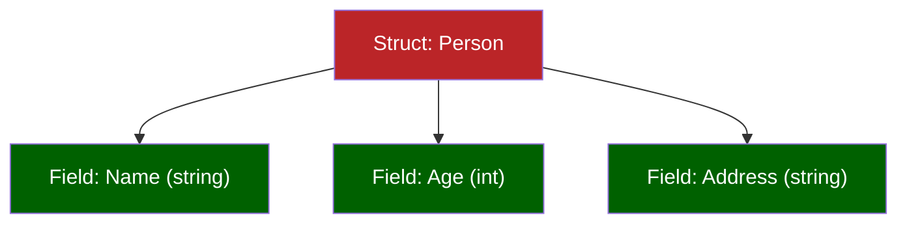
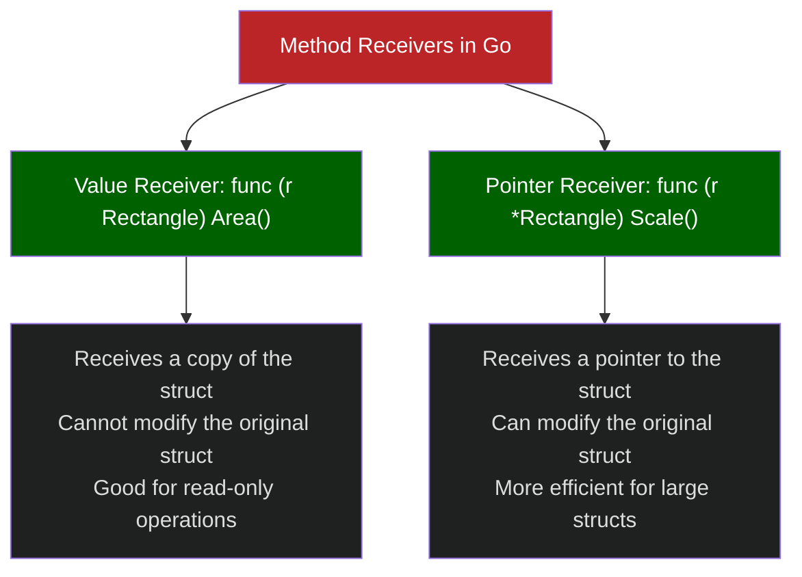
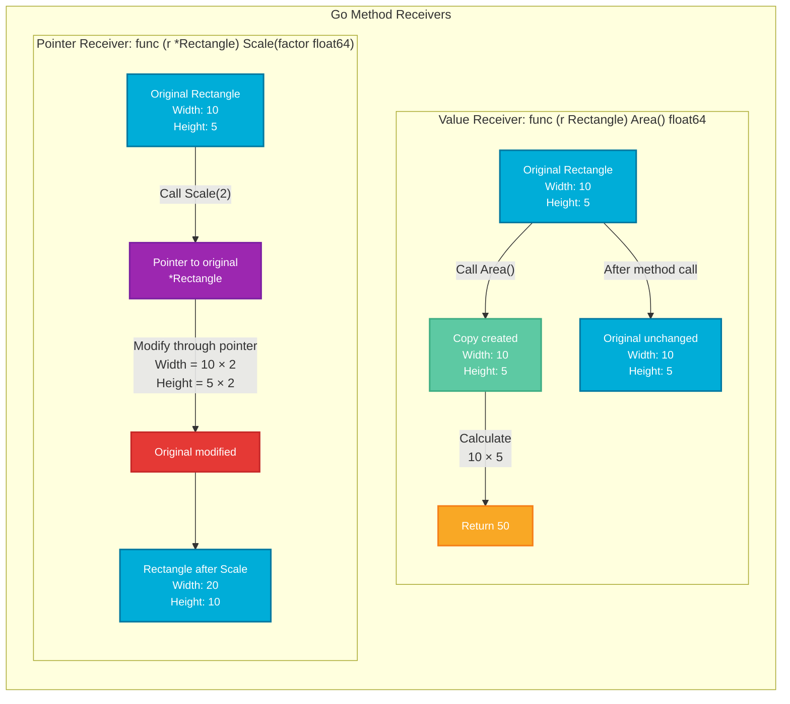

+++
date = '2025-03-28T21:45:06-07:00'
draft = false
title = "Structs Fundamentals: From Basics to Advanced Usage"
tags = ["go", "programming", "data-structures", "fundamentals"]
featured_image = "/images/gophers/go-learn.svg"
+++

If you've been diving into Go programming (or "Golang" as the cool kids say), you've definitely encountered structs. They're absolutely fundamental to how we organize and work with data in Go, and mastering them is crucial to writing clean, efficient Go code.

I like to teach about structs, like other fundamentals, because of how powerful structs can be when used properly. Let's break down everything you need to know about structs, from the very basics to some advanced patterns I've learned the hard way.

## What Are Structs in Go?


At their core, structs in Go are composite data types that group together variables (called fields) under a single name. If you're coming from object-oriented languages, you might think of them as similar to classes, but with some key differences that make Go... well, Go!

 Unlike classes in OOP languages, Go structs don't support inheritance. This is by design - Go favors composition over inheritance, which leads to more straightforward, less entangled code. 

Let's visualize the basic concept of a struct:



In Go, structs serve several important purposes:

- Grouping related data together
- Creating custom types
- Implementing interfaces
- Enabling method attachment
- Providing encapsulation

## Setting Up a Go Project with Structs

Let's start by setting up a simple Go project where we'll explore structs. First, create a new directory and initialize a Go module:

```bash
mkdir go-structs-tutorial
cd go-structs-tutorial
go mod init github.com/yourusername/go-structs-tutorial
```

Now, let's create our first file with a basic struct example:

`main.go`

```go
package main

import (
	"fmt"
)

// Person is a struct that represents a human
type Person struct {
	Name    string
	Age     int
	Address string
}

func main() {
	// Creating a new Person
	p := Person{
		Name:    "John Doe",
		Age:     30,
		Address: "123 Main St",
	}

	fmt.Println("Person:", p)
}
```

Run the code with:

```bash
go run main.go
```

And you should see output like:

```
Person: {John Doe 30 123 Main St}
```

## Basic Usage of Structs

Now that we understand what structs are, let's explore some common ways to use them.

### Declaring and Initializing Structs

There are several ways to create structs in Go:

`examples/initialization.go`

```go
package main

import "fmt"

type Employee struct {
	ID        int
	FirstName string
	LastName  string
	Role      string
}

func main() {
	// Method 1: Specify all fields in order
	emp1 := Employee{1, "Jacob", "Strawberry", "Developer"}

	// Method 2: Use field names (recommended for clarity)
	emp2 := Employee{
		ID:        2,
		FirstName: "Theo",
		LastName:  "Mahindra",
		Role:      "SRE",
	}

	// Method 3: Create an empty struct and assign fields later
	var emp3 Employee
	emp3.ID = 3
	emp3.FirstName = "Michael"
	emp3.LastName = "Michaelson"
	emp3.Role = "Manager"

	// Method 4: Using the new() function (returns a pointer)
	emp4 := new(Employee)
	emp4.ID = 4
	emp4.FirstName = "Sarah"
	emp4.LastName = "Conner"
	emp4.Role = "Director"

	fmt.Println("Employee 1:", emp1)
	fmt.Println("Employee 2:", emp2)
	fmt.Println("Employee 3:", emp3)
	fmt.Println("Employee 4:", *emp4) // Dereference the pointer
}
```


 Always use the field-name syntax when initializing structs with many fields. It makes your code more readable and protects against errors when struct definitions change. 

### Accessing and Modifying Struct Fields

Accessing struct fields is straightforward using the dot notation:

`examples/accessing.go`

```go
package main

import "fmt"

type Product struct {
	ID       string
	Name     string
	Price    float64
	InStock  bool
	Quantity int
}

func main() {
	product := Product{
		ID:       "p123",
		Name:     "Mechanical Keyboard",
		Price:    149.99,
		InStock:  true,
		Quantity: 10,
	}

	// Accessing fields
	fmt.Println("Product Name:", product.Name)
	fmt.Println("Price:", product.Price)

	// Modifying fields
	product.Price = 129.99
	product.Quantity = 8

	fmt.Println("Updated Product:", product)
}
```

### Nested Structs

Structs can be embedded within other structs, allowing for complex data structures:

`examples/nested.go`

```go
package main

import "fmt"

type Address struct {
	Street  string
	City    string
	State   string
	ZipCode string
	Country string
}

type Contact struct {
	Email string
	Phone string
}

type Customer struct {
	ID      int
	Name    string
	Address Address
	Contact Contact
}

func main() {
	customer := Customer{
		ID:   1001,
		Name: "Alice Wonderlund",
		Address: Address{
			Street:  "456 Park Ave",
			City:    "New York",
			State:   "NY",
			ZipCode: "10022",
			Country: "USA",
		},
		Contact: Contact{
			Email: "alice@example.com",
			Phone: "212-867-5309",
		},
	}

	fmt.Println("Customer:", customer.Name)
	fmt.Println("Lives in:", customer.Address.City)
	fmt.Println("Contact via:", customer.Contact.Email)
}
```

## Advanced Struct Techniques

Now let's flex with some more intermediate to advanced concepts that make structs in Go truly powerful.

### Struct Embedding and Composition

Go promotes composition over inheritance, and struct embedding is one of the main tools for this:

`examples/embedding.go`

```go
package main

import "fmt"

type Entity struct {
	ID        int
	CreatedAt string
	UpdatedAt string
}

// User embeds Entity
type User struct {
	Entity              // Embedded struct (anonymous field)
	Username     string
	Email        string
	PasswordHash string
}

// Post embeds Entity
type Post struct {
	Entity           // Same embedded struct
	Title      string
	Content    string
	AuthorID   int
}

func main() {
	user := User{
		Entity: Entity{
			ID:        1,
			CreatedAt: "2025-03-26T10:00:00Z",
			UpdatedAt: "2025-03-26T10:00:00Z",
		},
		Username:     "gopher",
		Email:        "gopher@golang.org",
		PasswordHash: "hash123",
	}

	// Direct access to embedded fields
	fmt.Println("User ID:", user.ID) // Not user.Entity.ID
	fmt.Println("Username:", user.Username)

	post := Post{
		Entity: Entity{
			ID:        101,
			CreatedAt: "2025-03-26T11:30:00Z",
			UpdatedAt: "2025-03-26T11:30:00Z",
		},
		Title:    "Understanding Go Structs",
		Content:  "Go structs are awesome...",
		AuthorID: user.ID,
	}

	fmt.Println("Post Title:", post.Title)
	fmt.Println("Created At:", post.CreatedAt)
}
```

 With embedded structs, the fields of the embedded struct become "promoted" to the outer struct, allowing direct access. This is a powerful feature for building composable types in Go. 

### Adding Methods to Structs

One of the most powerful features of structs is the ability to attach methods to them:

`examples/methods.go`

```go
package main

import (
	"fmt"
	"strings"
)

type Rectangle struct {
	Width  float64
	Height float64
}

// Area is a method of Rectangle
func (r Rectangle) Area() float64 {
	return r.Width * r.Height
}

// Perimeter is a method of Rectangle
func (r Rectangle) Perimeter() float64 {
	return 2 * (r.Width + r.Height)
}

// Scale modifies the receiver
func (r *Rectangle) Scale(factor float64) {
	r.Width *= factor
	r.Height *= factor
}

type Person struct {
	FirstName string
	LastName  string
	Age       int
}

// FullName returns the person's full name
func (p Person) FullName() string {
	return p.FirstName + " " + p.LastName
}

// IsAdult checks if the person is an adult
func (p Person) IsAdult() bool {
	return p.Age >= 18
}

func main() {
	rect := Rectangle{Width: 10, Height: 5}
	fmt.Printf("Rectangle: %+v\n", rect)
	fmt.Println("Area:", rect.Area())
	fmt.Println("Perimeter:", rect.Perimeter())

	rect.Scale(2)
	fmt.Printf("After scaling: %+v\n", rect)
	fmt.Println("New area:", rect.Area())

	person := Person{
		FirstName: "Go",
		LastName:  "Gopher",
		Age:       13,
	}

	fmt.Println("Name:", person.FullName())
	fmt.Println("Is adult:", person.IsAdult())
}
```

The difference between value receivers and pointer receivers is crucial to understand:



 Use pointer receivers when you need to modify the struct or when the struct is large to avoid copying. Use value receivers for immutable operations on smaller structs. 

Another diagram to visualize this would be:



## Event Sourcing with Structs

Let's build a more complex example to demonstrate the power of structs in a real-world scenario (or perhaps a coding exam).
For example, you get tasked to build a banking system. It must handle opening an account, depositing money, and withdrawing money.
We'll implement a simple event sourcing system for the bank system here:

`examples/event_sourcing.go`

```go
package main

import (
	"errors"
	"fmt"
	"time"
)

// Event represents a domain event
type Event struct {
	ID        string
	Type      string
	Timestamp time.Time
	Data      map[string]interface{}
}

// Account represents a bank account
type Account struct {
	ID            string
	Owner         string
	Balance       float64
	OpenedAt      time.Time
	Events        []Event
	EventHandlers map[string]func(*Account, Event) error
}

// NewAccount creates a new account
func NewAccount(id, owner string, initialBalance float64) *Account {
	now := time.Now()
	account := &Account{
		ID:       id,
		Owner:    owner,
		Balance:  0,
		OpenedAt: now,
		Events:   []Event{},
		EventHandlers: map[string]func(*Account, Event) error{
			"account_opened":  handleAccountOpened,
			"money_deposited": handleMoneyDeposited,
			"money_withdrawn": handleMoneyWithdrawn,
		},
	}

	// Create and apply the account_opened event
	account.ApplyEvent(Event{
		ID:        fmt.Sprintf("%s-1", id),
		Type:      "account_opened",
		Timestamp: now,
		Data: map[string]interface{}{
			"owner":           owner,
			"initial_balance": initialBalance,
		},
	})

	return account
}

// ApplyEvent applies an event to the account
func (a *Account) ApplyEvent(event Event) error {
	handlerFunc, exists := a.EventHandlers[event.Type]
	if !exists {
		return errors.New("unknown event type")
	}

	if err := handlerFunc(a, event); err != nil {
		return err
	}

	// Store the event
	a.Events = append(a.Events, event)
	return nil
}

// Deposit adds money to the account
func (a *Account) Deposit(amount float64) error {
	if amount <= 0 {
		return errors.New("deposit amount must be positive")
	}

	return a.ApplyEvent(Event{
		ID:        fmt.Sprintf("%s-%d", a.ID, len(a.Events)+1),
		Type:      "money_deposited",
		Timestamp: time.Now(),
		Data: map[string]interface{}{
			"amount": amount,
		},
	})
}

// Withdraw removes money from the account
func (a *Account) Withdraw(amount float64) error {
	if amount <= 0 {
		return errors.New("withdrawal amount must be positive")
	}

	if a.Balance < amount {
		return errors.New("insufficient funds")
	}

	return a.ApplyEvent(Event{
		ID:        fmt.Sprintf("%s-%d", a.ID, len(a.Events)+1),
		Type:      "money_withdrawn",
		Timestamp: time.Now(),
		Data: map[string]interface{}{
			"amount": amount,
		},
	})
}

// Event handlers
func handleAccountOpened(a *Account, e Event) error {
	a.Owner = e.Data["owner"].(string)
	a.Balance = e.Data["initial_balance"].(float64)
	return nil
}

func handleMoneyDeposited(a *Account, e Event) error {
	amount := e.Data["amount"].(float64)
	a.Balance += amount
	return nil
}

func handleMoneyWithdrawn(a *Account, e Event) error {
	amount := e.Data["amount"].(float64)
	if a.Balance < amount {
		return errors.New("insufficient funds")
	}
	a.Balance -= amount
	return nil
}

// Reconstruct rebuilds the account state from events
func ReconstructAccount(id string, events []Event) (*Account, error) {
	if len(events) == 0 {
		return nil, errors.New("no events to reconstruct from")
	}

	// Create a blank account
	account := &Account{
		ID: id,
		EventHandlers: map[string]func(*Account, Event) error{
			"account_opened":  handleAccountOpened,
			"money_deposited": handleMoneyDeposited,
			"money_withdrawn": handleMoneyWithdrawn,
		},
	}

	// Apply all events
	for _, event := range events {
		handlerFunc, exists := account.EventHandlers[event.Type]
		if !exists {
			return nil, errors.New("unknown event type")
		}

		if err := handlerFunc(account, event); err != nil {
			return nil, err
		}

		account.Events = append(account.Events, event)
	}

	return account, nil
}

func main() {
	// Create a new account
	account := NewAccount("acc123", "John Doe", 1000.00)
	fmt.Printf("Account created: %+v\n", account)

	// Deposit some $$
	err := account.Deposit(500.00)
	if err != nil {
		fmt.Println("Error:", err)
	}

    // Now withdraw some $$
	err = account.Withdraw(200.00)
	if err != nil {
		fmt.Println("Error:", err)
	}

	fmt.Printf("Final account state: %+v\n", account)
	fmt.Println("Balance:", account.Balance)
	fmt.Println("Number of events:", len(account.Events))

	// Show event history
	fmt.Println("\nEvent History:")
	for i, event := range account.Events {
		fmt.Printf("%d: [%s] %s at %s\n",
			i+1,
			event.Type,
			event.ID,
			event.Timestamp.Format(time.RFC3339),
		)
	}

	// Demonstrate reconstruction
	fmt.Println("\nReconstructing account from events...")
	reconstructedAccount, err := ReconstructAccount("acc123", account.Events)
	if err != nil {
		fmt.Println("Error:", err)
	} else {
		fmt.Printf("Reconstructed account: %+v\n", reconstructedAccount)
		fmt.Println("Reconstructed balance:", reconstructedAccount.Balance)
	}
}
```

This example demonstrates some powerful features of Go structs:

- Composition of different data types
- Method receivers to implement behavior
- Using maps to store function handlers
- Complex business logic using structs

The event sourcing pattern is perfect for showing how structs can model both data and behavior in Go applications.

## Wrapping Up

Structs are one of Go's most fundamental and powerful features. They provide a clean, efficient way to structure your data and implement behavior in Go applications.

We've covered:

- Basic struct definition and initialization
- Accessing and modifying struct fields
- Nested and embedded structs
- Adding methods to structs
- Advanced patterns with a real-world example

Remember, in Go, composition is favored over inheritance, and structs are the primary tool for composition. Mastering structs will take your Go programming to the next level.

 While structs are incredibly powerful, they're just one part of Go's type system. Interfaces work hand-in-hand with structs to create flexible, decoupled code. Consider exploring interfaces as your next step in mastering Go. 

## References

- [Go Documentation - Structs](https://golang.org/doc/effective_go.html#structs)
- [Go Tour - Structs](https://tour.golang.org/moretypes/2)
- [Go by Example: Structs](https://gobyexample.com/structs)
- [The Go Programming Language Specification](https://golang.org/ref/spec)
