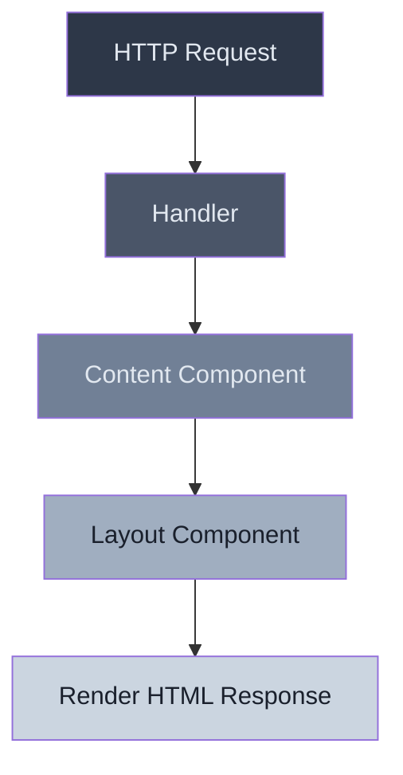

+++
date = '2025-03-21T19:50:55-07:00'
draft = false
title = 'Modern Templating for Go with Templ'
tags = ['html', 'go', 'htmx', 'templating', 'templ', 'webdev']
+++


I've been working on a handful of personal webdev Go projects, and the one thing I could never wrap my head around was [Templ](https://github.com/a-h/templ). I would start the project and go, "Oh no. I need a UI for this. Not everything can be made into a TUI... or can it..". This would lead me to looking at the Templ docs, not understanding how to implement it, and either use the embed package (I LOVE [embed](https://pkg.go.dev/embed)!) or starting a TypeScript frontend, creating a bunch of tsx files and coming to the sudden realization that I gave in to React.


Templ brings type-safe, component-based HTML templating to the Go ecosystem. When paired with [HTMX](https://htmx.org/) (Yes, I did try the GoTH stack sans Templ and thoroughly enjoyed it), it creates a powerful combination for building interactive web applications with minimal JavaScript.

For those of us who appreciate Go's simplicity and performance but struggle with the frontend story, Templ represents something of a holy grail. It's the missing puzzle piece that completes the picture of what modern Go web development can be.

Before discovering Templ, I bounced between various unsatisfying options:

1. Standard library templates: Powerful but stringly-typed and prone to runtime errors
2. Pure JavaScript frontends: "Two applications" syndrome
3. Embedding HTML (and raw handcrafted artisan JS): Simple but not scalable or maintainable

Each approach left me feeling like I was making a compromise. Templ finally offered a path that felt aligned with Go's philosophy – strong typing, compile-time validation, and composition over inheritance.

I'm still early in my journey with Templ, but for the first time, I feel like I'm building web UIs the "Go way" instead of fighting against the language or surrendering to the JavaScript ecosystem. And that feels right.

## What is Templ?

Templ is a templating language and compiler for Go that focuses on type safety and composition. Unlike traditional templating engines that rely on string-based templates, Templ treats templates as first-class Go code.

Here's what makes Templ stand out from the crowd:

- **Type Safety**: Templ templates are compiled to Go code, which means type errors are caught at compile-time, not runtime.
- **Component-Based**: If you're used to the whole component structure, you'll love this. Build reusable components that compose together naturally.
- **Go Integration**: Seamlessly integrate with your existing Go code and ecosystem.
- **Performance**: Templates compile down to efficient Go code that renders the HTML.
- **HTMX-Friendly**: Pairs perfectly with HTMX for building interactive interfaces with minimal JavaScript.

## Installation and Project Setup

Getting started with Templ is straightforward. You'll need two things:

1. The Templ command-line tool (compiler)
2. The Templ runtime library

Let's install both:

```bash
# Install the Templ CLI
go install github.com/a-h/templ/cmd/templ@latest

# Add the runtime to your project
go get github.com/a-h/templ
```

### Project Structure

From a high-level, our Templ project structure will look similar to this (sans the actual completed server for this blog post):

```
example-templ-project/
├── cmd/
│   └── server/
│       └── main.go          # Application entry point
├── internal/
│   ├── components/          # Generated Go code (don't edit these!)
│   │   └── views_templ.go
│   ├── handlers/
│   │   ├── http.go          # HTTP handlers
│   │   └── routes.go        # Route setup
│   ├── models/
│   │   └── model.go         # Domain models
│   ├── services/
│   │   └── service.go       # Business logic
│   └── views/               # Generated Go code (don't edit these!)
│       └── views_templ.go
├── scripts/                 # Includes any bash scripts for build/gen
├── templates/
│   ├── components/
│   │   ├── card.templ       # Reusable UI components
│   │   ├── layout.templ
│   │   └── nav.templ
│   ├── pages/
│   │   ├── home.templ       # Page templates
│   │   └── about.templ
│   └── views/               # Content
│       ├── sample.templ
│       └── content.templ
├── .air.toml
├── .gitignore
├── go.mod
├── go.sum
└── Makefile
```

Keep your `.templ` files and their generated `.go` files in separate packages to avoid circular dependencies. The generated code should be in a different package from your application code.


In a Go + Templ project, it's important to follow these principles:

1. **Separation of Concerns**: Keep templates, handlers, and business logic separated
2. **Component-Based Design**: Break down UIs into reusable components
3. **Clean Generation**: Generated code should be ignored in version control
4. **Idiomatic Go**: Follow standard Go project layouts and conventions

To make this process easier, let's create the following:
- A `generate-templ.sh` for generating `.templ` files and putting our templated `_templ.go` files under our `internal/` directory.
- A `Makefile` to simplify our all our commands.
- A `.air.toml` for using Air to hot reload our app as we work on it.

#### Scripting Templ Generating

First let's create the script.

```bash
mkdir -p scripts
touch scripts/generate-templ.sh
chmod +x scripts/generate-templ.sh
```

And inside the script you'll want to add the following contents:

```bash
#!/bin/bash

# Find all templ files
find ./templates -name "*.templ" | while read -r src_file; do
    # Calculate destination path
    rel_path=${src_file#./templates/}
    dir_name=$(dirname "$rel_path")
    file_name=$(basename "$rel_path")
    dest_dir="./internal/$dir_name"

    # Create output directory
    mkdir -p "$dest_dir"

    # Run templ on the file and capture output
    templ generate -f "$src_file" -stdout > "$dest_dir/${file_name%.templ}_templ.go"
done
```

This simple script will make it easy to generate the files from `templates/` to `internal/`.

#### Setting up the Makefile

Now you'll want to add the compilation step to your build process. Let's create a `Makefile` under the root of the directory. A good Makefile might look like this:

```makefile
.PHONY: generate build run clean dev

generate:
	./scripts/generate-templ.sh

build: generate
	go build -o bin/server ./cmd/server

run: build
	./bin/server

# Default example if none specified
# This is added because our example project will have multiple cmd targets
# Usage: make dev CMD_DIR=greeting-example
CMD_DIR ?= server
dev:
	CMD_DIR=$(CMD_DIR) air

clean:
	rm -rf bin/
	find ./templates -name "*_templ.go" -type f -delete

```

Now we can run `make generate` over and over and over. Although, this next step will make it unnecessary with the use of Air.

#### Setup Air TOML


Many developers use [Air](https://github.com/cosmtrek/air) for hot reloading during development. It can be configured to recompile your Templ files and restart your server when changes are detected.


First we want to install Air.

```bash
go install github.com/air-verse/air@latest
```

And now create the `.air.toml` in the root directory. The contents will look like:

```toml
root = "."
tmp_dir = "tmp"

[build]
  cmd = "./scripts/generate-templ.sh && go build -o ./tmp/main ./cmd/${CMD_DIR}"
  bin = "./tmp/main"
  include_ext = ["go", "templ"]
  exclude_regex = ["_templ.go"]
  delay = 1000
  exclude_dir = ["assets", "tmp", "vendor"]

[screen]
  clear_on_rebuild = true
```

This config will let us generate and build every time the files are modified. It leverages our bash script and makes it dynamic for the multiple commands that we will be creating under `cmd/`.

## Coding the Project

Let's start with some basic examples to get a feel for how Templ works with some cat-themed examples.


### Your First Templ View

Create a file named `greeting.templ` under `templates/views/`:

```bash
mkdir -p templates/views
touch templates/views/greeting.templ
```

Create the following content:

```go
// Create this under `templates/views/greeting.templ`
package views

templ CatGreeting(catName string) {
	<div>
		<h1>Hello, {catName}!</h1>
		<p>Welcome to the Templ demo</p>
	</div>
}
```

Run the Templ compiler to generate Go code:

```bash
make generate
```

This will create a file called `greeting_templ.go` (found under `internal/views/`) that contains the compiled Go code for your template.

Now you can use your template in a Go HTTP handler. Let's create a `main.go` to test our code. Let's do some setup.

```bash
mkdir -p cmd/greeting-example
touch cmd/greeting-example/main.go
```

Inside the contents:

```go
// Remember to create under `cmd/greeting-example/main.go`
package main

import (
	"net/http"

	"example-templ-project/templates/views"
	"github.com/a-h/templ"
)

func main() {
	http.Handle("/", templ.Handler(views.CatGreeting("Whiskers")))

	http.ListenAndServe(":8080", nil)
}
```

And now we can run it with:

```bash
make dev CMD_DIR=greeting-example
```

Visiting `localhost:8080` in your browser will show off our example!

### Component Composition

One of Templ's strengths is composition. Here's how you can compose templates. First let's create a component:

```bash
mkdir -p templates/components
touch templates/components/layout.templ
```

Add the following content to create our reusable component under `templates/components/layout.templ`:

```go
package components

templ CatLayout(title string) {
	<!DOCTYPE html>
	<html>
		<head>
			<title>{title}</title>
			<!-- HTMX for interactivity without JavaScript -->
			<script src="https://unpkg.com/htmx.org@1.9.6"></script>
			<style>
				body {
					font-family: system-ui, sans-serif;
					max-width: 800px;
					margin: 0 auto;
					padding: 1rem;
					background-color: #fffaf5;
				}
				.cat-container {
					border: 2px solid #ffb74d;
					border-radius: 8px;
					padding: 1rem;
					margin-bottom: 1rem;
				}
				.cat-paw {
					cursor: pointer;
					display: inline-block;
					transition: transform 0.2s;
				}
				.cat-paw:hover {
					transform: rotate(10deg);
				}
			</style>
		</head>
		<body>
			<header>
				<span class="cat-paw">🐾</span> <strong>Templ Demo</strong>
			</header>
			{ children... }
		</body>
	</html>
}
```

This will allow us to add HTMX and a simple box. Now let's use our component in a view! Create `templates/views/composition.templ`:

```go
package views

import "example-templ-project/internal/components"

templ CatContent(title string) {
	@components.CatLayout(title) {
		<main>
			<div class="cat-container">
				<h1>Welcome to my catalog of templates</h1>
				<p>This is an amazing demo of Templ with HTMX.</p>
			</div>
		</main>
	}
}

```

Now let's test it all with an example command. Create the following `cmd/composition-example/main.go` with the following content:

```go
package main

import (
	"net/http"

	"github.com/a-h/templ"

	"example-templ-project/internal/views"
)

func main() {
	http.Handle("/", templ.Handler(views.CatContent("Cat Page!")))

	http.ListenAndServe(":8080", nil)
}
```

We can run this on `localhost:8080` with:

```bash
make dev CMD_DIR=composition-example
```

Here's a diagram showing the component composition flow:



### Conditional Rendering

Templ supports conditional rendering using Go's own control structures. For this, let's make use of our compositional to load htmx and let's create a `templates/views/conditional.templ`:

```go
package views

import "example-templ-project/internal/components"

templ CatTreatingContent(catName string, hasTreats bool) {
    <div id="cat-treating" class="cat-container">
        if hasTreats {
            <h1>Thank you for the treats, {catName}!</h1>
            <div>
                <span>😻 Happy cat is happy!</span>
                <button hx-post="/conditional?hasTreats=false" hx-target="#cat-treating" hx-swap="outerHTML" class="treat-button">
                    Reset
                </button>
            </div>
        } else {
            <h1>Hello, {catName}!</h1>
            <div>
                <button hx-post="/conditional?hasTreats=true" hx-target="#cat-treating" hx-swap="outerHTML" class="treat-button">
                    Give Treats
                </button>
            </div>
        }
    </div>
}

templ CatTreatingPage(catName string, hasTreats bool) {
    @components.CatLayout("Treats") {
        @CatTreatingContent(catName, hasTreats)
    }
}

```

Next we need to create the example command for this. Setup `cmd/iteration-example/main.go` to have the following contents:

```go
package main

import (
	"net/http"

	"github.com/a-h/templ"

	"example-templ-project/internal/views"
)

func main() {
	http.Handle("/", templ.Handler(views.CatContent("Cat Page!")))
	http.HandleFunc("/conditional", func(w http.ResponseWriter, r *http.Request) {
		if r.Method == "GET" {
			// Full page with layout for initial load
			views.CatTreatingPage("Whiskers", false).Render(r.Context(), w)
		} else {
			// Just the content for HTMX requests
			hasTreats := r.URL.Query().Get("hasTreats") == "true"
			views.CatTreatingContent("Whiskers", hasTreats).Render(r.Context(), w)
		}
	})

	http.ListenAndServe(":8080", nil)
}

```

Remember to change the `CMD_DIR` for testing this.

```bash
make dev CMD_DIR=conditional-example
```


Notice how we've added an HTMX-powered button that makes a POST request to `/conditional` and will swap its own HTML with the server response. This is how HTMX enables interactivity without writing JavaScript.


### Iteration

Iterating over collections is just as intuitive, although this example has quite a bit going on. Let's create `templates/views/iteration.templ`:

```go
package views

import (
  "fmt"

  "example-templ-project/internal/components"
)

type Cat struct {
	ID       int
	Name     string
	Breed    string
	Naps     int
	FavToy   string
}

templ CatList(cats []Cat) {
	<div class="cat-collection">
		<h2>Cat Collection</h2>
		<ul>
			for _, cat := range cats {
				<li id={"cat-" + fmt.Sprint(cat.ID)} class="cat-item">
					<strong>{cat.Name}</strong> - {cat.Breed}
					<div>Naps today: {fmt.Sprintf("%d", cat.Naps)}</div>
					<div>Favorite toy: {cat.FavToy}</div>
					<button
						hx-get={"/pet-cat/" + fmt.Sprint(cat.ID)}
						hx-target={"#cat-" + fmt.Sprint(cat.ID)}
						hx-swap="outerHTML"
					>
						Pet {cat.Name}
					</button>
				</li>
			}
		</ul>
	</div>
}

templ CatPage(cats []Cat, hasTreats bool) {
	@components.CatLayout("Cat Paradise") {
		<main>
			<div id="treats-section">
				@CatTreatingSection(hasTreats)
			</div>

			<div class="cat-collection">
				<h2>Cat Collection</h2>
				<ul>
					for _, cat := range cats {
						@CatListItem(cat)
					}
				</ul>
			</div>
		</main>
	}
}

// Treatments section component
templ CatTreatingSection(hasTreats bool) {
	<div id="treats-section" class="cat-container">
		if hasTreats {
			<h2>Treats are available! 🍤</h2>
			<div>
				<span>😻 All cats are happy!</span>
				<button
					hx-post="/treats?hasTreats=false"
					hx-target="#treats-section"
					hx-swap="outerHTML"
					class="treat-button">
					Put Treats Away
				</button>
			</div>
		} else {
			<h2>No treats currently</h2>
			<div>
				<button
					hx-post="/treats?hasTreats=true"
					hx-target="#treats-section"
					hx-swap="outerHTML"
					class="treat-button">
					Give Treats to All Cats
				</button>
			</div>
		}
	</div>
}

// Individual cat item
templ CatListItem(cat Cat) {
	<li id={"cat-" + fmt.Sprint(cat.ID)} class="cat-item">
		<strong>{cat.Name}</strong> - {cat.Breed}
		<div>Naps today: {fmt.Sprintf("%d", cat.Naps)}</div>
		<div>Favorite toy: {cat.FavToy}</div>
		<button
			hx-get={"/pet-cat/" + fmt.Sprint(cat.ID)}
			hx-target={"#cat-" + fmt.Sprint(cat.ID)}
			hx-swap="outerHTML"
			class="treat-button"
		>
			Pet {cat.Name}
		</button>
	</li>
}

```

Let's setup the `cmd/iteration-example/main.go` to handle the HTMX requests:

```go
package main

import (
	"net/http"
	"strconv"

	"example-templ-project/internal/views"
)

var (
	// This is mock data. Generally you would get and update this data with a database
	cats = []views.Cat{
		{ID: 1, Name: "Finn", Breed: "Orange", Naps: 5, FavToy: "Mouse"},
		{ID: 2, Name: "Honey", Breed: "Calico", Naps: 3, FavToy: "String"},
		{ID: 3, Name: "Wonkers", Breed: "Black", Naps: 7, FavToy: "Catnip Ball"},
	}
	globalHasTreats = false
)

func main() {
	http.HandleFunc("/", handleMainPage)
	http.HandleFunc("/pet-cat/", handlePetCat)
	http.HandleFunc("/treats", handleTreats)

	http.ListenAndServe(":8080", nil)
}

func handleMainPage(w http.ResponseWriter, r *http.Request) {
	views.CatPage(cats, globalHasTreats).Render(r.Context(), w)
}

func handlePetCat(w http.ResponseWriter, r *http.Request) {
	idStr := r.URL.Path[len("/pet-cat/"):]
	id, err := strconv.Atoi(idStr)

	if err != nil {
		http.Error(w, "Invalid cat ID", http.StatusBadRequest)
		return
	}

	var targetCat views.Cat
	var found bool

	for i, cat := range cats {
		if cat.ID == id {
			cats[i].Naps++
			targetCat = cats[i]
			found = true
			break
		}
	}

	if !found {
		http.Error(w, "Cat not found", http.StatusNotFound)
		return
	}

	views.CatListItem(targetCat).Render(r.Context(), w)
}

func handleTreats(w http.ResponseWriter, r *http.Request) {
	// Toggle treats state
	hasTreatsParam := r.URL.Query().Get("hasTreats")
	globalHasTreats = (hasTreatsParam == "true")

	views.CatTreatingSection(globalHasTreats).Render(r.Context(), w)
}

```

We can see this in action under `localhost:8080` with:

```bash
make dev CMD_DIR=iteration-example
```

## Wrap Up

Templ represents a significant step forward for Go web development. By bringing a component-based approach with full type safety to Go templates, it addresses many of the pain points developers have faced with traditional templating solutions.

When combined with HTMX, it creates a powerful stack for building interactive web applications with minimal JavaScript.

Here's why you should consider Templ and HTMX for your next Go web project:

1. **Maintainability**: Components are modular, reusable, and composable.
2. **Performance**: Compiled templates are efficient and fast.
3. **Integration**: Works seamlessly with the standard Go HTTP stack.
4. **Interactivity**: HTMX enables dynamic interfaces without complex JavaScript frameworks.

Whether you're building a simple website or a complex web application, Templ's approach to templating aligns perfectly with Go's philosophy of simplicity, type safety, and performance. The idiomatic project structure ensures your code remains maintainable as it grows, while the combination with HTMX lets you create rich, interactive experiences without the complexity of a full JavaScript framework.

Checkout the entire project code in my [github repo](https://github.com/catpaladin/example-templ-project).

Give Templ and HTMX a try for your next Go web project - I think you'll find it's the templating solution you've been waiting for!
