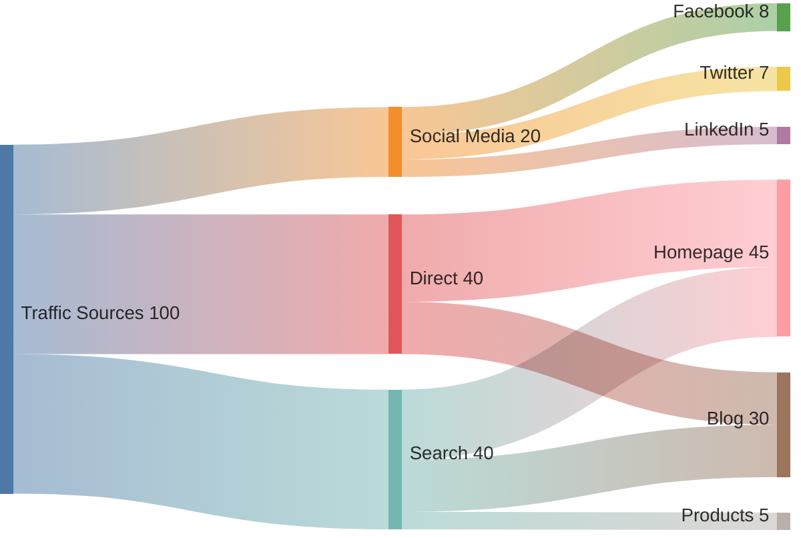
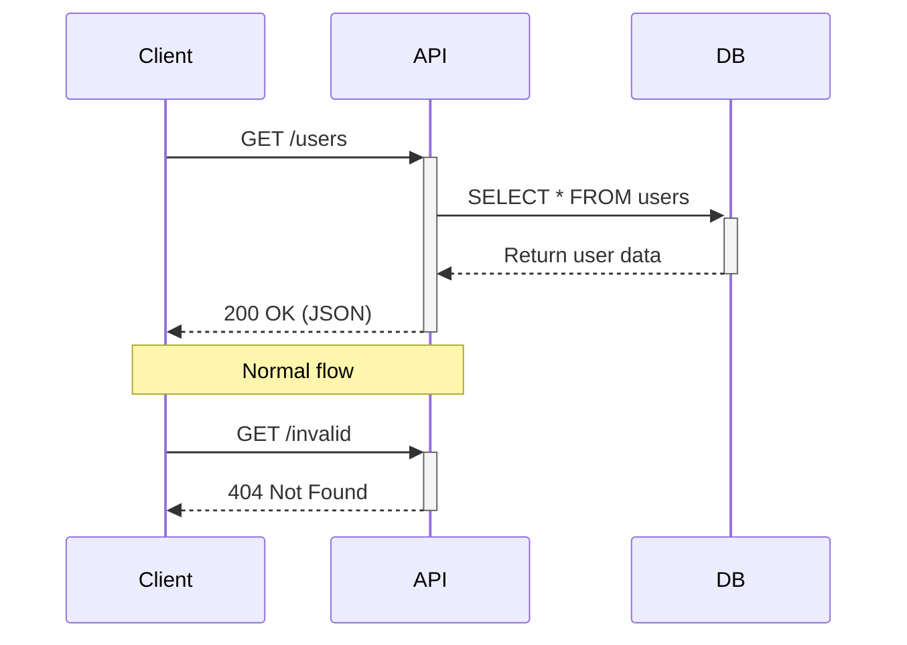
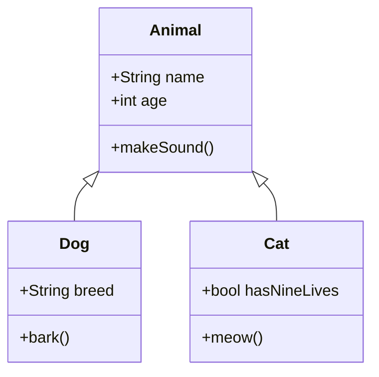
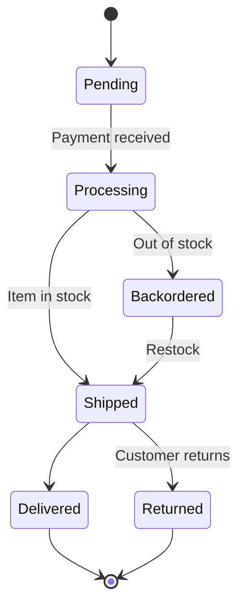
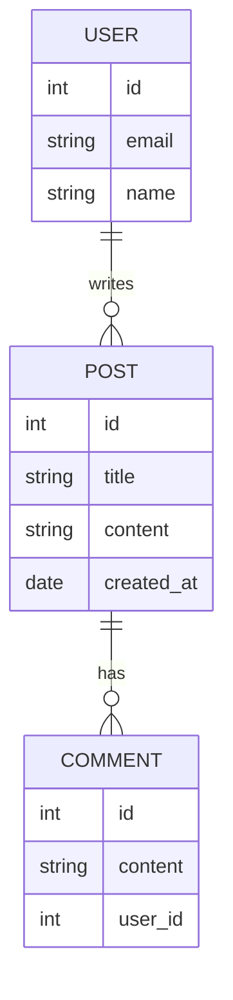
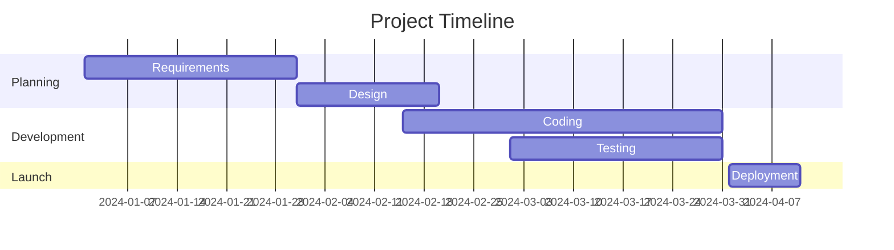
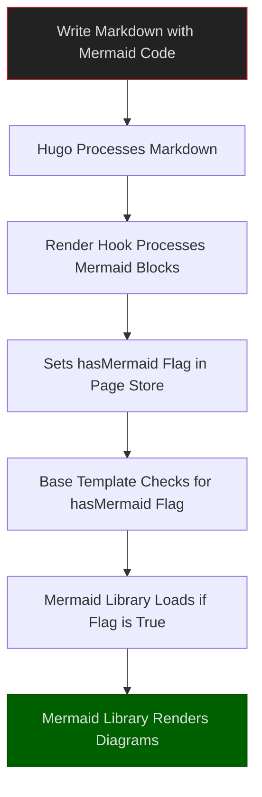
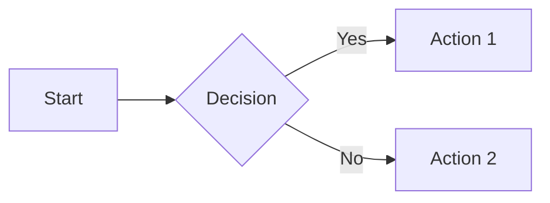

+++
date = '2025-03-01T19:48:53-08:00'
draft = false
title = 'Getting Mermaid Diagrams Working in Hugo'
tags = ["hugo", "mermaid", "blogging"]
featured_image = "/images/go-fish.svg"
+++

Let's be honest: adding Mermaid diagrams to your Hugo site should be straightforward, but it's often a frustrating experience. Most tutorials gloss over the critical theme-specific modifications required, leaving you with broken diagrams and cryptic errors.

After spending way too many hours banging my head against this particular wall with the m10c theme, I'm documenting the actual working solution so you don't have to suffer through the same pain.

## An Intro to Mermaid Through Examples

If you're coming to this blog post and don't know what Mermaid diagrams are, they're a way to create diagrams through code. Here are several visuals to give you an idea of what you can do with Mermaid.

### Sankey Diagrams


````markdown

````

### Sequence Diagrams


````markdown

````

### Class Diagrams


````markdown

````

### State Diagrams


````markdown

````

### Entity Relationship Diagrams


````markdown

````

### Gantt Chart Diagrams


````markdown

````

Nice, huh? Diagrams make it easier for some readers to understand concepts. Through the work in this blog, I was able to implement the same Mermaid codeblocks as in my Obsidian notes.

## The Problem with Standard Hugo Mermaid Tutorials

The [official Hugo documentation](https://gohugo.io/content-management/diagrams/#mermaid-diagrams) provides a basic implementation that works great... if you're using the default theme with no customizations. But let's be real - who does that?

Most of us are using custom themes (like m10c in my case), and that's where things break down. The standard implementation doesn't account for how themes structure their templates and load JavaScript.


The key insight: You need to override your theme's base template, not just add the render hook.


## The Solution: Theme-Specific Implementation

Here's my working implementation for the m10c theme, with explanations of why each part matters:

### Step 1: Create the Base Template Override

First, you need to override your theme's base template. For m10c, that means:

1. Identify the original template: `themes/m10c/layouts/_default/baseof.html`
2. Create your override at: `layouts/_default/baseof.html`
3. Copy the content from the theme's template to your override

### Step 2: Add Mermaid Support to the Base Template

Next, modify your override to include the Mermaid library. Add this code just before the closing `</body>` tag:

```html
<!-- Add Mermaid support - must be placed before closing body tag -->
{{ if .Store.Get "hasMermaid" }}
  <script type="module">
    import mermaid from 'https://cdn.jsdelivr.net/npm/mermaid/dist/mermaid.esm.min.mjs';
    mermaid.initialize({
      startOnLoad: true,
      theme: 'dark',  // Options: default, forest, dark, neutral
      securityLevel: 'loose',
      // Add custom theme properties
      themeVariables: {
        // Primary colors
        primaryColor: '#BB2528',
        primaryTextColor: '#fff',
        primaryBorderColor: '#7C0000',

        // Secondary colors
        secondaryColor: '#006100',
        secondaryTextColor: '#fff',
        secondaryBorderColor: '#004d00',

        // Other colors as needed
        mainBkg: '#1f2020',
        textColor: '#ddd',
        lineColor: '#999',

        // Specific diagram colors
        nodeBorder: '#777',
        titleColor: '#F8F8F8'
      }
    });
  </script>
{{ end }}
```

This code checks if the page has Mermaid content (using Hugo's Store) and only loads the Mermaid library when needed. The custom theme variables ensure your diagrams match your site's dark theme.

### Step 3: Create the Render Hook

Now create a file at `layouts/_default/_markup/render-codeblock-mermaid.html` with the following content:

```html
<pre class="mermaid">
  {{- .Inner | htmlEscape | safeHTML }}
</pre>
{{ .Page.Store.Set "hasMermaid" true }}
```

This render hook does two critical things:

1. Wraps your Mermaid code in the correct HTML structure
2. Sets a flag in the page's Store so the base template knows to load the Mermaid library

## How This Actually Works

Let me explain the process flow with a Mermaid diagram:



The key insight here is that the render hook and base template work together through Hugo's Store mechanism. Without either piece, the system breaks down.

## Using Mermaid in Your Content

With this implementation in place, you can now add Mermaid diagrams to your Markdown content like this:

````markdown

````


Always use the explicit `mermaid` language identifier for your code blocks, not just triple backticks.


## Why Your Theme Matters

Different Hugo themes structure their templates differently. The approach I've outlined works for m10c, but you might need to adjust it for other themes. The general principles remain the same:

1. Override the base template that controls your HTML output
2. Add conditional loading of the Mermaid library based on content
3. Create a render hook that flags pages containing Mermaid code

## Common Pitfalls to Avoid

Here are some issues I encountered that aren't mentioned in most tutorials:

1. **Missing the theme override**: Just adding the render hook isn't enough
2. **Incorrect script loading**: Modern Mermaid uses ES modules, requiring the type="module" attribute
3. **Theme incompatibility**: Dark-themed sites need custom Mermaid styling
4. **Resource loading order**: The Mermaid library must load after your content is ready

## Conclusion

Getting Mermaid diagrams working in Hugo requires understanding how your specific theme handles templates and JavaScript. The solution I've outlined for m10c addresses these theme-specific concerns and provides a robust implementation that works reliably.

By overriding the appropriate templates and leveraging Hugo's Store mechanism, you can seamlessly integrate Mermaid diagrams into your content without fighting with your theme.
