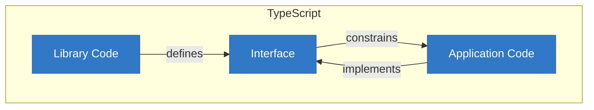
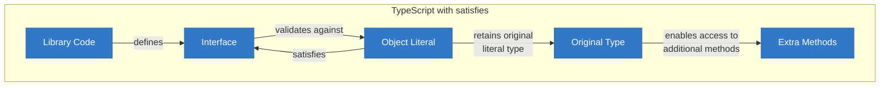
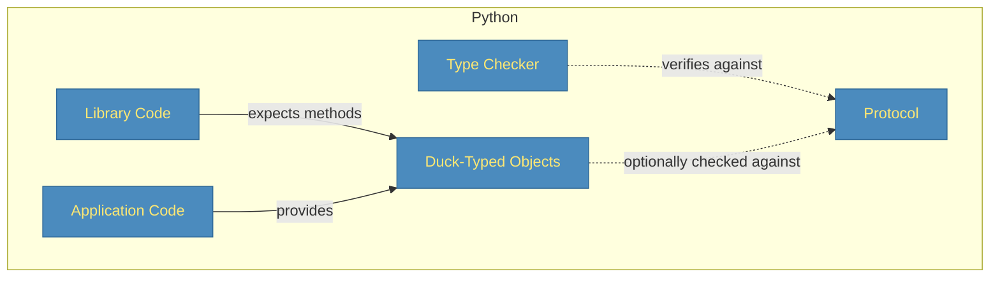
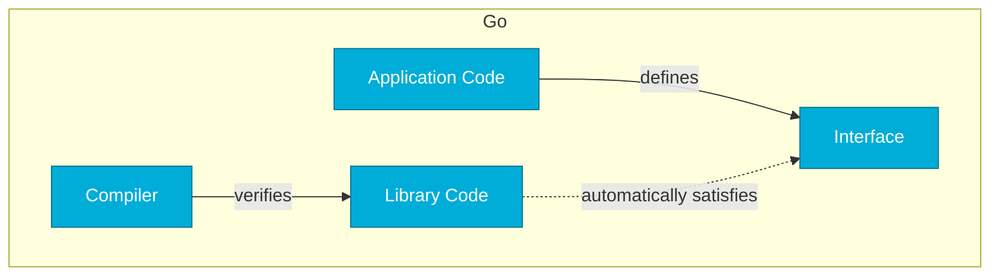
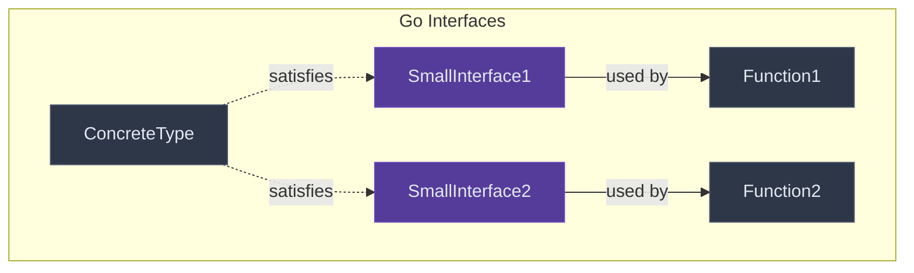
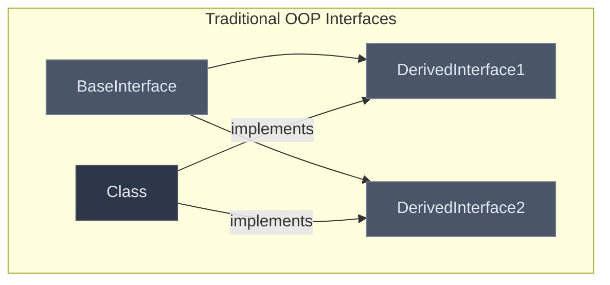
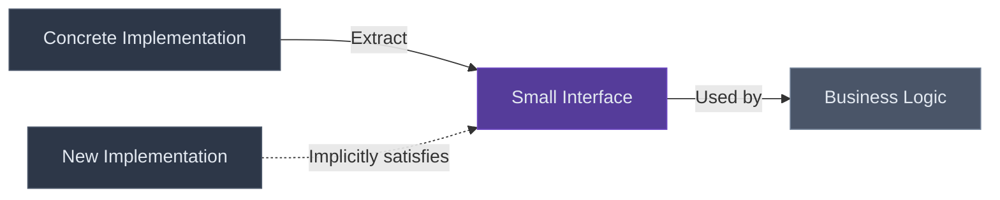

+++
date = '2025-03-14T21:49:18-07:00'
draft = false
title = 'Understanding Go Interfaces'
tags = ["go", "interfaces", "python", "typescript", "mocks", "aws", "fundamentals"]
featured_image = "/images/gophers/go-learn.svg"
+++

I still remember the moment it clicked. I was knee-deep in refactoring a Go CLI (_weekend project_)
for unit testing with mocks, which had become a tangled mess of dependencies when suddenly – 🤯 –
the elegance of Go's interface system hit me like a revelation.

It has been many years, but I remember programming in C#; where interfaces were verbose constructs
that required explicit declarations and implementation hierarchies. But here was Go, silently
composing functionality in a way that felt almost magical.


If you're coming from other languages, Go's interfaces might seem too simple to be powerful. Trust
me, that simplicity is deceptive. It's like discovering that the unassuming Swiss Army knife in your
pocket can also transform into a top of the line commercial espresso grinder (_I wish this was
possible_).

It can be a hard concept for folks. I still remember at a previous job, a couple of coworkers were
complaining to me about another coworker saying, "BlahBlah doesn't understand interfaces. Just look
at the codebase." My opinion on this is that interfaces should be implemented the way they are
designed for their language, and not some anti-pattern. Oh, and yes, BlahBlah did not understand
interfaces for the language. They were using an anti-pattern. 😆

## Interfaces Across Languages: A Tale of Three Approaches

Let's look at how interfaces work across TypeScript, Python, and Go. This should help show the
different ways to implement them. For these examples, I'll use a common thing that engineers will
try to interface; a logger!

### TypeScript: Interfaces as Contracts

TypeScript's interfaces can be done multiple ways. Here is an example of using object literals:

```typescript
// Define an interface
interface Logger {
  log(message: string): void;
  error(message: string): void;
}

// Using an object literal
const fileLogger = {
  log(message: string) {
    // Write to file: info.log
    console.log(`[FILE-INFO] ${message}`);
  },
  error(message: string) {
    // Write to file: error.log
    console.error(`[FILE-ERROR] ${message}`);
  }
};

// The function demands a Logger
function processData(data: string, logger: Logger): void {
  try {
    // Process data...
    logger.log('Data processed successfully');
  } catch (e) {
    logger.error(`Failed to process data: ${e.message}`);
  }
}

// This works! TypeScript uses duck typing to verify that fileLogger matches the Logger interface
processData('some data', fileLogger);
```

In TypeScript land, you're constantly dealing with:

- Explicit interface declarations
- Classes that formally implement those interfaces
- Type annotations everywhere
- A whole inheritance hierarchy to maintain

This explicitness creates tight coupling between your interfaces and implementations. Want to adapt
an existing class to work with your interface? Too bad – you'll need to either modify it to
explicitly implement your interface or create a wrapper class.

You basically get the following:



Alternatively, you can use the `satisfies` operator for implicit interfacing:

```typescript
// Define an interface
interface Logger {
  log(message: string): void;
  error(message: string): void;
}

// Using satisfies to explicitly verify the object is compatible with Logger
const customLogger = {
  log(message: string) {
    // Custom implementation
    console.log(`[CUSTOM] ${message}`);
  },
  error(message: string) {
    // Custom implementation
    console.error(`[CUSTOM-ERROR] ${message}`);
  },
  // We can have additional methods not in the interface
  warn(message: string) {
    console.warn(`[CUSTOM-WARN] ${message}`);
  }
} satisfies Logger;

// The function demands a Logger
function processData(data: string, logger: Logger): void {
  try {
    // Process data...
    logger.log('Data processed successfully');
  } catch (e) {
    logger.error(`Failed to process data: ${e.message}`);
  }
}

// Works with our custom logger
processData('some data', customLogger);

// We can also still access the extra methods
customLogger.warn('This is a warning'); // This works!
```

Which looks like:



### Python: Duck Typing with Protocols

Python traditionally relies on duck typing ("if it walks like a duck and quacks like a duck..."),
but in Python, Protocols are there for type checking and the closest thing to interfaces:

```python
from typing import Protocol

# Define a Protocol for type checking
class Logger(Protocol):
    def log(self, message: str) -> None: ...
    def error(self, message: str) -> None: ...

# No explicit implementation needed!
class ConsoleLogger:
    def log(self, message: str) -> None:
        print(f"[INFO] {message}")

    def error(self, message: str) -> None:
        print(f"[ERROR] {message}")

# Type hint, but runtime doesn't care
def process_data(data: str, logger: Logger) -> None:
    try:
        # Process data...
        logger.log("Data processed successfully")
    except Exception as e:
        logger.error(f"Failed to process data: {str(e)}")

# This works even without the Protocol,
# but the Protocol helps with static type checking
process_data("some data", ConsoleLogger())
```

Python's approach is:

- Runtime duck typing (any object with the right methods works)
- Optional static type checking with Protocols
- No enforcement at runtime
- Protocols are primarily for documentation and tooling

The Protocol system is similar to Go's interfaces but lives primarily in the type checking realm –
your code will run even if types don't match, potentially leading to runtime errors. Of course it's
totally possible you're working on a cloud team using Python that doesn't understand interfaces, and
simply write Python like scripts or commit full AI generated code. In that case, you're less likely
to see use of interfaces benefiting the codebase. Let it languish.

Let's visualize Protocol use:



### Go: Implicit Satisfaction with Compile-Time Verification

Now let's see Go's approach:

```go
// Define an interface
type Logger interface {
    Log(message string)
    Error(message string)
}

// No explicit implementation declaration
type ConsoleLogger struct{}

func (l ConsoleLogger) Log(message string) {
    fmt.Printf("[INFO] %s\n", message)
}

func (l ConsoleLogger) Error(message string) {
    fmt.Printf("[ERROR] %s\n", message)
}

// ProcessData requires a Logger
func ProcessData(data string, logger Logger) {
    // Process data...
    logger.Log("Data processed successfully")
}
```

Go's approach is:

- Define interfaces based on what you need, not what others provide
- No explicit implementation declarations
- Compile-time verification that types satisfy interfaces
- Zero runtime overhead for interface checks

We can visualize this as:



### In Comparison

Let's visualize them side-by-side:

```mermaid
flowchart TD
    subgraph "TypeScript"
        TS_LIB[Library Code] -->|defines| TS_I[Interface]
        TS_APP[Application Code] -->|implements| TS_I
        TS_I -->|constrains| TS_APP
    end

    subgraph "Python"
        PY_LIB[Library Code] -->|expects methods| PY_DUCK[Duck-Typed Objects]
        PY_TYPE[Type Checker] -.->|verifies against| PY_PROTO[Protocol]
        PY_DUCK -.->|optionally checked against| PY_PROTO
        PY_APP[Application Code] -->|provides| PY_DUCK
    end

    subgraph "Go"
        GO_APP[Application Code] -->|defines| GO_I[Interface]
        GO_LIB[Library Code] -.->|automatically satisfies| GO_I
        GO_COM[Compiler] -->|verifies| GO_LIB
    end

    style TS_I fill:#3178C6,stroke:#2C6AA8,color:#FFFFFF
    style TS_LIB fill:#3178C6,stroke:#2C6AA8,color:#FFFFFF
    style TS_APP fill:#3178C6,stroke:#2C6AA8,color:#FFFFFF

    style PY_LIB fill:#4B8BBE,stroke:#306998,color:#FFE873
    style PY_DUCK fill:#4B8BBE,stroke:#306998,color:#FFE873
    style PY_PROTO fill:#4B8BBE,stroke:#306998,color:#FFE873
    style PY_TYPE fill:#4B8BBE,stroke:#306998,color:#FFE873
    style PY_APP fill:#4B8BBE,stroke:#306998,color:#FFE873

    style GO_I fill:#00ADD8,stroke:#00758D,color:#FFFFFF
    style GO_LIB fill:#00ADD8,stroke:#00758D,color:#FFFFFF
    style GO_APP fill:#00ADD8,stroke:#00758D,color:#FFFFFF
    style GO_COM fill:#00ADD8,stroke:#00758D,color:#FFFFFF
```



The fundamental difference is in who defines the interfaces and how they're connected to
implementations:

1. **TypeScript**: Library authors define interfaces, application developers implement them.
   Alternatively, you can use satisfies for looser coupling. ↔️ _Flexibe coupling_
2. **Python**: Library authors expect method signatures, application developers provide matching
   objects. Type checkers optionally verify. ↔️ _Loose coupling with optional checking_
3. **Go**: Application developers define interfaces based on what they need, and any library that
   happens to have matching methods automatically works. ↔️ _Perfect decoupling_

 Go's approach inverts the dependency
relationship! Instead of libraries dictating interfaces that your code must implement, your code
defines interfaces that any library can satisfy without modification.

This design means:

- You can create interfaces for third-party code you don't control
- Interfaces can be added to existing code without modifying it
- Dependencies flow in the direction you want (toward interfaces, not implementations)
- Your code becomes naturally more testable and modular (HUGE!) 

Let's dive deeper into why Go's interfaces are so incredible and how you can leverage their full
power.

## What Makes Go Interfaces Special?

Unlike languages, like C#, where interfaces are explicitly implemented, Go takes a completely
different approach: **implicit implementation**. This seemingly small design decision has massive
implications for how we structure our code.

```go
// This is all it takes to define an interface in Go
type Stringer interface {
    String() string
}

// And this type automatically implements it without any "implements" keyword
type Person struct {
    Name string
    Age  int
}

func (p Person) String() string {
    return fmt.Sprintf("%s (%d years)", p.Name, p.Age)
}
```

 Think of Go interfaces as describing what a type
can _do_, not what a type _is_. This subtle shift will change how you design your code.


As Rob Pike, one of Go's creators, famously said: "The bigger the interface, the weaker the
abstraction" [\[1\]](https://go-proverbs.github.io/). This wasn't immediately intuitive to me, and
I've made mistakes of creating big interfaces with the aws sdk in the past, but it's become my
guiding principle when designing Go code now.


## The Interface Hierarchy (or lack thereof)

Let's visualize how Go's interfaces work compared to traditional OOP languages:





As explained in the Go documentation [\[2\]](https://golang.org/doc/effective_go#interfaces), one of
Go's most distinctive features is that interfaces are satisfied implicitly. This means there's no
"implements" keyword like in Java or C#.

## Idiomatic Interface Usage in Go

There are several patterns that have emerged as idiomatic ways to use interfaces in Go:

### 1. Accept Interfaces, Return Concrete Types

Functions should accept interfaces but return concrete types. Not only does it make your code more
flexible, but its this form of abstract thinking that enables your tech debt – I mean functions
become more robust with their dependency injection.

Here's a comparison:

```go
// Good: Accept interface, return concrete type.
func ProcessData(reader io.Reader) *Result {
    // Process the data from the reader
    return &Result{...}
}

// Less flexible: Accept concrete type.
// You're locked in with this one
func ProcessFile(fileName *os.File) *Result {
    // Can only process files, not other readers
    return &Result{...}
}
```

### 2. Define Interfaces at the Point of Use

Unlike other languages where interfaces are defined by the implementor, in Go, interfaces are
typically defined by the consumer, as outlined in Effective Go
[\[3\]](https://golang.org/doc/effective_go):

```go
// In a client package that needs to store users
package client

// We define the interface we need
type UserStorage interface {
    GetUser(id string) (*User, error)
    SaveUser(user *User) error
}

// Our code only depends on this interface
func ProcessUser(storage UserStorage, id string) error {
    // Implementation
}
```

Defining interfaces for consumers of your package is an anti-pattern!

### 3. Keep Interfaces Small

The standard library is full of tiny interfaces that do one thing well. For example:

```go
// From io package
type Reader interface {
    Read(p []byte) (n int, err error)
}

type Writer interface {
    Write(p []byte) (n int, err error)
}

// From sort package
type Interface interface {
    Len() int
    Less(i, j int) bool
    Swap(i, j int)
}
```

As explained in Effective Go [\[3\]](https://golang.org/doc/effective_go): "interfaces with only one
or two methods are common in Go code, and are usually given names ending in -er, such as Reader,
Writer, Formatter, etc." It is an idiomatic style choice for the language, that I mostly follow.
Just like those of us who follow the PEP 8 style guide for Python, unlike `somePeople` (YOU KNOW WHO
YOU ARE!).


## Consuming Standard Library Interfaces

One of the most powerful aspects of Go is how the standard library uses interfaces extensively.
Let's see some examples of how to effectively work with these:

### Working with the Database/SQL Package

The database/sql package is a masterclass in interface usage. Let's look at how we can leverage its
interfaces:

```go
import (
    "context"
    "database/sql"
    "log"

    _ "github.com/lib/pq" // PostgreSQL driver
)

// Define our own interface for testability
type UserRepository interface {
    GetUserByID(ctx context.Context, id int) (*User, error)
    SaveUser(ctx context.Context, user *User) error
}

// Concrete implementation using database/sql
type SQLUserRepository struct {
    db *sql.DB
}

func (r *SQLUserRepository) GetUserByID(ctx context.Context, id int) (*User, error) {
    user := &User{}
    err := r.db.QueryRowContext(ctx,
        "SELECT id, name, email FROM users WHERE id = $1", id,
    ).Scan(&user.ID, &user.Name, &user.Email)

    if err != nil {
        return nil, err
    }
    return user, nil
}

// Implementation of other methods...

// Now we can use it in our business logic
func ProcessUserData(repo UserRepository, userID int) error {
    // Our code is now testable and flexible
}
```

The beauty here is that `sql.DB` itself uses interfaces internally (like `driver.Conn`,
`driver.Stmt`), allowing different database drivers to work with the same API.

### HTTP Handlers and Middleware

The net/http package is another excellent example of interface usage:

```go
type Handler interface {
    ServeHTTP(ResponseWriter, *Request)
}
```

This tiny interface powers entire web frameworks! Let's see how to use it effectively:

```go
import (
    "log"
    "net/http"
    "time"
)

// Middleware for logging requests
func LoggingMiddleware(next http.Handler) http.Handler {
    return http.HandlerFunc(func(w http.ResponseWriter, r *http.Request) {
        start := time.Now()

        // Call the next handler
        next.ServeHTTP(w, r)

        // Log after the request is done
        log.Printf("%s %s took %v", r.Method, r.URL.Path, time.Since(start))
    })
}

// Our actual handler
type UserHandler struct {
    userService UserService
}

func (h *UserHandler) ServeHTTP(w http.ResponseWriter, r *http.Request) {
    // Handler implementation
}

// Wire it all together
func main() {
    userHandler := &UserHandler{...}

    // Apply middleware
    handler := LoggingMiddleware(userHandler)

    http.Handle("/users/", handler)
    http.ListenAndServe(":8080", nil)
}
```

## Advanced Interface Techniques

### 1. Interface Composition

You can compose interfaces by embedding them, as shown in the Go documentation
[\[2\]](https://golang.org/doc/effective_go#interfaces):

```go
type ReadWriter interface {
    io.Reader
    io.Writer
}

type ReadWriteCloser interface {
    io.Reader
    io.Writer
    io.Closer
}
```

This is how the standard library builds up more complex interfaces from simpler ones.

### 2. Optional Interface Implementation

Sometimes you want to provide special behavior for types that implement a specific interface, but
fall back to default behavior for those that don't. This pattern is explored in Ian Lance Taylor's
article on Go interfaces [\[6\]](https://research.swtch.com/interfaces):

```go
// From the encoding/json package
type Marshaler interface {
    MarshalJSON() ([]byte, error)
}

// Inside the json package, it checks if values implement this interface
if m, ok := value.(Marshaler); ok {
    return m.MarshalJSON()
}
// Otherwise fall back to default marshaling
```

This pattern is used extensively throughout the standard library [\[4\]](https://pkg.go.dev/std).

### 3. Type Assertions and Type Switches

When working with interfaces, you often need to extract the concrete type:

```go
func HandleData(data interface{}) {
    // Type switch
    switch v := data.(type) {
    case string:
        fmt.Println("String:", v)
    case int:
        fmt.Println("Integer:", v)
    case fmt.Stringer:
        fmt.Println("Stringer:", v.String())
    default:
        fmt.Printf("Unknown type: %T\n", v)
    }

    // Or type assertion
    if str, ok := data.(string); ok {
        // It's a string
    }
}
```

The Go Blog's article on reflection [\[5\]](https://go.dev/blog/laws-of-reflection) provides deep
insights into how these mechanisms work under the hood.

## Practical Interface Examples


### Example 1: Creating Mock-Friendly Code

Let's say we need to interact with a database. One day you could be using SQLite for a project and
all of a sudden your friend, who is also working on the project, switches the database to MariaDB
because the creator liked his comment on LinkedIn. Or maybe you get sick of relational databases and
setup Couchbase (NoSQL, LETS GOOOOOOOO).

Instead of directly using a specific database implementation, we can define an interface:

```go
type UserStore interface {
    GetUser(id string) (*User, error)
    SaveUser(user *User) error
    DeleteUser(id string) error
}

// Our business logic only depends on the interface
func ProcessUserData(store UserStore, userID string) error {
    user, err := store.GetUser(userID)
    if err != nil {
        return err
    }

    // Process user data...
    user.LastProcessed = time.Now()

    return store.SaveUser(user)
}
```

I got super excited when I learned about interfacing to create easier mock tests. Instead of
spinning up a real database, I can create a simple mock the calls:

```go
type MockUserStore struct {
    users map[string]*User
}

func (m *MockUserStore) GetUser(id string) (*User, error) {
    user, exists := m.users[id]
    if !exists {
        return nil, fmt.Errorf("user not found")
    }
    return user, nil
}

// implement other methods...

// Now testing is trivial!
func TestProcessUserData(t *testing.T) {
    mockStore := &MockUserStore{
        users: map[string]*User{
            "123": {ID: "123", Name: "Test User"},
        },
    }

    err := ProcessUserData(mockStore, "123")

    // Assert on results...
}
```

### Example 2: Working with Third-Party Libraries Using AWS SDK v2

Let's see how to effectively interface with the AWS SDK v2, which was designed with better
testability in mind:

```go
import (
    "context"
    "io"
    "time"

    "github.com/aws/aws-sdk-go-v2/aws"
    "github.com/aws/aws-sdk-go-v2/service/s3"
)

// Define our own interface that describes just what we need
type S3Client interface {
    GetObject(ctx context.Context, params *s3.GetObjectInput, optFns ...func(*s3.Options)) (*s3.GetObjectOutput, error)
    PutObject(ctx context.Context, params *s3.PutObjectInput, optFns ...func(*s3.Options)) (*s3.PutObjectOutput, error)
}

// Our service that depends on the interface, not the concrete implementation
type StorageService struct {
    client S3Client
}

// Factory function
func NewStorageService(client S3Client) *StorageService {
    return &StorageService{client: client}
}

func (s *StorageService) DownloadFile(ctx context.Context, bucket, key string) ([]byte, error) {
    result, err := s.client.GetObject(ctx, &s3.GetObjectInput{
        Bucket: aws.String(bucket),
        Key:    aws.String(key),
    })
    if err != nil {
        return nil, err
    }
    defer result.Body.Close()

    return io.ReadAll(result.Body)
}

// For actual code, use the real client
// This is quick and dirty high-level logic
func main() {
    // Configure the SDK (error handling omitted for brevity)
    cfg, _ := config.LoadDefaultConfig(context.TODO(), config.WithRegion("us-west-2"))

    // S3 client
    client := s3.NewFromConfig(cfg)

    // Pass it to our service
    service := NewStorageService(client)

    data, err := service.DownloadFile(context.TODO(), "my-bucket", "my-file.txt")
    // ...
}
```

And then for the test we just need to create a struct that matches our interface.

```go
// For tests, use a mock implementation
type MockS3Client struct {
    GetObjectFunc func(ctx context.Context, params *s3.GetObjectInput, optFns ...func(*s3.Options)) (*s3.GetObjectOutput, error)
    PutObjectFunc func(ctx context.Context, params *s3.PutObjectInput, optFns ...func(*s3.Options)) (*s3.PutObjectOutput, error)
}

func (m *MockS3Client) GetObject(ctx context.Context, params *s3.GetObjectInput, optFns ...func(*s3.Options)) (*s3.GetObjectOutput, error) {
    return m.GetObjectFunc(ctx, params, optFns...)
}

func (m *MockS3Client) PutObject(ctx context.Context, params *s3.PutObjectInput, optFns ...func(*s3.Options)) (*s3.PutObjectOutput, error) {
    return m.PutObjectFunc(ctx, params, optFns...)
}

func TestDownloadFile(t *testing.T) {
    // Create a mock that returns predefined data
    mockClient := &MockS3Client{
        GetObjectFunc: func(ctx context.Context, params *s3.GetObjectInput, optFns ...func(*s3.Options)) (*s3.GetObjectOutput, error) {
            return &s3.GetObjectOutput{
                Body: io.NopCloser(strings.NewReader("mock file content")),
            }, nil
        },
    }

    service := NewStorageService(mockClient)

    data, err := service.DownloadFile(context.TODO(), "test-bucket", "test-key")

    // Assert no error
    if err != nil {
        t.Fatalf("Expected no error, got %v", err)
    }

    // Assert data is as expected
    if string(data) != "mock file content" {
        t.Fatalf("Expected 'mock file content', got '%s'", string(data))
    }
}
```

And now with this, we mock the aws calls and let our `DownloadFile` do its thing.

 The AWS SDK v2 was completely redesigned around
interfaces, making it much more testable than v1. Notice how we define our own narrow interface that
matches just the methods we actually use, rather than trying to implement the entire AWS API.


This pattern gives us several advantages:

1. We only depend on the specific methods we need, not the entire API
2. It's clear from our interface what AWS functionality we're using
3. We can easily mock the client for testing (which I find better than actually calling aws
   resources or using middleware for testing)
4. We can swap implementations for different environments (local dev, staging, production)

## The Empty Interface and Type Assertions

Before we wrap up, let's talk about the empty interface: `interface{}` (or `any` in Go 1.18+). This
interface has no methods, which means every type satisfies it.

```go
func PrintAnything(v interface{}) {
    // Type assertion to check if v is a string
    if str, ok := v.(string); ok {
        fmt.Println("String:", str)
        return
    }

    // Type switch for multiple types
    switch val := v.(type) {
    case int:
        fmt.Println("Integer:", val)
    case bool:
        fmt.Println("Boolean:", val)
    case []interface{}:
        fmt.Println("Slice with", len(val), "items")
    default:
        fmt.Printf("Unknown type: %T\n", v)
    }
}
```

 While the empty interface is powerful, use it
sparingly. The more specific your interfaces, the more the compiler can help you catch errors early.


## Wrapping Up: The Interface Philosophy

After years of working with Go interfaces, I've developed a simple philosophy that aligns with the
Go documentation and community best practices:

1. Start with concrete implementations
2. Extract interfaces when you need abstraction
3. Keep interfaces small and focused
4. Let behavior determine the interfaces, not the other way around
5. Embrace the fact that interfaces are satisfied implicitly



Go's interface system forces you to think differently about abstraction, and that's a good thing.

So go forth and interface all the things - just keep 'em small!

## References

- [1] [Rob Pike, "Go Proverbs"](https://go-proverbs.github.io/)
- [2] [Go Documentation, "Interfaces"](https://golang.org/doc/effective_go#interfaces)
- [3] [The Go Authors, "Effective Go"](https://golang.org/doc/effective_go)
- [4] [The Go Team, "Standard Library Documentation"](https://pkg.go.dev/std)
- [5] [The Go Blog, "The Laws of Reflection"](https://go.dev/blog/laws-of-reflection)
- [6] [Ian Lance Taylor, "Go Interfaces"](https://research.swtch.com/interfaces)
