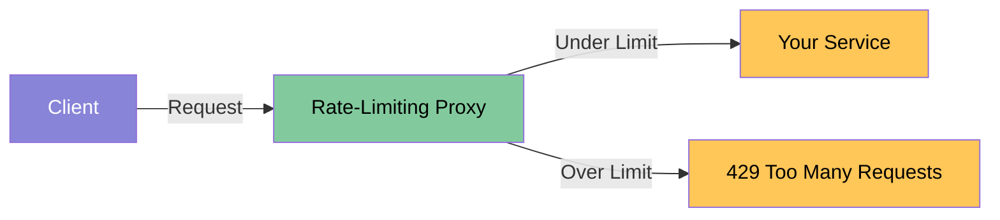
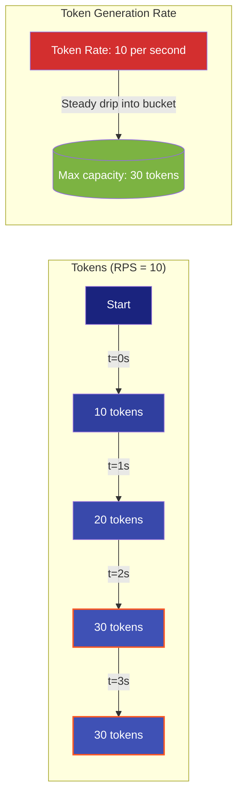
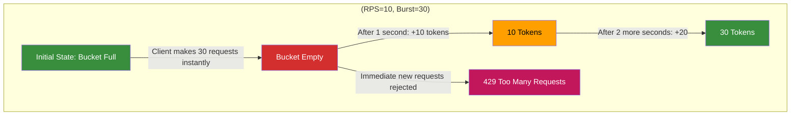
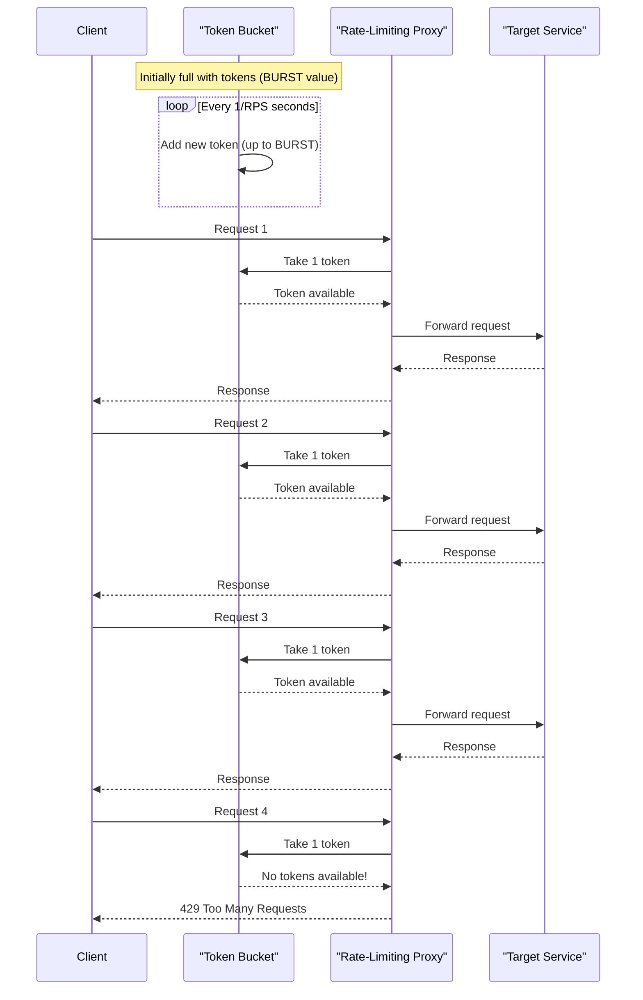

+++
date = '2025-03-07T18:52:37-08:00'
draft = false
title = 'Building a Rate-Limiter in Go'
tags = ["go", "api", "reverse-proxy", "rate-limiting"]
featured_image = "/images/gophers/go-magic.svg"
+++

Here is a fun project to get you GO-ing! Imagine, your API is humming along nicely until that one client (a complete savage) decides to hammer it with requests, bringing everything to a crawl. This is where rate limiting comes in to save the day!

In this post, we're building a configurable rate-limiting reverse proxy. And by the end of this blog, you'll have a lightweight, performant service that sits in front of your APIs and protects them from traffic spikes.

## What Exactly Are We Building?

A reverse proxy acts as a middleman between clients and your actual service. Our proxy will add a critical feature: **rate limiting** to control how many requests per second (RPS) each client can make.



Our proxy will be configurable via environment variables:

- `TARGET_URL`: The API we're protecting (i.e. `localhost:8080`)
- `PROXY_PORT`: The port our proxy runs on (i.e. `8000`)
- `RPS`: Requests per second allowed
- `BURST`: Maximum capacity and how many requests can temporarily exceed the rate limit

For this example, we will be building our rate-limiting reverse proxy using the [Token Bucket Algorithm](https://en.wikipedia.org/wiki/Token_bucket). But before we jump into things, I wanted to break down the concepts.

The Token Bucket Algorithm is fundamentally a traffic cop for your API. It works on a deceptively simple principle:

1. You have a bucket that holds tokens
2. Tokens are added to the bucket at a constant rate
3. Each API request requires one or more tokens
4. If there are enough tokens, the request goes through and tokens are consumed
5. If not, the request is rejected (usually with a 429 Too Many Requests)

RPS (Requests Per Second) is your token generation rate - it defines how many new request permits you're issuing every second. This is your system's sustainable throughput.


If your RPS is set to 10:

- Your bucket gets 10 new tokens every second
- That's one new token every 0.1 seconds
- This is your long-term, guaranteed throughput capacity


The following charts visualize this:



Burst capacity is like your API's turbo button - the maximum number of requests you'll allow all at once, even if it exceeds your sustainable rate. It's your buffer against traffic spikes.


If your burst is 30:

- Your bucket has a maximum capacity of 30 tokens
- A client can make up to 30 requests immediately
- After burst capacity is exhausted, they're throttled to your RPS


The following visualization describes this:



Start to make sense? Let's jump into the project to see this in action.

## Project Setup

Let's start by creating our project structure. I'm assuming you already have Go 1.24 installed.

```bash
mkdir rate-limit-proxy
cd rate-limit-proxy
go mod init github.com/yourusername/rate-limit-proxy
touch cmd/rate-limit-proxy/main.go
```

Now let's install the packages we'll need:

```bash
go get golang.org/x/time/rate
```

This package provides Go's excellent token bucket rate limiter, which we'll be using extensively.

## Building Our Rate-Limiting Proxy

Let's start by creating the overall structure of our application in `cmd/rate-limit-proxy/main.go`:

```go
package main

import (
	"fmt"
	"log"
	"net/http"
	"net/http/httputil"
	"net/url"
	"os"
	"strconv"
	"sync"
	"time"

	"golang.org/x/time/rate"
)

// ClientLimiter tracks rate limits for each client
type ClientLimiter struct {
	limiter  *rate.Limiter
	lastSeen time.Time
}

// Global map to store limiters for each client IP
var (
	clients    = make(map[string]*ClientLimiter)
	mu         sync.Mutex // protects clients map
	cleanupInt = 5 * time.Minute
)

func main() {
	// Configuration from environment variables
	targetURL := getEnv("TARGET_URL", "http://localhost:8080")
	proxyPort := getEnv("PROXY_PORT", "8000")
	rpsStr := getEnv("RPS", "10")
	burstStr := getEnv("BURST", "20")

	// Parse numeric configs
	rps, err := strconv.ParseFloat(rpsStr, 64)
	if err != nil {
		log.Fatalf("Invalid RPS value: %v", err)
	}

	burst, err := strconv.Atoi(burstStr)
	if err != nil {
		log.Fatalf("Invalid BURST value: %v", err)
	}

	// Setup the reverse proxy
	url, err := url.Parse(targetURL)
	if err != nil {
		log.Fatalf("Invalid target URL: %v", err)
	}

	proxy := httputil.NewSingleHostReverseProxy(url)

	// Start cleanup routine for inactive clients
	go cleanupOldClients()

	// Set up the HTTP server with our custom handler
	http.HandleFunc("/", createRateLimitHandler(proxy, rps, burst))

	fmt.Printf("Starting rate-limiting proxy server on :%s\n", proxyPort)
	fmt.Printf("Forwarding to: %s\n", targetURL)
	fmt.Printf("Rate limit: %.1f requests/second with burst of %d\n", rps, burst)

	if err := http.ListenAndServe(":"+proxyPort, nil); err != nil {
		log.Fatalf("Failed to start server: %v", err)
	}
}

// Helper function to get env variable with fallback
func getEnv(key, fallback string) string {
	if value, exists := os.LookupEnv(key); exists {
		return value
	}
	return fallback
}
```

Now let's implement the rate limiting handler and cleanup function:

```go
// Create our rate-limiting handler function
func createRateLimitHandler(proxy *httputil.ReverseProxy, rps float64, burst int) http.HandlerFunc {
	return func(w http.ResponseWriter, r *http.Request) {
		// Get client IP
		clientIP := r.RemoteAddr

		// Get or create rate limiter for this client
		limiter := getClientLimiter(clientIP, rps, burst)

		// Check if request is allowed
		if limiter.limiter.Allow() {
			// Forward the request to the target service
			proxy.ServeHTTP(w, r)
		} else {
			http.Error(w, "429 Too Many Requests", http.StatusTooManyRequests)
			log.Printf("Rate limit exceeded for client %s", clientIP)
		}
	}
}

// Get a rate limiter for a client
func getClientLimiter(clientIP string, rps float64, burst int) *ClientLimiter {
	mu.Lock()
	defer mu.Unlock()

	limiter, exists := clients[clientIP]
	if !exists {
		// Create a new rate limiter for this client
		limiter = &ClientLimiter{
			limiter:  rate.NewLimiter(rate.Limit(rps), burst),
			lastSeen: time.Now(),
		}
		clients[clientIP] = limiter
		return limiter
	}

	// Update the last seen time
	limiter.lastSeen = time.Now()
	return limiter
}

// Cleanup routine to remove inactive clients
func cleanupOldClients() {
	for {
		time.Sleep(cleanupInt)

		mu.Lock()
		now := time.Now()
		for ip, client := range clients {
			if now.Sub(client.lastSeen) > 1*time.Hour {
				delete(clients, ip)
				log.Printf("Cleaned up limiter for inactive client: %s", ip)
			}
		}
		mu.Unlock()
	}
}
```

Let's break down what's happening in this code:

1. We set up a reverse proxy using Go's `httputil` package
2. For each client (identified by IP), we create a rate limiter using Go's token bucket implementation
3. When a request comes in, we check if the client has exceeded their rate limit
4. If they have, we return a 429 Too Many Requests status
5. If not, we forward the request to the target service
6. We also have a background goroutine that cleans up rate limiters for clients that haven't been seen in a while


The token bucket algorithm allows for brief bursts of traffic while still maintaining a consistent average rate limit. This makes it more forgiving than strict per-second limits.

The `rate.Limiter.Allow()` method consumes a single token when it's called, but it doesn't actually block or delay execution! It simply returns `false` if no tokens are available.


## Handling X-Forwarded-For Headers

One issue with our current implementation is that it uses `RemoteAddr` to identify clients. In production environments with load balancers, you'll typically want to respect the `X-Forwarded-For` header. Let's enhance our code:

```go
// Get client's real IP, respecting X-Forwarded-For header
func getRealIP(r *http.Request) string {
	// Check for X-Forwarded-For header
	forwarded := r.Header.Get("X-Forwarded-For")
	if forwarded != "" {
		// X-Forwarded-For can contain multiple IPs; use the first one
		ips := strings.Split(forwarded, ",")
		return strings.TrimSpace(ips[0])
	}

	// Fall back to RemoteAddr if X-Forwarded-For is not present
	ip := r.RemoteAddr

	// Strip port number if present
	host, _, err := net.SplitHostPort(ip)
	if err == nil {
		// Successfully split host and port, use just the host
		ip = host
	}

	return ip
}
```

Don't forget to add `strings` and `net` to your imports!


Now, update the `createRateLimitHandler` function to use this instead:

```go
// Create our rate-limiting handler function
func createRateLimitHandler(proxy *httputil.ReverseProxy, rps float64, burst int) http.HandlerFunc {
	return func(w http.ResponseWriter, r *http.Request) {
		// Get client IP
		clientIP := getRealIP(r)

		// Rest of the function remains the same
		// ...
	}
}
```

## Testing Our Rate Limiter

Now that we have our rate-limiting proxy, let's test it. First, make sure you have a test service running. For this example, I'll use a simple echo server. We can create this under `cmd/echo-server/main.go`

```go
package main

import (
	"fmt"
	"log"
	"net/http"
)

func main() {
	http.HandleFunc("/", func(w http.ResponseWriter, r *http.Request) {
		fmt.Fprintf(w, "Hello from the test service! Path: %s\n", r.URL.Path)
	})
	log.Println("Starting test service on :8080")
	http.ListenAndServe(":8080", nil)
}
```

In a separate terminal, start our echo server:

```bash
# Start a simple test service
go run cmd/echo-server/main.go
```

Now, in another terminal, set the environment variables and start our rate-limiting proxy:

```bash
export TARGET_URL=http://localhost:8080
export PROXY_PORT=8000
export RPS=2
export BURST=3
go run cmd/rate-limit-proxy/main.go
```

This configures our proxy to allow an average of 2 requests per second, with a burst of 3 at most.

Let's test it with a more aggressive approach - we'll use Go itself to hammer the endpoint with concurrent requests!

We'll create a simple go script under `cmd/test-rate-limit/main.go`

```go
package main

import (
	"fmt"
	"io"
	"net/http"
	"sync"
	"time"
)

func main() {
	// Number of concurrent requests to send
	concurrency := 10
	totalRequests := 20

	fmt.Printf("Sending %d requests with %d concurrent workers...\n", totalRequests, concurrency)

	// Use a WaitGroup to wait for all goroutines to finish
	var wg sync.WaitGroup
	wg.Add(concurrency)

	// Channel to distribute work
	jobs := make(chan int, totalRequests)

	// Fill the jobs channel
	for i := 1; i <= totalRequests; i++ {
		jobs <- i
	}
	close(jobs)

	// Start time for benchmarking
	startTime := time.Now()

	// Launch workers
	for i := 0; i < concurrency; i++ {
		go func() {
			defer wg.Done()

			for jobID := range jobs {
				// Make the request
				resp, err := http.Get("http://localhost:8000/")

				if err != nil {
					fmt.Printf("Request %d: ERROR - %v\n", jobID, err)
					continue
				}

				// Read and discard body to free connection
				body, _ := io.ReadAll(resp.Body)
				resp.Body.Close()

				status := "SUCCESS"
				if resp.StatusCode != 200 {
					status = "RATE LIMITED"
				}

				// Print result with timestamp
				elapsed := time.Since(startTime).Seconds()
				fmt.Printf("[%.3fs] Request %d: %s (Status: %d)\n",
					elapsed, jobID, status, resp.StatusCode)

				if resp.StatusCode == 200 {
					// Show a bit of the body for successful requests
					bodyPreview := string(body)
					if len(bodyPreview) > 30 {
						bodyPreview = bodyPreview[:30] + "..."
					}
					fmt.Printf("  Response: %s\n", bodyPreview)
				}
			}
		}()
	}

	// Wait for all workers to finish
	wg.Wait()

	// Show summary
	elapsed := time.Since(startTime)
	fmt.Printf("\nCompleted in %.2f seconds\n", elapsed.Seconds())
	fmt.Printf("Average RPS attempted: %.1f\n", float64(totalRequests)/elapsed.Seconds())
}
```

You should see something like:


```
Sending 20 requests with 10 concurrent workers...
[0.010s] Request 2: SUCCESS (Status: 200)
  Response: Hello from the test service! P...
[0.010s] Request 3: SUCCESS (Status: 200)
  Response: Hello from the test service! P...
[0.010s] Request 1: SUCCESS (Status: 200)
  Response: Hello from the test service! P...
[0.011s] Request 8: RATE LIMITED (Status: 429)
[0.011s] Request 4: RATE LIMITED (Status: 429)
[0.011s] Request 9: RATE LIMITED (Status: 429)
[0.011s] Request 5: RATE LIMITED (Status: 429)
[0.011s] Request 7: RATE LIMITED (Status: 429)
[0.011s] Request 6: RATE LIMITED (Status: 429)
[0.011s] Request 10: RATE LIMITED (Status: 429)
[0.011s] Request 11: RATE LIMITED (Status: 429)
[0.011s] Request 12: RATE LIMITED (Status: 429)
[0.011s] Request 13: RATE LIMITED (Status: 429)
[0.011s] Request 15: RATE LIMITED (Status: 429)
[0.011s] Request 14: RATE LIMITED (Status: 429)
[0.011s] Request 17: RATE LIMITED (Status: 429)
[0.011s] Request 16: RATE LIMITED (Status: 429)
[0.011s] Request 18: RATE LIMITED (Status: 429)
[0.011s] Request 19: RATE LIMITED (Status: 429)
[0.011s] Request 20: RATE LIMITED (Status: 429)

Completed in 0.01 seconds
Average RPS attempted: 1757.1
```


The first nine requests should succeed and then you'll start seeing 429 errors as the rate limit kicks in.


If we were to do the following,

```shell
export BURST=10
go run cmd/rate-limit-proxy/main.go
```

And then re-run our tests, we would get an output like:


```
Sending 20 requests with 10 concurrent workers...
[0.199s] Request 6: SUCCESS (Status: 200)
  Response: Hello from the test service! P...
[0.199s] Request 8: SUCCESS (Status: 200)
  Response: Hello from the test service! P...
[0.199s] Request 3: SUCCESS (Status: 200)
  Response: Hello from the test service! P...
[0.199s] Request 11: RATE LIMITED (Status: 429)
[0.199s] Request 12: RATE LIMITED (Status: 429)
[0.199s] Request 10: SUCCESS (Status: 200)
  Response: Hello from the test service! P...
[0.199s] Request 5: SUCCESS (Status: 200)
  Response: Hello from the test service! P...
[0.199s] Request 2: SUCCESS (Status: 200)
  Response: Hello from the test service! P...
[0.199s] Request 4: SUCCESS (Status: 200)
  Response: Hello from the test service! P...
[0.199s] Request 15: RATE LIMITED (Status: 429)
[0.199s] Request 9: SUCCESS (Status: 200)
  Response: Hello from the test service! P...
[0.200s] Request 14: RATE LIMITED (Status: 429)
[0.200s] Request 16: RATE LIMITED (Status: 429)
[0.200s] Request 1: SUCCESS (Status: 200)
  Response: Hello from the test service! P...
[0.200s] Request 13: RATE LIMITED (Status: 429)
[0.200s] Request 19: RATE LIMITED (Status: 429)
[0.200s] Request 17: RATE LIMITED (Status: 429)
[0.200s] Request 20: RATE LIMITED (Status: 429)
[0.200s] Request 7: SUCCESS (Status: 200)
  Response: Hello from the test service! P...
[0.200s] Request 18: RATE LIMITED (Status: 429)

Completed in 0.20 seconds
Average RPS attempted: 100.1
```


</br>


In production, you might want to add headers like `X-RateLimit-Limit` and `X-RateLimit-Remaining` to give clients more information about their rate limit status.


## Rate Limiting Visualization

Let's visualize what's happening with our token bucket algorithm:



## Wrap Up

We've built a configurable, efficient rate-limiting reverse proxy in Go. This proxy can protect your services from traffic spikes, malicious clients, or simply overzealous integrations.

Some key points about our implementation:

1. **Per-client rate limiting**: Each client gets their own rate limiter
2. **Token bucket algorithm**: Allows for bursts while maintaining average limits
3. **Configurable via environment variables**: Easy to adjust for different services
4. **Real IP detection**: Works correctly even behind load balancers
5. **Memory efficient**: Automatically cleans up inactive client limiters

With minimal code, we've created a powerful piece of infrastructure that can be deployed in front of any HTTP service. This is the beauty of Go - it comes with so many useful packages out of the box that you can build production-ready components with very little code.

The full source code is available [here](https://github.com/catpaladin/rate-limit-proxy).

Happy coding, Gophers!
