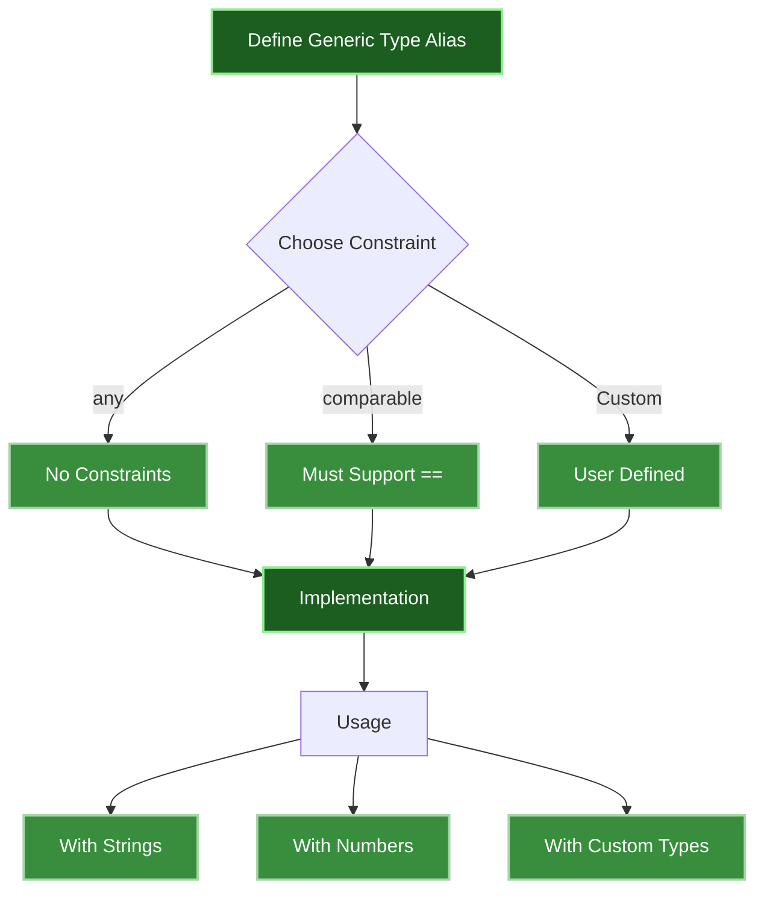

+++
date = '2025-02-15T09:00:54-08:00'
draft = false
title = 'Understanding Generic Type Aliases in Go 1.24'
tags = ["go", "python", "typescript", "generics"]
featured_image = "/images/go-generics.svg"
+++

After spending years writing Go, the introduction of generic type aliases in Go 1.24 is something that I have to say is exciting! Let's break down exactly what this means, how it works, and how it compares to other languages.

## Understanding Go's Type System Evolution

### Type Aliases vs Type Definitions

First, let's clear up a fundamental concept in Go:

```go
// Type Definition - Creates a NEW type
type MyInt int     // MyInt is a different type than int

// Type Alias - Creates a SYNONYM for existing type
type AliasInt = int // AliasInt is exactly the same as int
```

Here's a practical example showing the difference:

```go
func main() {
    // Type Definition behavior
    type UserID int
    var id UserID = 1
    var number int = 2
    // id = number  // This fails! Different types
    id = UserID(number)  // This works with explicit conversion

    // Type Alias behavior
    type RequestID = int
    var reqID RequestID = 1
    var otherNumber int = 2
    reqID = otherNumber  // This works! Same type
}
```

## Understanding Generic Type Aliases


<!--  -->

Generic type aliases allow us to create type synonyms that can work with different data types while maintaining Go's strong type safety.
Think of it as creating flexible building blocks that can adapt to different data types without sacrificing compile-time safety.

### Basic Examples: Result and Set Types

Let's break down some fundamental patterns that you'll use constantly:

```go
// Result represents a common pattern in Go:
// handling both successful operations and errors
type Result[T any] = struct {
    Data    T          // The actual data of any type
    Success bool       // Operation status
    Error   error     // Error if any
}

// Set represents a collection of unique items
// using Go's efficient map implementation
type Set[T comparable] = map[T]bool

func main() {
    // Let's see how Result works with strings
    userData := Result[string]{
        Data:    "John Doe",
        Success: true,
        Error:   nil,
    }
    fmt.Printf("User data: %v\n", userData.Data) // Output: User data: John Doe

    // Now with numbers - same type, different data
    calculationResult := Result[int]{
        Data:    42,
        Success: true,
        Error:   nil,
    }
    fmt.Printf("Calculation result: %d\n", calculationResult.Data) // Output: Calculation result: 42

    // Sets are perfect for managing unique collections
    fruitSet := Set[string]{
        "apple":  true,   // Present in set
        "banana": true,   // Present in set
    }

    // Checking membership is lightning fast
    fmt.Println("Is apple in set?", fruitSet["apple"])     // Output: true
    fmt.Println("Is orange in set?", fruitSet["orange"])   // Output: false

    // Sets work just as well with numbers
    primeSet := Set[int]{
        2: true,
        3: true,
        5: true,
    }
    fmt.Println("Is 2 prime?", primeSet[2]) // Output: true
}
```

### Advanced Use Cases: Building Robust Data Structures

Now let's look at some more sophisticated patterns that showcase the full power of generic type aliases:

```go
import "sync"

// Optional represents a value that might or might not be present
// Perfect for handling nullable values without using pointers
type Optional[T any] = struct {
    Value    T
    HasValue bool
}

// SafeMap provides a thread-safe map implementation
// using Go's sync.RWMutex for concurrent access
type SafeMap[K comparable, V any] = struct {
    Data map[K]V
    mu   sync.RWMutex
}

// Queue implements a simple FIFO data structure
type Queue[T any] = struct {
    items []T
}

func main() {
    // Optional is perfect for handling potentially missing values
    userEmail := Optional[string]{
        Value:    "user@example.com",
        HasValue: true,
    }

    if userEmail.HasValue {
        fmt.Printf("Email: %s\n", userEmail.Value)
    }

    // SafeMap provides thread-safe operations
    userScores := SafeMap[string, int]{
        Data: make(map[string]int),
    }

    // Thread-safe operations
    userScores.mu.Lock()
    userScores.Data["Alice"] = 100
    userScores.mu.Unlock()

    // Reading data safely
    userScores.mu.RLock()
    score := userScores.Data["Alice"]
    userScores.mu.RUnlock()

    fmt.Printf("Alice's score: %d\n", score)
}
```

The real power of these generic type aliases becomes apparent when you need to:
1. Handle different data types with the same logic
2. Provide type safety without code duplication
3. Build reusable components that work across your codebase

Here's a practical example combining these concepts:

```go
// ResultSet combines our Result and Set types
type ResultSet[T comparable] = struct {
    Results  []Result[T]
    UniqueValues Set[T]
}

func main() {
    // Using ResultSet with strings
    userNames := ResultSet[string]{
        Results: []Result[string]{
            {Data: "Alice", Success: true},
            {Data: "Bob", Success: true},
            {Data: "Alice", Success: true}, // Duplicate
        },
        UniqueValues: Set[string]{
            "Alice": true,
            "Bob":   true,
        },
    }

    // Check unique values
    fmt.Println("Is Alice in set?", userNames.UniqueValues["Alice"])

    // Count successful results
    successCount := 0
    for _, result := range userNames.Results {
        if result.Success {
            successCount++
        }
    }
    fmt.Printf("Successful results: %d\n", successCount)
}
```


## Language Comparison: Generic Type Aliases Across Other Languages

Let's explore how TypeScript and Python handle generic type aliases compared to Go 1.24. This should help those of you reading who are familiar with other languages, but have never touched type aliases (*let alone generics!*).

### TypeScript: Type Aliases

TypeScript's type system is like that overachieving friend who always does extra credit - it comes with a rich set of features for type manipulation. Here's how TypeScript approaches generic type aliases:

```typescript
// The classic Result type - TypeScript style
type Result<T> = {
    data: T;              // Generic data of any type
    success: boolean;     // Operation status
    error: Error | null;  // Notice the union type - very TypeScript!
}

// Sets with TypeScript's powerful type constraints
type Set<T extends string | number | symbol> = {
    [key in T]: boolean;  // Using mapped types - a TypeScript specialty
}

// Optional values using union types
type Optional<T> = {
    value: T;
    hasValue: boolean;
} | null;  // Union with null - TypeScript's way of handling optional values

// Let's put these to work
const userResult: Result<string> = {
    data: "John Doe",
    success: true,
    error: null
};

// TypeScript's type inference is pretty smart
const numberSet: Set<number> = {
    1: true,
    2: true
    // Try adding a string here - TypeScript will yell at you!
};

// The compiler catches type mismatches
const invalidSet: Set<number> = {
    "one": true  // Error: string key in number set
};
```

What makes TypeScript special:
1. Union types (`Error | null`)
2. Mapped types (`[key in T]`)
3. Type constraints (`extends string | number | symbol`)
4. Excellent type inference

### Python: Type Hints with a Twist

Type aliases are interesting in Python. While there is no way to enforce typing, with the exception of some strong mypy type checking (or some custom decorators), generics and type aliases are done through typing hinting. Here's how Python 3.13 handles generic type aliases:

```python
from typing import TypeVar, Generic, TypeAlias
from dataclasses import dataclass

# TypeVar is Python's way of saying "this could be anything"
T = TypeVar('T')
K = TypeVar('K')
V = TypeVar('V')

# Using dataclass to reduce boilerplate
@dataclass
class Result(Generic[T]):
    data: T                 # Generic data field
    success: bool           # Status flag
    error: Exception | None # Python 3.10+ union type syntax

# Type aliases in Python - simpler but powerful
Set: TypeAlias = dict[T, bool]

@dataclass
class Optional(Generic[T]):
    value: T | None        # Modern Python union type syntax
    has_value: bool

# Using our generic types
def process_data() -> Result[str]:
    return Result(
        data="Processing complete",
        success=True,
        error=None
    )

# Type checkers will validate this
string_result = Result[str](
    data="Hello Python!",
    success=True,
    error=None
)

# But Python won't stop you at runtime
number_set: Set[int] = {
    1: True,
    "oops": True  # This will work (but your type checker will complain)
}
```

Python's approach is unique because:
1. Type hints are optional
2. Runtime behavior isn't affected by types
3. External type checkers (like mypy) do the heavy lifting
4. Generics are implemented through the `typing` module

### The Key Differences

While all three languages support generic type aliases, they each have their own philosophy:

1. **Go**:
   - Compile-time enforcement
   - Simple, straightforward syntax
   - No runtime overhead
   - Explicit type conversions required

2. **TypeScript**:
   - Rich type system features
   - Extensive type inference
   - Compile-time checking (but compiles to JavaScript)
   - Powerful type manipulation capabilities

3. **Python**:
   - Optional type hints
   - Runtime type checking tools
   - Gradual typing approach
   - Type hints as documentation

Here's a quick side-by-side comparison using our Result type:

```go
// Go
type Result[T any] = struct {
    Data    T
    Success bool
    Error   error
}
```

```typescript
// TypeScript
type Result<T> = {
    data: T;
    success: boolean;
    error: Error | null;
}
```

```python
# Python
@dataclass
class Result(Generic[T]):
    data: T
    success: bool
    error: Exception | None
```

The syntax might be different, but the goal is the same: creating reusable, type-safe code. Each language just takes its own path to get there!

## Best Practices for Go Generic Type Aliases

### 1. Keep It Simple

Don't make them over complex, but also don't be vague with your parameters.

```go
// Good - Clear purpose
type JsonResponse[T any] = struct {
    Data    T
    Status  int
    Message string
}

// Bad - Vague and difficult to understand
type JsonResponse[T any, E comparable, M ~string] = struct {
    Data    T
    Status  int
    Error   E
    Message M
}
```

### 2. Use Meaningful Constraints

It is too easy to just say "any". Unless you really don't plan on refactoring your code, try to constrain the generics to expected types.

```go
// Good - Clear constraint usage
type NumericResult[T ~int | ~float64] = struct {
    Value T
    Valid bool
}

// Not ideal - Overly permissive
type Result[T any] = struct {
    Value T
    Valid bool
}
```

### 3. Document Your Types

Documentation makes it easier for the poor souls who inherit your tech debt, including you!

```go
// UserResult represents an API response containing user data.
// T can be any user-related struct.
type UserResult[T any] = struct {
    Data    T
    Status  int
    Message string
}
```

## Closing

Remember: Generic type aliases in Go provide a powerful way to create reusable, type-safe code while maintaining Go's simplicity and explicitness. Choose them when they make your code clearer and more maintainable.
